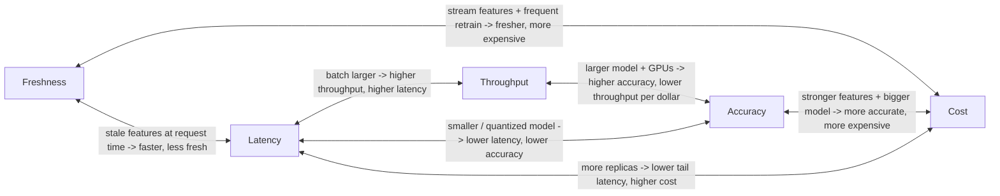
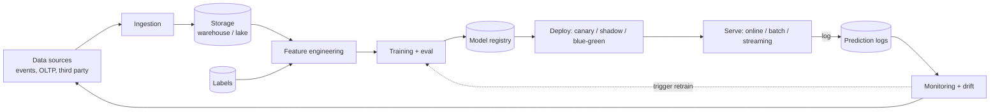
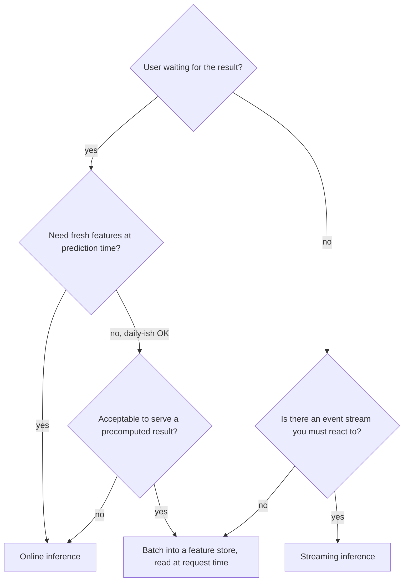
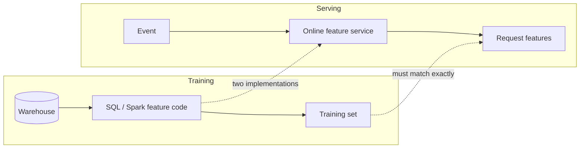

# 00 — Foundations

> Time budget: 60 minutes of careful reading. Re-read the diagrams once. The vocabulary in this module is referenced by every other one.

**By the end you can:**

1. State the five system properties of an ML system and the pairwise trade-offs between them.
2. Draw the ML lifecycle as a flowchart and locate where each downstream module lives.
3. Distinguish train-serve skew from data drift, and explain why the former is more common in production.
4. Write a one-page SLO document for an ML service, including SLIs and an error budget.
5. Choose between batch, online, and streaming inference for a concrete product use case.

---

## 1. ML system vs ML model

A useful diagnostic question: if you swapped the model for a hard-coded `return 0.5`, what would still be standing?

If most of the system is still standing — the data pipelines, the feature store, the serving stack, the monitoring, the A/B framework — you have an **ML system**. If almost nothing is standing, you have a **model**. Most teams build the second and discover they need the first about six months in.

The same idea framed by Sculley et al. in "Hidden Technical Debt in Machine Learning Systems" (NeurIPS 2015): the model is a small box in the middle of a much larger architecture, and the cost of the surrounding architecture dominates long-term ownership cost. The 2015 paper's diagram has held up well.

This course is about the rest of the picture.

---

## 2. The five properties

Every ML system trades off five properties. You cannot maximize all five. Naming them up front gives you a vocabulary for design conversations.

| Property | Definition | Typical SLI |
|----------|-----------|-------------|
| **Latency** | Time from request to response, measured at a high percentile. | p99 of `inference_latency_ms` |
| **Throughput** | Successful requests per unit time. | `requests_per_second`, `tokens_per_second` |
| **Cost** | Dollars per successful request, including amortized training. | `usd_per_1k_requests` |
| **Freshness** | Time from a real-world event to its reflection in the model's view. | `feature_freshness_seconds`, `model_age_hours` |
| **Accuracy** | How well predictions match the desired outcome. Domain-specific. | `auc`, `ndcg@10`, `precision_at_k`, win rate |

A more honest sixth — **safety / fairness** — sits outside this matrix and dominates in regulated settings. See [Module 13](../13-privacy-fairness-ethics/README.md).

### Pairwise trade-offs



Every one of these edges has a real cost lever associated with it. The trick to ML systems design is to identify which two properties you actually care about and pick the lever that trades off the others.

Examples:

| Product | Properties that matter | Properties that lose |
|---------|------------------------|----------------------|
| Real-time fraud check at checkout | Latency, accuracy, freshness | Cost |
| Daily marketing-uplift batch | Accuracy, cost | Latency, freshness |
| Search autocomplete | Latency, throughput | Accuracy (within reason) |
| LLM chat assistant | Latency, accuracy | Cost |
| Yearly tax-classification model | Accuracy | Latency, throughput, freshness |

Lock in your two and design the rest around them.

---

## 3. The ML lifecycle



This is the only diagram in the course that is intentionally a loop. The loop closes through monitoring back to data. A team that does not close this loop is doing science, not engineering.

Where each downstream module sits:

| Stage | Module |
|-------|--------|
| Ingestion + storage | [01 Data Platform](../01-data-platform/README.md) |
| Feature engineering | [02 Feature Stores](../02-feature-stores/README.md) |
| Training | [03 Training Infra](../03-training-infra/README.md) |
| Deploy + serve | [04 Serving](../04-serving-online-batch-streaming/README.md), [11 MLOps](../11-mlops-and-ci-cd/README.md) |
| Retrieval-specific serve | [05 Vector DBs](../05-vector-dbs-and-retrieval/README.md), [06 LLMs](../06-llm-serving-and-rag/README.md) |
| Ranking-specific serve | [07 Recsys](../07-recommendation-systems/README.md), [08 Search](../08-search-and-ranking/README.md) |
| Streaming / online | [09 Real-time](../09-real-time-ml/README.md) |
| Monitoring + drift | [10 Monitoring](../10-monitoring-and-drift/README.md) |
| Cost + scale | [12 Cost](../12-cost-multitenancy-scaling/README.md) |
| Privacy + fairness | [13 Privacy](../13-privacy-fairness-ethics/README.md) |

---

## 4. Batch vs online vs streaming inference

Three serving shapes, three different stacks. Picking the wrong one is the single most expensive mistake at the architecture stage.

| Shape | What it looks like | Latency | Freshness | Cost | When to use |
|-------|--------------------|---------|-----------|------|-------------|
| **Batch** | Offline job scores a table; results land in a warehouse or feature store. | minutes-hours per job | hours-days | Cheapest | Daily marketing scores; weekly churn risk; sometimes nightly recs. |
| **Online (request/response)** | Synchronous prediction per request. | tens-hundreds of ms | depends on features | Highest | Fraud, search ranking, recsys, chat. The most common shape. |
| **Streaming** | Predictions emitted from a stream as events flow. | seconds | seconds | Medium | Anomaly detection, real-time personalization signals, IoT. |

### Decision tree



A common refactor: a system starts online because the team didn't know any better, hits a cost ceiling, realizes 90% of the work could be precomputed, and moves to **batch-then-look-up**. The other common refactor goes the other way: batch was fine until business stakeholders asked for "real-time" and a new requirement broke the existing pipeline. Plan for the shape change.

---

## 5. Train-serve skew, the single most common production bug

A model is trained on features produced by code path A (typically in a notebook over a warehouse). It is served on features produced by code path B (typically in a service over an online store). The two paths drift in subtle ways: a different unit, a different time zone, a different default for a missing value, a different join key.

The result: offline metrics look perfect; the production model behaves badly; the team blames "drift" when nothing has drifted except the implementation.



Three fixes, in increasing order of organizational difficulty:

1. **Log the served features at serving time.** Build training sets from those logs. The serving path becomes the ground truth for training. This is the cheapest fix and the one Stripe, Uber, Pinterest, and DoorDash all converged on independently.
2. **A single feature definition with two execution backends.** Feast, Tecton, and Vertex AI Feature Store all do this; they produce identical SQL for the offline store and identical service code for the online store from one declaration.
3. **Production replay tests.** For every release, replay a recent shard of production requests against the new model and compare distributions to the old.

See [Module 02](../02-feature-stores/README.md) for the full picture.

A useful diagnostic: when offline AUC is 0.85 and online AUC is 0.71, suspect skew before you suspect anything else.

---

## 6. SLAs, SLOs, SLIs — for ML systems

The SRE vocabulary (Beyer et al., Google, 2016) carries over to ML with minor extensions.

| Term | Definition | ML example |
|------|------------|------------|
| **SLI** (Indicator) | A measurement. | p99 inference latency, prediction throughput, daily AUC vs baseline. |
| **SLO** (Objective) | A target for an SLI over a window. | "99% of inference requests under 120 ms, measured weekly." |
| **SLA** (Agreement) | A contractual SLO with consequences. | "99.9% inference availability monthly or a service credit." |
| **Error budget** | `1 - SLO`. The amount of failure you can afford. | If SLO is 99.9% availability, the budget is 43 minutes/month. |

### ML-specific SLOs (often forgotten)

| SLO | What it measures | Why it matters |
|-----|------------------|----------------|
| **Latency** | p50, p95, p99 of `predict()`. | Direct user experience. |
| **Availability** | Fraction of requests not returning 5xx. | Standard. |
| **Freshness** | Median seconds from event to feature available at serving. | A stale feature is silently wrong; an unavailable feature is loudly wrong. |
| **Prediction-quality SLI** | Rolling AUC / NDCG / engagement uplift vs a baseline. | The only way to catch silent regressions. |
| **Drift SLI** | KS distance / PSI between training and serving feature distributions. | Early warning. |
| **Coverage** | Fraction of requests where the model fired (not fallback). | Quietly drops when feature pipelines break. |

A template SLO document for an online ML service:

```text
Service:           search-ranking-v3
Owner:             search-platform
Window:            rolling 28 days

SLO 1 - latency:      p99(predict_latency_ms) <= 120 over 28 days, measured per-region
SLO 2 - availability: success_rate >= 99.9% over 28 days
SLO 3 - freshness:    p95(feature_age_seconds) <= 60 for user_recent_clicks
SLO 4 - quality:      ndcg@10 within -1.5% of week-ago baseline, measured daily
SLO 5 - coverage:     fraction_with_model >= 99% (vs heuristic fallback)

Error budget policy:
  - If ANY SLO is breached for >24 h, freeze model releases until resolved.
  - Quality SLO breach triggers automatic rollback to the prior model.
```

The error budget policy is the part that actually changes behavior. Without it, SLOs are decoration.

---

## 7. What this course will not cover

Naming what's out of scope sharpens what's in scope.

| Out of scope | Why |
|--------------|-----|
| Training-time math (loss functions, optimizers, network architectures) | Many great books and courses; see Goodfellow / Murphy / Bishop. |
| Hyperparameter tuning algorithms | Sub-system of training, well covered elsewhere. |
| Specific algorithm-by-algorithm walkthroughs (XGBoost vs LightGBM) | This is a systems course. We treat models as components. |
| Coding tutorials | The course is reading and thinking. The calculators are the only runnable artifact. |
| Toy datasets | Every example is at production scale (millions to billions of events / vectors / users). |

---

## Cross-links

- One-pager: [`cheat-sheet.md`](./cheat-sheet.md).
- Practice: [`exercises.md`](./exercises.md).
- Mistakes I have made in production: [`pitfalls.md`](./pitfalls.md).
- Real systems: [`case-studies/`](./case-studies/).
- Vocabulary: [`../glossary.md`](../glossary.md).
- Big picture: [`../diagrams-shared/online-ml-reference-architecture.md`](../diagrams-shared/online-ml-reference-architecture.md).

## Sources

- *Designing Data-Intensive Applications*, Kleppmann (O'Reilly, 2017), chapters 1-2.
- *Designing Machine Learning Systems*, Huyen (O'Reilly, 2022), chapters 1-3.
- "Hidden Technical Debt in Machine Learning Systems," Sculley et al. (NeurIPS 2015).
- *Site Reliability Engineering*, Beyer et al. (Google, O'Reilly, 2016), SLO chapters.
- "Reliable Machine Learning," Chen, Murphy, Zaharia et al. (O'Reilly, 2022).
