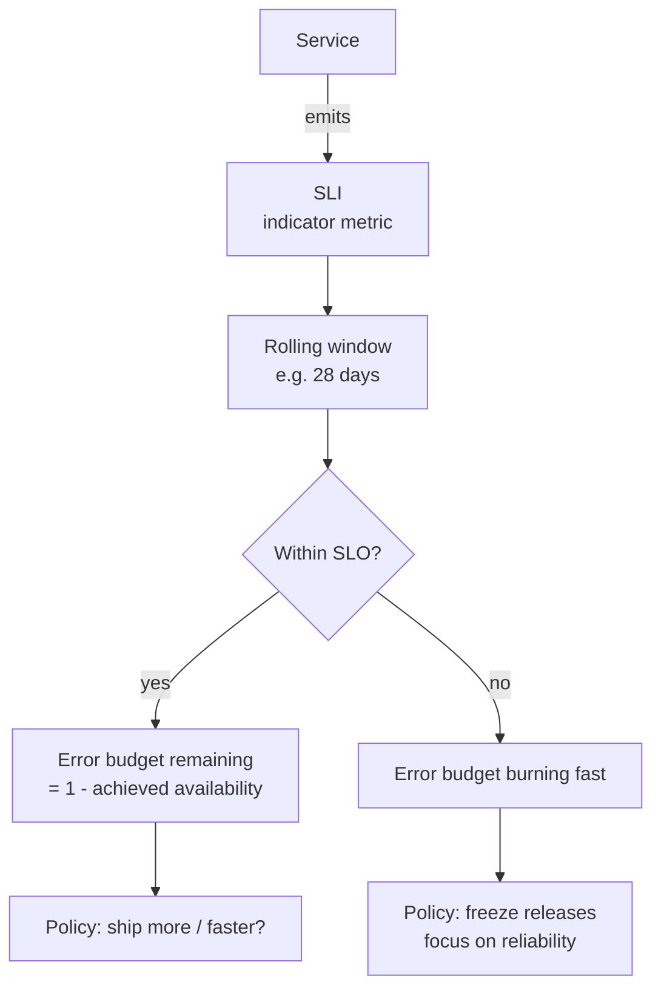

# Google — SRE and the SLO discipline (2016)

## Problem

By the early 2010s, Google operated services on a scale where every team's "we should be more reliable" intuition was useless without measurement. Two teams with the same uptime number disagreed on whether to slow releases or speed them up. The *Site Reliability Engineering* book (Beyer et al., O'Reilly, 2016) codified the answer.

This is not an ML system. But the vocabulary — SLI, SLO, SLA, error budget — is the foundation every ML SRE discipline builds on. Every ML platform team converges on a version of this.

## Architecture (conceptually)

## Three load-bearing decisions

1. **The error budget is the link between reliability and velocity.** You don't have to argue "should we slow down releases?" — the budget answers it.
2. **The SLO is a number, not a vibe.** You commit to a measurement, a target, and a window.
3. **The SLA is contractual; the SLO is internal.** The SLO is set *tighter* than the SLA so a breached SLO is a leading indicator, not a regulatory event.

## Adaptation to ML

ML systems need three extensions:

| Extension | What it adds | Module |
|-----------|--------------|--------|
| **Quality SLOs** | A rolling prediction-quality metric vs a baseline. | [10 Monitoring](../../10-monitoring-and-drift/README.md) |
| **Freshness SLOs** | Time from event to feature availability. | [02 Feature Stores](../../02-feature-stores/README.md) |
| **Coverage SLIs** | Fraction of traffic the model actually scored vs heuristic fallback. | [04 Serving](../../04-serving-online-batch-streaming/README.md) |

## What you should steal

- The **error-budget policy** is the single highest-leverage piece of ML platform governance. Write yours down.
- The instinct to **set the SLO tighter than the SLA**. For ML quality SLOs specifically, set them tight enough that a breach is an early-warning, not a customer-visible problem.

## Sources

- *Site Reliability Engineering*, Beyer, Jones, Petoff, Murphy (Google, O'Reilly, 2016).
- *The Site Reliability Workbook*, Beyer, Murphy, Rensin, Kawahara, Thorne (Google, O'Reilly, 2018).
