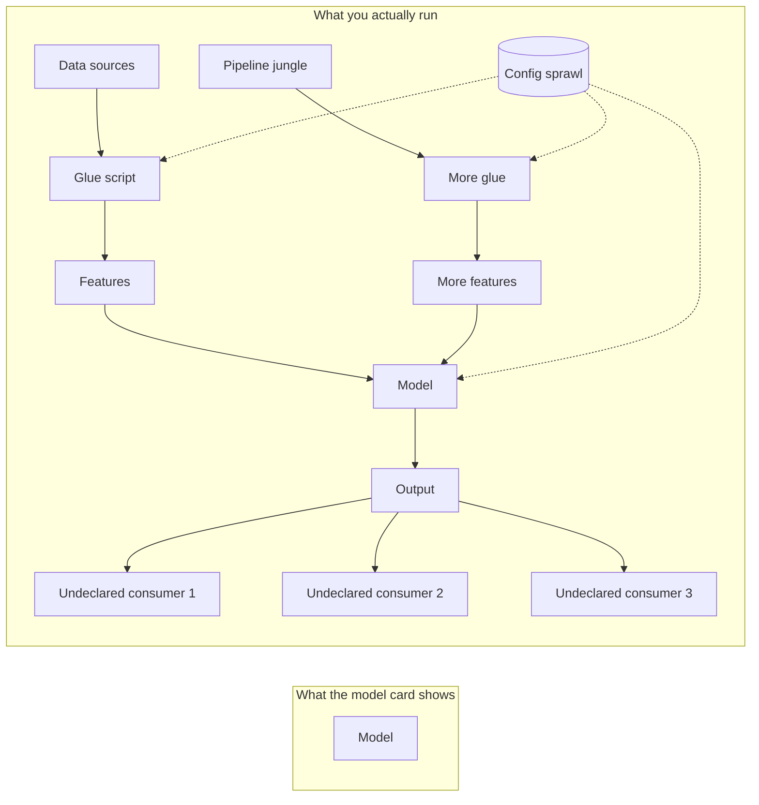

# Google — Hidden Technical Debt in Machine Learning Systems (2015)

## Problem

By 2015, Google had thousands of ML models in production and was running into a quieter crisis than the one most teams talked about. The models worked. The systems around them did not. Ownership of pipelines was diffuse, debugging was hours-to-days, and the smallest behavioural change in one place rippled unpredictably through dependent systems.

The Sculley et al. NeurIPS 2015 paper put a vocabulary on the problem.

## Architecture

There is no architecture diagram in the paper itself — the point of the paper is that the *picture you should have drawn* is not the picture you actually have.

The paper's claim, well supported in their own production: the box labelled "Model" is a vanishingly small fraction of the total cost of an ML system.

## Three load-bearing observations

1. **CACE — Changing Anything Changes Everything.** Models are not modular. Tweaking a feature changes the optimal hyperparameters; tweaking the hyperparameters changes which features matter. There is no "independent component" in the software-engineering sense.
2. **Pipeline jungles** grow without ownership. Each feature has a script; each script depends on three more; nobody knows the full graph.
3. **Undeclared consumers** of model outputs accumulate. Downstream teams treat your prediction stream as an API that you never agreed to support. Removing it breaks them; keeping it locks you in.

## What they got wrong (or didn't see clearly enough in 2015)

The paper undersold how much of this could be solved by **feature stores** and **data contracts** as first-class abstractions. By 2017-2018, Uber's Michelangelo, Airbnb's Zipline, and Feast had operationalised most of the paper's prescriptions. The 2015 framing makes it sound like a discipline problem; in practice it was a platform problem, fixed by building the right primitives.

The paper also pre-dates the LLM era. Most of the lessons carry over — prompt sprawl is the new pipeline jungle, eval-set drift is the new feature drift — but the cost ratios have changed; inference cost now often dwarfs every other line item.

## What you should steal

- The **CACE** framing is still the best one-line argument for end-to-end eval, not unit eval, of ML systems.
- The **undeclared consumer** lens. Any time you ship a model output to a topic, a table, or an endpoint, ask: who depends on the schema and what guarantees did we make?
- The instinct that the model is a small box in a much bigger picture. The next eleven modules are the bigger picture.

## Sources

- "Hidden Technical Debt in Machine Learning Systems," Sculley, Holt, Golovin, Davydov, Phillips, Ebner, Chaudhary, Young, Crespo, Dennison (NeurIPS 2015).
