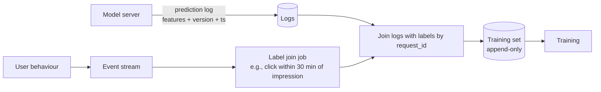

# 00 — Foundations exercises

Twelve questions. Sit with each one for ten minutes before unfolding the solution.

---

### 1. INTERVIEW. Design a 40-minute sketch: "an online ML system that predicts whether a payment will be fraudulent at the moment of checkout."

What are the five properties' priorities? Draw the architecture. Specify SLOs.

Solution

Priorities: **latency** (the user is waiting), **accuracy** (false positives drive away customers, false negatives cost money), **freshness** (a card stolen ten minutes ago must already be flagged). Throughput is high but bursty; cost is real but not the primary driver.

Architecture: API gateway -> feature service (reads user, merchant, device, recent-velocity features from an online store with ~5 ms p99) -> model server (gradient-boosted trees or a small DNN at <30 ms p99) -> async log every prediction with features and version.

SLOs: p99 < 100 ms, availability >= 99.95%, feature freshness p95 <= 5 s for velocity features, false-positive rate within 0.5 pp of baseline measured daily, error-budget policy freezes deploys on quality breach.

The streaming feature pipeline (Kafka -> Flink -> online store) is where the freshness SLO lives. See [Module 09](../09-real-time-ml/README.md).

---

### 2. DECISION. You have a recommendation model that costs $0.0008 per request and serves 200M requests/day. The product team wants to halve the cost. Latency cannot get worse; accuracy can drop by up to 0.5% NDCG@10. What do you try?

Solution

Levers in order of cost-per-effort:

1. **Cache results for read-heavy sessions.** Many recommendation lists are looked at more than once in a session. Caching the response for the session window cuts compute proportionally to the lookups.
2. **Knowledge-distill the ranker** into a smaller student model and accept the 0.5% NDCG hit. Distillation is well-trodden ground (Hinton et al., 2015) and routinely halves serving compute.
3. **Quantize to INT8** the ranker weights at serving time. Modern inference servers do this transparently; the accuracy hit is usually small for tree ensembles and tolerable for DNNs.
4. **Two-tier ranker.** Cheap ranker over 1000 candidates; expensive ranker only over the top 100. Most of the cost is in over-ranking the long tail.

Probably not: switching cloud providers, retraining from scratch on a different architecture. Both promise a lot and deliver in 6 months at the earliest.

---

### 3. CASE-STUDY READ. Read "Meet Michelangelo: Uber's Machine Learning Platform" (Uber Engineering, 2017). Summarize the three load-bearing decisions and one thing the original post got wrong, based on Uber's later posts.

Solution

Three load-bearing decisions:

1. **Unified offline + online feature store** with the same feature definitions used for training and serving. This is the train-serve-skew fix at platform scale.
2. **A single platform abstraction across teams.** Michelangelo's value is not any one component; it's that fraud, ETA, and pricing teams ship through the same pipeline.
3. **Built-in monitoring and drift detection** as part of the deployment, not a separate effort.

What didn't age well: the original 2017 design treated batch and online as two pipelines with separate orchestration; subsequent posts (Uber 2019, 2021, 2023) describe progressive consolidation onto a streaming-first feature pipeline and Flink for both. The "two pipelines that share definitions" approach turned out to be cheaper in maintenance than in compute, but ultimately the unified streaming layer won.

---

### 4. DECISION. The data science team is reporting offline AUC of 0.88; the product team reports a 12% relative drop in click-through from the previous model. Both numbers are correct. Where do you look first?

Solution

**Train-serve skew before drift.** In order:

1. Diff the feature distributions between the training set and the predictions logged at serving time. Compute KS for each numeric feature, chi-square for each categorical. The bug is almost always one feature with a moved mean or a new default.
2. Check whether any feature is being **read at the wrong timestamp** at serving (e.g., reading the user's `last_session_country` *after* the current session is recorded, leaking the answer into a training set that didn't leak it).
3. Verify the **model version** logged matches what's actually loaded; mis-promoted artifacts happen.
4. Only then look at population drift.

The order matters because the first two are bugs and the last is reality.

---

### 5. INTERVIEW. Design a 40-minute sketch: a daily marketing-uplift score for 200M customers. Cost matters, latency does not.

Solution

This is the canonical **batch** shape.

Architecture: nightly Spark or BigQuery job reads the warehouse, builds features point-in-time, scores the uplift model in parallel, writes results back to a table. Downstream consumers (CRM, push-notification service, ads platform) read from that table during the day.

Trade-offs: zero serving latency (it's a table lookup), accuracy is excellent because the batch can afford a large ensemble, freshness is 24 hours. If marketing wants near-real-time the answer is **not** to make the batch faster but to add a streaming pipeline for the small slice of users whose recent behaviour matters and serve from there.

SLOs: job completion by 06:00 local each day, p99 row staleness 27 h (i.e., yesterday's 03:00 cut). No latency SLO. Quality SLO: rolling AUC delta from last week within 1 pp.

---

### 6. DECISION. You're choosing between batch and online inference for "predict whether to send a push notification at the moment a user opens the app." Argue both sides.

Solution

**Online side.** The trigger is at request time and the features (current session location, time-of-day, last-30-seconds behaviour) are inherently online. Online lets you use these signals.

**Batch side.** Most app opens come from users whose "should we ping?" answer is stable for the next four hours (e.g., a quiet hour after a session). A daily batch scoring 95% of users + a small online tier for the volatile remainder is much cheaper.

**Recommendation:** the hybrid. Online inference path exists for users with high-velocity recent behaviour; batch precompute serves the rest. This is the same idea as a write-through cache for ML predictions.

---

### 7. CASE-STUDY READ. Read "Hidden Technical Debt in Machine Learning Systems" (Sculley et al., NeurIPS 2015). What three anti-patterns from that paper still bite ML teams in 2026?

Solution

The paper holds up. The three that still bite:

1. **Glue code and pipeline jungles.** The graph of code that gets data into a model is far larger than the model code itself, and it accumulates without ownership.
2. **Configuration debt.** A model's behaviour is the product of a hundred config knobs (feature lists, transforms, hyperparameters, deployment flags). Without typed, versioned config, nobody knows why production is what it is.
3. **Undeclared consumers.** Someone downstream consumes your prediction logs or feature outputs and depends on a subtle property (a particular default value, a column order) that you didn't promise. You change the property; they break. The fix is data contracts (see Module 01).

Lower-importance now (because the field caught up): "CACE — Changing Anything Changes Everything." Modern feature stores and registries help, though they don't eliminate the problem.

---

### 8. INTERVIEW. Sketch the SLO document for a search-ranking model used by 10M DAU. The product PM wants "fast and good."

Solution

Translate "fast and good":

- **Latency SLO:** p99(predict_latency_ms) <= 120, p50 <= 30. Window: 28 days, per-region.
- **Availability SLO:** 99.9%.
- **Quality SLO:** NDCG@10 within -1% relative of the four-week trailing mean, measured daily on a held-out slice; if breached for two consecutive days, freeze rollouts.
- **Freshness SLO:** p95(user_recent_clicks feature age) <= 30 s.
- **Coverage SLO:** at least 99% of requests scored by the model (vs heuristic fallback); below 99% indicates a feature-pipeline outage.

The error budget policy: if **any** SLO is breached, freeze new model rollouts (not config rollouts). On a quality SLO breach: automatic rollback to the prior model.

---

### 9. DECISION. The team proposes "online learning" — update the model weights from every request. Argue for or against in this context: an e-commerce ranker at 50M DAU.

Solution

**Against, almost always.** Online learning sounds magical but in production it amplifies risk in three ways:

1. **Adversarial feedback.** Bots, spammers, and a single viral event can poison weights in minutes.
2. **No rollback granularity.** Bad weight updates cannot easily be undone the way bad model deploys can.
3. **Operational headache.** Two replicas can diverge if learning happens server-side without coordination.

What you actually want is **frequent batch retraining** — every hour or every few hours — with the existing rollback + canary + monitoring discipline. This captures 95% of the freshness upside with 5% of the risk.

The exception: contextual-bandit-style updates over a known-bounded action space (e.g., which ad creative to show), where the policy is explicit and the update rule is conservative. See [Module 09](../09-real-time-ml/README.md).

---

### 10. DECISION. Your team is debating "should we even use ML for this?" The task: classify support tickets into 12 categories. The current rules-based system has 85% accuracy. The data team estimates a model could hit 91%.

Solution

Before you start: write down the **fully-loaded cost** of the ML option vs the rules option for two years. Include eng time for the pipeline, model retraining, monitoring, drift response, eval set maintenance, and ownership rotation.

For 12 categories at 6 pp accuracy lift: probably worth it **only if** ticket volume is high enough that 6 pp materially changes routing cost. If volume is modest, the rules-based system at 85% wins on total cost of ownership.

A common middle ground: ship the rules system, log misclassifications, then introduce a model **only for the categories where the rules fail**. The model has a narrower job, simpler eval, and easier rollback.

The lesson generalizes: the question is never "ML or not", it's "ML where, and what does the rules baseline give us for free?" See [Module 12](../12-cost-multitenancy-scaling/README.md) for "when not to use ML."

---

### 11. INTERVIEW. Your interviewer says: "I want a back-of-envelope: at 100M DAU and 4 sessions each showing 20 recommendations, how many recommendation requests per day and per second?"

Solution

`100M users * 4 sessions = 400M requests/day`. Per second: `400M / 86400 ≈ 4,630 RPS` **mean**. Peak is 3-5x mean for consumer products, so plan for ~15-25k RPS at peak.

If each request returns 20 items, that's 8B item impressions/day, which becomes 8B log lines/day, which becomes ~1-3 TB/day of compressed prediction logs. Plan storage and retention now, not later.

---

### 12. INTERVIEW. Draw the loop from logged predictions back to the next training run. Where do labels come from, and how do you avoid label leakage?

Solution

Three rules to avoid leakage:

1. **Features must be computed as-of the prediction timestamp**, not later. The serving-time log of features is the cleanest source.
2. **Labels are joined by request_id**, not by reverse lookup over the warehouse.
3. **Feature engineering on the training set must never use any column the serving path doesn't have** — every join should be against a feature already in the online store, or it cannot be served at inference time.

Skim ahead to [Module 02](../02-feature-stores/README.md) for the point-in-time-correctness machinery that enforces all three automatically.

