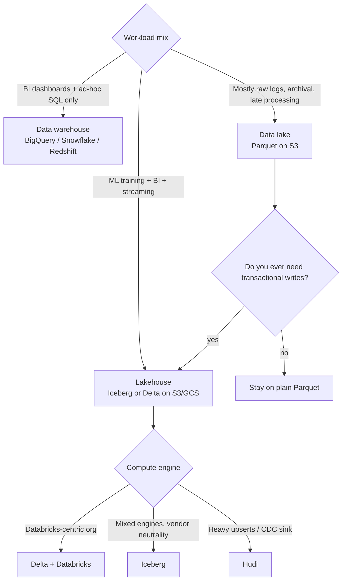
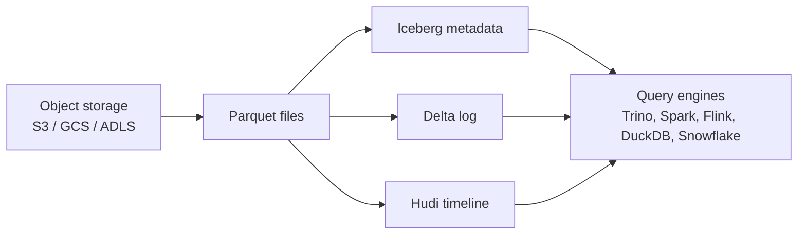
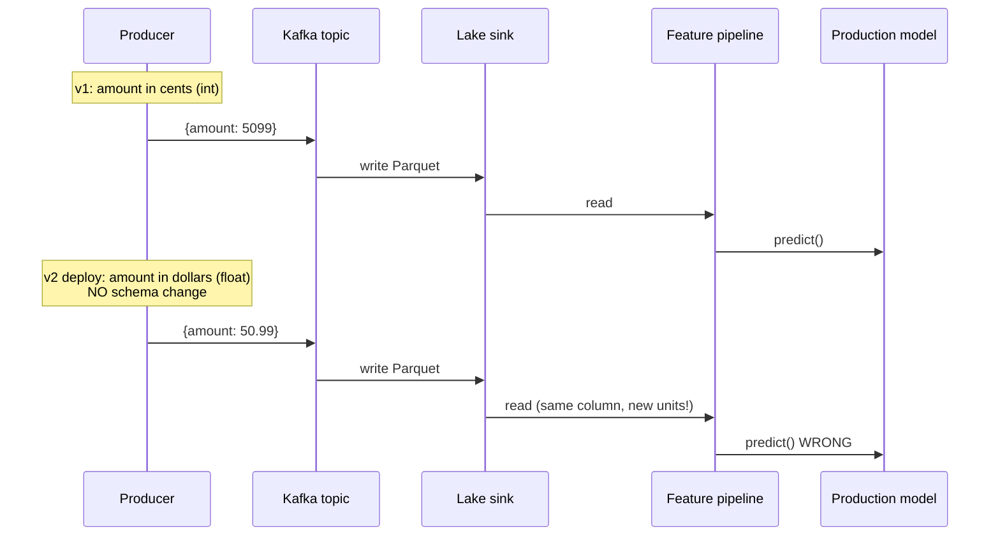
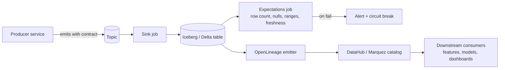

# 01 — Data Platform

> Time budget: 90 minutes. The data platform is the bedrock; every downstream module assumes it works.

**By the end you can:**

1. Choose between lake, warehouse, and lakehouse for a given workload, with a decision tree.
2. Pick an ingestion shape: batch, CDC, or event stream.
3. Pick a storage format (Parquet, ORC, Iceberg, Delta, Hudi) and justify it.
4. Spec a data-quality layer (contracts, expectations, lineage) without over-engineering.
5. Cost a query and propose three concrete levers to reduce it.

---

## 1. Lake vs warehouse vs lakehouse

Three architectures, two decades of debate, one bad article every week. Here is the short version.

| Architecture | Storage | Compute | Schema | Strength | Weakness |
|--------------|---------|---------|--------|----------|----------|
| **Data warehouse** | Proprietary columnar (BigQuery, Snowflake, Redshift) | Coupled to storage | Schema-on-write | Sub-second analytical SQL on cleaned data. ACID. | Vendor lock-in. Storage cost. Hard to use for ML training (no easy file access). |
| **Data lake** | Open files on object storage (S3, GCS, ADLS) — usually Parquet | Decoupled (Spark, Trino, DuckDB, Ray) | Schema-on-read | Cheap. Open. ML-friendly (you can read files). | No ACID without a table format. Easy to make a swamp. |
| **Data lakehouse** | Open files + ACID table format (Iceberg, Delta, Hudi) on object storage | Decoupled | Schema-on-write, evolves cleanly | The warehouse and the lake had a child. ACID + open storage + ML-friendly. | Newer. More moving parts than either of the above. |

The lakehouse pattern (Armbrust et al., CIDR 2021) is the dominant new build as of 2026. Iceberg specifically has become the de facto open table standard; most cloud vendors now read and write it natively.

### Decision tree

For an ML-heavy organization in 2026, the default is **Iceberg on object storage, queried by multiple engines, with a metadata catalog**. This is what Netflix, Stripe, Shopify, Apple, LinkedIn, and most new builds have converged on (Netflix Iceberg post 2018-2022; Apple Iceberg blog 2023; LinkedIn 2024).

---

## 2. Ingestion shapes

Three shapes, picked by the producer's behaviour.

| Shape | Source | Latency to lake | Schema control | When to use |
|-------|--------|------------------|----------------|-------------|
| **Batch** | Files dropped by upstream (CSV, JSON, Parquet) | Hours | At read time | Vendor data feeds, slow-moving reference data, daily SaaS exports. |
| **CDC** | Row-level changes from an OLTP DB | Seconds-minutes | Pinned to source schema | Replicating production DB tables for analytics + ML. Debezium, Fivetran, Airbyte are the workhorses. |
| **Event stream** | Producers emit semantic events to Kafka / Kinesis / PubSub | Seconds | Producer-owned | First-party telemetry, click logs, IoT, anything where the producer is your own service. |

A real platform has all three, and they meet in the warehouse / lakehouse via a unified write path.

### CDC vs event stream — the subtle distinction

CDC mirrors **rows**. Event streams emit **facts**. The difference matters at the ML layer:

- A CDC stream of `users` rows tells you the current state. It is not a useful training signal because by the time you read it, the old state is gone.
- An event stream of `user_updated` events tells you *what changed* and when. It is the only useful training signal for "did this change cause that outcome?" analyses.

Strong production teams use CDC for **state replication** and event streams for **history**. Conflating them — using CDC as a substitute for events — is a category error and bites you eighteen months in when you need a backfill that includes "what did the user see at time T?"

---

## 3. Storage formats

Once you've chosen a lakehouse, you still have three table formats and several file formats to pick from.

### File formats

| Format | Type | Strengths | Weaknesses | Default for |
|--------|------|-----------|-----------|-------------|
| **Parquet** | Columnar | The analytical default. Wide tool support. Good compression. | Mediocre for write-heavy workloads. | Most analytical data. |
| **ORC** | Columnar | Stronger predicate pushdown for some engines. Hive-native. | Less universal tool support. | Hadoop-heritage stacks. |
| **Avro** | Row | Excellent schema evolution. Compact. | Not analytical. | Kafka payloads, schema registry. |

For ML training feature stores: Parquet on the offline side; serialized protobufs or rows in a KV store on the online side.

### Table formats (the lakehouse layer)

| Format | Origin | Strength | Weakness | Pick if |
|--------|--------|----------|----------|---------|
| **Iceberg** | Netflix (2017), Apache | Engine-neutral. Hidden partitioning. Strong schema evolution. Most cloud vendors now read it. | Heaviest metadata for very small tables. | You want vendor neutrality and many engines. |
| **Delta Lake** | Databricks (2019), Linux Foundation | Mature ACID. Time travel. Great Databricks integration. Now Delta UniForm reads as Iceberg too. | Best inside Databricks. | You are Databricks-centric. |
| **Hudi** | Uber (2017), Apache | Upserts and CDC sinks are first-class. Built around mutability. | Operationally heavier; smaller mindshare. | You are sinking CDC at scale and updates dominate. |

The 2024-2025 trend has been **format convergence** — Delta UniForm and Iceberg's expanding ecosystem mean reads are increasingly portable. Picking a format is no longer a religious decision but it is still a real one because writers have to commit.

### Cost levers — the four that matter

1. **Partitioning.** Partition by the columns you filter on most (`event_date`, `region`). Wrong partitioning is the most common reason a query scans 100x more than it should.
2. **Clustering / sort keys.** Within a partition, sort by the next-most-common filter. Predicate pushdown reads only the relevant row groups.
3. **File size.** Aim for 128 MB to 1 GB Parquet files. Files smaller than this are death by metadata; files larger than this lose parallelism on read. Most lakehouses include compaction jobs to fix this; run them.
4. **Statistics.** Iceberg / Delta keep column min/max per file; queries that filter on those skip files entirely. Don't disable statistics.

A query that costs $20 on a 10 TB table almost always costs $0.05 on the same table partitioned and clustered correctly.

---

## 4. Schema evolution and why it breaks ML

The single most expensive type of bug at the data-platform / ML boundary is a **silent schema change**.

Three layers of defence:

1. **Producer-side data contracts.** The producer declares a schema (with units, semantics, allowed null behaviour) and CI breaks if a change is incompatible. The Bufstream / Confluent Schema Registry / Apicurio model.
2. **Reader-side expectations.** Great Expectations, Soda, dbt tests. Tests that run on every ingest and fail loudly. "Amount > 0", "country is one of [...]", "no nulls in user_id."
3. **Lineage.** OpenLineage events on every write; DataHub or Marquez ingests them. When something breaks, you can find every downstream consumer in seconds instead of days.

Iceberg, Delta, and Hudi all support **schema evolution natively** — adding, dropping, renaming columns without rewriting files. Use it. But schema evolution at the storage layer is not the same as schema evolution at the **semantic** layer; units, defaults, and label semantics still need contracts.

---

## 5. Data quality stack

A minimum-viable data-quality layer:

| Component | Open option | Vendor option |
|-----------|-------------|---------------|
| **Contracts** | Buf / Protobuf + CI | Confluent Schema Registry |
| **Expectations** | Great Expectations, Soda Core, dbt tests | Monte Carlo, Anomalo |
| **Lineage** | OpenLineage + Marquez, DataHub | Atlan, Alation, Collibra |
| **Catalog** | DataHub, Amundsen | Atlan, Alation |
| **Anomaly detection** | Bring your own | Monte Carlo, Anomalo, Lightup |

Build the open core; buy the anomaly detection if your data volume justifies it. A team of three engineers should not be building data anomaly detection.

---

## 6. Cost: what a query actually costs

A useful budget exercise. For a 1 TB Parquet table partitioned by `event_date` and clustered by `user_id`:

| Query | Files scanned | Bytes scanned | Cost on Snowflake / BigQuery (illustrative) |
|-------|----------------|---------------|---------------------------------------------|
| `SELECT * FROM t WHERE event_date = '2026-05-18'` | One partition | ~30 GB | ~$0.15 |
| `SELECT * FROM t WHERE event_date BETWEEN '2026-05-01' AND '2026-05-18'` | 18 partitions | ~540 GB | ~$2.70 |
| `SELECT COUNT(*) FROM t WHERE user_id = 'abc'` | All partitions, but only metadata thanks to min/max | ~5 GB | ~$0.03 |
| `SELECT * FROM t WHERE user_id = 'abc'` (no date filter, no clustering) | All partitions, full scan | ~1 TB | ~$5.00+ |

The 100x range is entirely a function of how the table is laid out, not what the engine is. **The cheapest query is one that doesn't scan files.**

For ML training specifically: snapshot-isolate your training read against a specific Iceberg / Delta snapshot ID. If your training takes two days and the table is mutating during that window, you can otherwise have multiple workers reading slightly different views of the same logical table.

---

## 7. The ML angle — where this module's choices show up

| Choice | Downstream impact |
|--------|-------------------|
| Lake vs warehouse | If you go warehouse-only, you cannot easily train large models because GPU jobs cannot read Snowflake / BigQuery natively. The warehouse becomes a bottleneck. The lakehouse pattern fixes this. |
| Table format | Iceberg / Delta / Hudi all support **time travel**, which lets you train against "the data as it was at time T." This is the bedrock of point-in-time correctness; without it, you lose train-serve fidelity. |
| Partitioning | Bad partitioning makes training-set construction a multi-hour job. Good partitioning makes it minutes. |
| Streaming ingest vs CDC | Streaming events give you a history. CDC gives you a current state. Models trained on the difference between past and present need events; models that only need a snapshot are fine on CDC. |
| Schema evolution | A producer adding a nullable column is fine. A producer changing units silently is a Sev-1. Build contracts. |

---

## Cross-links

- [`cheat-sheet.md`](./cheat-sheet.md)
- [`exercises.md`](./exercises.md)
- [`pitfalls.md`](./pitfalls.md)
- [`case-studies/`](./case-studies/)
- Reference: [`../diagrams-shared/online-ml-reference-architecture.md`](../diagrams-shared/online-ml-reference-architecture.md)
- Up next: [02 Feature Stores](../02-feature-stores/README.md)

## Sources

- "Lakehouse: A New Generation of Open Platforms," Armbrust, Ghodsi, Xin, Zaharia (CIDR 2021).
- "Apache Iceberg: An Architectural Look Under the Covers" (Tabular / Apache, 2022).
- "Apache Hudi: Streaming Data Lake Platform," Vinoth Chandar et al. (Apache, 2021).
- Netflix Tech Blog, Iceberg posts (2018-2022).
- "Building the data platform at Apple with Iceberg" (Apple, 2023).
- "Minerva: A Centralized Metric Platform" (Airbnb Engineering, 2018).
- "DataHub: A Generalized Metadata Search & Discovery Tool" (LinkedIn, 2020).
- OpenLineage specification, current release.
