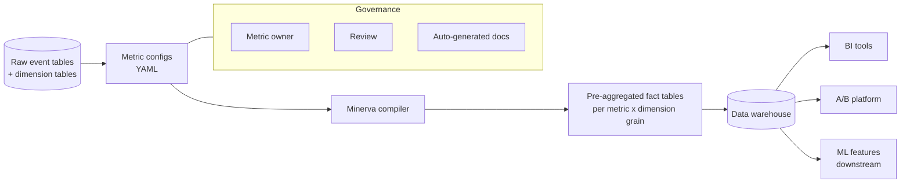

# Airbnb — Minerva (2018)

## Problem

Airbnb had hundreds of teams each writing SQL for "active user," "booking conversion," "host cancellation." Numbers disagreed across dashboards. A single metric, defined in five places, drifted in subtle ways. The data science org was spending more time reconciling definitions than analyzing.

## Architecture

A metric is defined once, in YAML, with its grain (event source, dimensions, aggregation, filters). Minerva compiles the YAML into SQL, materialises the aggregates, and exposes them as canonical tables that every downstream tool reads.

## Three load-bearing decisions

1. **Declarative metrics, compiled.** The metric definition is data, not SQL. The compiler can change without rewriting metrics.
2. **One metric, many grains.** Pre-aggregated cubes for (metric x dimension x time-grain) make BI fast and A/B analyses reproducible.
3. **Ownership is required.** Every metric has an owner; reviews are mandated for material changes.

## What didn't go to plan in the first iteration

- **Pre-aggregation explosion.** Naive cubes blew up storage; the team had to introduce lazy materialisation and grain pruning.
- **Long-tail of one-off metrics.** Many teams wanted "the same thing but slightly different" for one report. Minerva had to add inheritance and parameterisation to avoid YAML sprawl.
- **Performance vs flexibility.** Pre-aggregation made BI fast; ML feature consumers sometimes wanted finer grains than were materialised, forcing a fallback to raw events.

## What you should steal

- The pattern transfers directly to **feature stores**. A feature is a YAML definition, compiled to SQL for offline and to service code for online. See [Module 02](../../02-feature-stores/README.md).
- **One definition, one owner.** Don't let SQL for the same concept proliferate across dashboards or notebooks.
- The willingness to **make a small platform team** that owns the abstraction. Three people on Minerva saved hundreds elsewhere.

## Sources

- "Minerva: A Centralized Metric Platform" (Airbnb Engineering, 2018).
- "How Airbnb Standardized Metric Computation at Scale" (Airbnb, 2020-2021).
