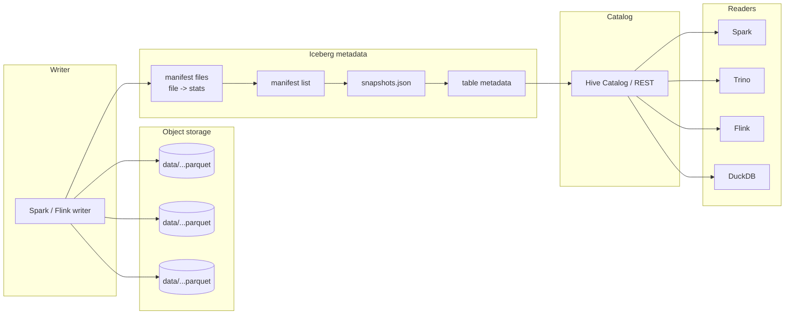

# Netflix — Iceberg origin (2018-2022)

## Problem

By 2018, Netflix was running Hive on S3 at petabyte scale. The Hive metastore had become the bottleneck: listing partitions for a table with millions of partitions took minutes; atomic multi-file commits did not exist; partition evolution required full-table rewrites. The data warehouse team needed a way to keep the open file format (Parquet on S3) but get warehouse-grade transactional semantics on top.

## Architecture

The key insight: the file layout doesn't change, but a small tree of JSON / Avro metadata files describes "the table as of snapshot N." A commit is an atomic pointer swap to a new root metadata file. Readers always see a consistent snapshot.

## Three load-bearing decisions

1. **Manifests carry per-file statistics.** Min/max, null counts, lower / upper bounds per column. Query planners prune at metadata time, not file time.
2. **Hidden partitioning.** The user writes `day(event_ts)`; queries on `event_ts` get partition pruning automatically without the user knowing or caring about partition columns. This was the breakthrough — Hive's "you must filter on the partition column" friction disappeared.
3. **Engine neutrality from day one.** Iceberg was designed to be readable by Spark, Trino, Flink, and others equally; this is why it eventually ate the lakehouse market.

## What didn't go to plan

- **Catalog standardization** took years. The Hive Metastore worked but was a legacy weight. Iceberg's REST catalog spec (2023-2024) finally made the catalog interchangeable, but until that, every engine had its own catalog quirks.
- **Adoption pace.** Netflix open-sourced Iceberg in 2018. Wide adoption outside Netflix didn't happen until 2021-2022 when Snowflake, BigQuery, and others added Iceberg support.
- **Writes still go through one engine at a time.** Concurrent writers from different engines required careful coordination; this remained a sharp edge into the early 2020s.

## What you should steal

- The **snapshot pointer** pattern. Atomic commits on top of immutable files is the right primitive for any system you build that has both readers and writers on object storage.
- **Statistics-in-metadata** as a query optimisation. Prune in JSON, not in Parquet.
- The discipline of **versioning the table format itself**, not just the data. Iceberg v1 to v2 to v3 evolves with the ecosystem; teams that pinned to v1 can upgrade explicitly.

## Sources

- Netflix Tech Blog: Iceberg posts (2018-2022).
- "Apache Iceberg: An Architectural Look Under the Covers" (Tabular, 2022).
- Apache Iceberg specification v2 and v3.
- "Lakehouse: A New Generation of Open Platforms," Armbrust et al. (CIDR 2021).
