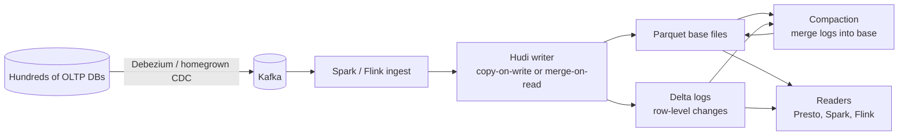

# Uber — Hudi (2017-2021)

## Problem

Uber's data platform sank firehose CDC streams from hundreds of OLTP databases into the lake. Hive tables on S3 / HDFS didn't support upserts; every update meant rewriting partitions. At Uber's scale (trips, payments, driver state) this was untenable. Uber needed a table format that natively supported upserts and deletes on object storage.

## Architecture

Two write modes:

| Mode | Behaviour | Trade-off |
|------|-----------|-----------|
| **Copy-on-write (CoW)** | Each update rewrites the affected Parquet file. | Read-fast, write-slow. |
| **Merge-on-read (MoR)** | Updates land in a row-oriented log; readers merge on the fly; compaction periodically merges logs into Parquet. | Write-fast, read-slower until compaction. |

## Three load-bearing decisions

1. **Upserts are first-class.** No other table format in 2017 treated mutability as a primary concern; Iceberg and Delta added it later but Hudi was built around it.
2. **Two write modes for the same logical table.** Operators choose based on the read-write profile of each table.
3. **Incremental queries.** A Hudi reader can fetch "changes since timeline X" — useful for downstream ETL that wants to process only what's new.

## What didn't age well

- **Operational complexity.** Hudi has timeline files, base files, log files, archive files, and a compaction scheduler. The fleet of cron jobs around Hudi tables can be larger than the data team itself.
- **Ecosystem mindshare** drifted to Iceberg as upserts became table-stakes features there too (Iceberg v2 row-level deletes, 2022). Hudi remained strong for high-mutation workloads but lost in the average new-build decision.
- **Schema and partition evolution** were available but less ergonomic than Iceberg's equivalents.

## What you should steal

- The **CoW vs MoR trade-off** is real; if you're building any system over object storage with updates, you face the same question.
- The **incremental-query** primitive. Downstream pipelines reading "changes since" is a far cheaper integration pattern than full-table reads.
- The reminder that **mutable lakehouses cost more to operate** than append-only ones. If you can model your data as append-only events, do it; you save real ops time.

## Sources

- "Apache Hudi: Streaming Data Lake Platform," Vinoth Chandar et al. (Apache, 2021).
- Uber Engineering Blog: Hudi posts (2017-2023).
- "Real-time Data Infrastructure at Uber" (VLDB 2021).
