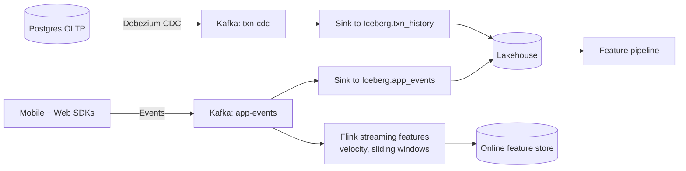

# 01 — Data Platform exercises

---

### 1. DECISION. Your team has a Snowflake warehouse holding everything, and you're about to start training transformer-based models on 10 TB of internal text. What do you do?

Solution

You cannot efficiently train GPU jobs over Snowflake — there is no native file-protocol read from a GPU node, and pulling 10 TB through a JDBC connection is impractical.

Three reasonable moves:

1. **Export to S3 / GCS in Parquet, governed by Iceberg.** Snowflake supports external Iceberg tables now (since 2023-2024); you keep BI reading from Snowflake and add a lakehouse plane for ML.
2. **Use Snowflake's native Iceberg tables.** Same data, two read paths.
3. **Bulk-export once for the first training run** and accept staleness. Cheap. Not sustainable.

Default: option 2 if it fits your governance, option 1 otherwise. Don't do option 3 long-term — it is option 0 of "warehouse swamp by another name."

---

### 2. INTERVIEW. Design the ingestion stack for a fintech that processes 1M transactions per day plus continuous app-event telemetry. The ML team needs both for fraud models.

Solution

Two pipelines into one lakehouse.

Three SLOs to specify: (a) CDC freshness — txn rows in Iceberg within 60s, (b) event ingest freshness — p95 events available in Iceberg within 120s, (c) streaming feature freshness — p95 features in online store within 10s.

Data contracts on both the CDC payload schema and the app event schema. Great Expectations on every Iceberg write.

---

### 3. DECISION. A 2.5 TB Parquet table with 30 columns is partitioned by `region` (12 values). Queries typically filter by `event_date` and rarely by region. The query bill is high. What's the fix?

Solution

Re-partition by `event_date`, cluster by `region` and `user_id` as secondary. Queries that filter by date will scan one partition (~10-50 GB) instead of one twelfth of all partitions (~200 GB+).

Operationally: do this with a one-time rewrite job that produces a new table; cut consumers over; drop the old. Don't do an in-place repartition during business hours — it doubles storage temporarily and slows reads.

If `region` is genuinely useful for partition pruning some of the time, a Z-order (Delta) or hidden partitioning by `event_date` plus clustering by `region` (Iceberg) gets you both.

---

### 4. CASE-STUDY READ. Read "Apache Iceberg: An Architectural Look Under the Covers" (Tabular / Apache, 2022). What three properties does Iceberg's metadata layer give you that plain Parquet on S3 does not?

Solution

1. **Atomic transactions.** Iceberg commits are atomic snapshots; readers see either the old state or the new, never a partial write.
2. **Hidden partitioning.** Iceberg tracks partition transformations (e.g., `day(event_ts)`) in metadata, so you can change the partitioning scheme without rewriting the data, and queries don't need to know the physical partition columns.
3. **Per-file statistics.** Min/max, null counts, and value counts per column per file enable predicate pushdown without opening files. Combined with manifest files, queries can prune to the relevant subset in metadata before any data is read.

Bonus: time travel, schema evolution without rewrite, and engine portability — the same Iceberg table is readable by Spark, Trino, Flink, DuckDB, Snowflake, BigQuery, and an ever-growing list.

---

### 5. INTERVIEW. Walk through how you would build "the data platform you'd want for the first six months at a Series A startup that wants to do ML."

Solution

Bias to ruthlessly simple, ML-ready, and cheap.

- **Object storage** (S3 or GCS).
- **Iceberg** with the AWS Glue or Polaris catalog. Costs $50/month at this scale.
- **Ingest:** Airbyte or Fivetran for SaaS sources, Debezium or DMS for Postgres CDC, a single Kafka cluster (managed: Confluent Cloud or AWS MSK Serverless) for app events.
- **Compute:** DuckDB or Trino for SQL, Spark on Kubernetes (or Databricks at $$ if scale demands it) for heavy jobs.
- **Quality:** Great Expectations checks in CI, dbt tests on transforms.
- **Lineage:** OpenLineage + Marquez. Free.
- **Catalog:** DataHub or Amundsen. Free.

Do **not** build: a custom metadata catalog, a custom CDC system, an in-house Kafka deployment, a homegrown feature store. None of these are differentiators at this stage.

When you outgrow this: usually the first thing to break is the streaming side. Plan to move to managed Flink or a dedicated streaming platform around the 100k events/sec mark.

---

### 6. DECISION. The producer team wants to "just rename the `total` column to `amount` in the events." What's your response?

Solution

No, and here's the contract:

1. The producer adds the new field `amount` alongside `total`.
2. Both fields are populated for at least one full retention window (often 30-90 days) so historical queries continue to work.
3. The data contract marks `total` as deprecated; CI fails any new code that reads `total` directly.
4. After the deprecation window, the producer stops writing `total`.
5. Lineage tooling identifies downstream consumers; each gets a migration ticket.
6. Old data is left as-is (or, if a renaming on history is required, a one-time rewrite job runs with a clear rollback).

This is producer discipline, not data-engineering discipline. The producer owns the schema.

---

### 7. CASE-STUDY READ. Skim the Netflix Iceberg blog posts (2018-2022). What three problems did Netflix have with Hive tables that drove them to invent Iceberg?

Solution

1. **Partition listings at scale.** Hive's metastore listed partitions by walking the storage prefix; with millions of partitions, planning a query took longer than running it.
2. **Schema and partition evolution were unsafe.** Changing partitioning required rewriting the table; changing schema in-place was a footgun.
3. **No atomic multi-file commit.** A failed write left orphaned files and confused readers; there was no transactional semantics over plain object storage.

Iceberg's manifest-list + manifest design pushes partition info into metadata files (cheap to list) and snapshot commits give atomicity. The 2018-2020 Netflix posts make a strong case that the right primitive was a versioned snapshot, not a smarter partition scheme.

---

### 8. INTERVIEW. You have a 50 TB user-events table and a 200 GB users dimension table. A join is killing your warehouse. What do you change?

Solution

Several levers:

1. **Broadcast the small side.** At 200 GB the dim is too big to broadcast naively, but a **filtered** version (only users active in the last 30 days) is often 10-50 GB and broadcastable.
2. **Pre-join into a materialised view** updated nightly. Cheap if the dim doesn't change often.
3. **Bucket / sort both sides by `user_id`.** Sort-merge join then runs without a shuffle. Iceberg supports this via partition transforms.
4. **Z-order the events table by user_id** (Delta) so user-keyed reads are mostly local.
5. **Push the filter down.** Most queries don't actually want all 50 TB joined against the dim — they want a date slice. Make sure that filter is pushed past the join.

The biggest lever is almost always #5, and people skip it because the SQL "looks fine."

---

### 9. DECISION. Your CFO asks: "We're spending $400k/month on Snowflake. Can you cut that in half?" What do you assess?

Solution

Three questions before any answer:

1. **Where is the spend?** Snowflake's bill is dominated by compute (warehouse credits) far more than storage. The 80/20 is almost always five queries or five dashboards. Find them.
2. **Are queries scanning what they should?** Run the query history; bucket by bytes scanned vs result size. Queries with ratios above 1000:1 are usually fixable with partitioning or clustering.
3. **Are warehouses sized right?** Many teams run XL warehouses for queries that would finish on Small. Auto-suspend should be aggressive.

After triage, the cuts come from:

- Pushing heavy ML feature jobs to Spark on cheaper compute (often half the cost per unit work).
- Materializing the top-10 expensive queries as tables or MVs.
- Right-sizing warehouses and tightening auto-suspend.
- Archiving cold data out of Snowflake's storage to S3 with Iceberg external tables.

50% savings is plausible without changing vendors. The biggest risk is breaking dashboards during the migration; gate each move behind a query-equivalence test.

---

### 10. INTERVIEW. Describe the difference between time-travel and point-in-time joins. When do you need which?

Solution

**Time travel** is a *single-table* property: "give me this table as of timestamp T." Iceberg / Delta / Hudi support it natively.

**Point-in-time (PIT) join** is a *multi-table* property: "give me the value of feature F for entity E as of timestamp T, where F lives in a different table with its own timeline." PIT joins are the standard way to build a training set without leaking future information.

Time travel is the **building block** for PIT joins; PIT join logic is the SQL on top.

You need time travel for reproducible training-set construction and for forensic queries ("what did the dashboard show on Tuesday?"). You need PIT joins for training-set construction in any ML system with features that change over time (i.e., all of them). See [Module 02](../02-feature-stores/README.md).

---

### 11. CASE-STUDY READ. Read "Minerva: A Centralized Metric Platform" (Airbnb Engineering, 2018). What did Airbnb solve that an ML team also benefits from?

Solution

Minerva centralized **metric definitions**. Instead of every team writing its own SQL for "active user," everyone reads from a Minerva-computed dimensional fact table; everyone gets the same numbers.

For ML teams, the analogy is **feature definitions**. A feature store (Module 02) is Minerva for features. The same architectural insight applies: a centralized, declarative metric (or feature) registry beats every team rolling their own SQL by an order of magnitude in correctness and maintainability.

---

### 12. INTERVIEW. The product team wants "real-time" reporting on a metric that currently lands in the warehouse on a 6-hour delay. They are vague on what "real-time" means. What do you do?

Solution

Pin a number. The architecture is determined by the latency requirement:

- **6 hours -> 1 hour:** keep the batch pipeline; run it more often. Cheap.
- **1 hour -> 5 minutes:** micro-batch with a 5-min Flink job or a frequently-running Spark job.
- **5 minutes -> seconds:** dedicated stream-processing pipeline (Flink, Kafka Streams, Materialize, RisingWave) writing to a serving layer.
- **Sub-second:** stream + materialized views in the serving DB (a Druid / Pinot / ClickHouse for OLAP-on-stream).

Each step up is 5-10x more expensive than the last. Push hard for "what's the cost of being one minute late?" — that's the actual product requirement; "real-time" is shorthand.

