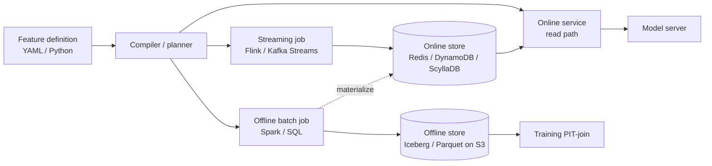
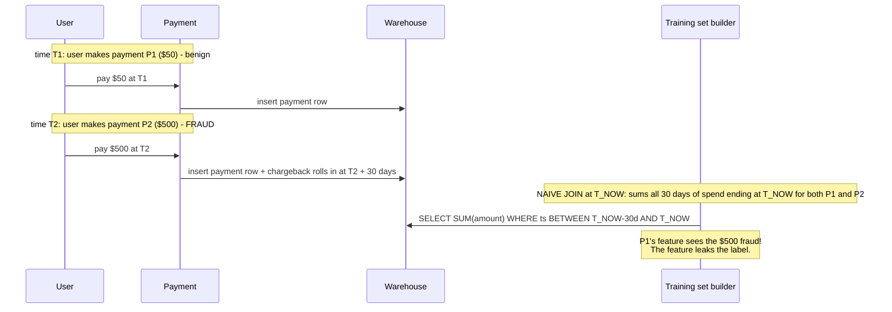
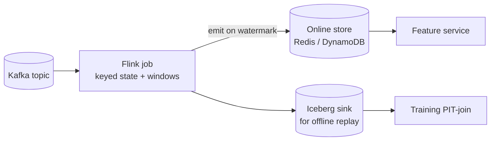
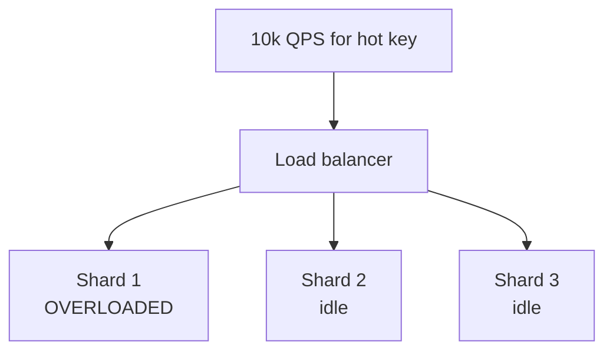
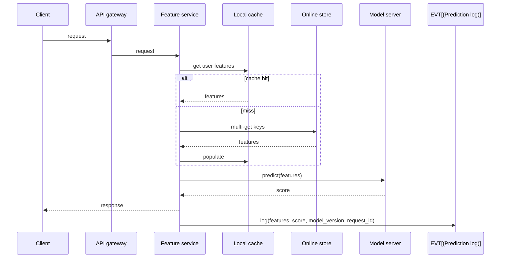

# 02 — Feature Stores

> Time budget: 90 minutes. This is the most under-built piece of infrastructure in early-stage ML organisations and the most-quoted lesson of mature ones.

**By the end you can:**

1. Explain the two-store pattern and why it exists.
2. Walk through a point-in-time (PIT) join, on paper, and show where naive joins leak labels.
3. Choose between Feast, Tecton, Vertex / Databricks Feature Store, and in-house, with a decision matrix.
4. Spec streaming features in Flink or Kafka Streams.
5. Diagnose the hot-key feature problem and apply the YouTube-style embedding cache pattern.

---

## 1. Why feature stores exist

The single failure mode that motivates feature stores: **training-serving skew** (introduced in [Module 00](../00-foundations/README.md)).

Two teams, two execution paths, one logical feature. The training path computes `user_avg_purchase_30d` over the warehouse in SQL. The serving path computes the same name in a Go microservice over Redis. After three months, the two implementations differ: one counts refunds, one doesn't. Offline AUC is great. Online click-through tanks.

The fix is a discipline: **one feature definition, two execution backends** — offline (training) and online (serving) — derived from the same declarative source. The "feature store" is the system that enforces this.



The two-store pattern decouples the **freshness requirement** (online) from the **throughput requirement** (offline / training). It also gives you the only thing that actually defends against skew: a single declaration that compiles to both paths.

---

## 2. Point-in-time correctness

The most common ML training bug. Naive joins leak label information.

Imagine you train on `(user, feature, label)` rows. Each row is "user U at time T had feature F, and label L." If `F` is computed as "U's last login time as it stands today," not "U's last login time as of T," your feature has used information from after the label was assigned. Your model will look spectacular offline and fail online because at inference time you cannot read the future.

### Worked example

A fraud model on payments. Feature: `user_total_amount_30d` (sum of card spend in the last 30 days). Label: `was_fraud` on the payment.



The naive `SUM(...) GROUP BY user_id` evaluated as of `T_NOW` adds the $500 fraudulent payment to P1's feature value, even though at T1 that payment hadn't happened yet. The model learns "users whose 30-day spend includes a $500 payment are fraud-likely" — and this looks great on the eval set because that feature *does* correlate with fraud, but only by virtue of seeing the future.

### Correct PIT join

For each training row at time `T_row`, the feature must be computed using only data with `event_time < T_row`.

```sql
-- Conceptually:
SELECT
  p.user_id,
  p.payment_id,
  p.event_time AS T_row,
  (SELECT SUM(amount)
     FROM payments
    WHERE user_id = p.user_id
      AND event_time < p.event_time
      AND event_time >= p.event_time - INTERVAL '30 days') AS user_total_amount_30d,
  p.is_fraud
FROM payments p;
```

In practice you don't write this SQL. The feature store generates it for you from the declaration, and runs it efficiently using a sorted merge over (entity, time) windows.

### The three rules

1. Every feature has an **event-time column**.
2. Every training row has a **timestamp** (the moment the prediction would have been made).
3. The PIT join takes the **last value of each feature as of `T_row - epsilon`** where `epsilon` is at least the feature's typical serving age.

Subtle point on `epsilon`: at serving time, you read whatever the online store has *now*, which is some seconds (or minutes) stale relative to the truth. Training with `event_time < T_row` is too generous — it gives the model a feature value that wouldn't have been available to the serving model. Use `event_time < T_row - epsilon` where epsilon matches the typical online freshness.

---

## 3. Streaming features

Most real production features are computed from streams: windowed aggregations like "clicks in the last 5 minutes," "distinct cards used in the last hour," "sessions per user in the last day."



Key concepts (Apache Flink documentation, Flink Forward 2018-2023 talks):

| Concept | What it does | Why ML cares |
|---------|--------------|--------------|
| **Event time** | Time the event happened, not when it arrived. | Late events shouldn't lie about ordering. |
| **Watermarks** | "I think I've seen all events up to time T." | Lets the job emit final results without waiting forever. |
| **Sliding / tumbling / session windows** | The three kinds of aggregation window. | Most ML features are sliding-window sums or counts. |
| **Keyed state** | Per-entity state (per user, per device). | The natural granularity for features. |

### Streaming feature parity at training time

This is the hardest part. The streaming feature `user_clicks_5min` is computed by a Flink job and lives in the online store. For training, you need its value at every historical T. Two approaches:

1. **Materialize streaming features to the offline store.** Same Flink job writes both online (KV) and to an Iceberg sink. Training PIT-joins against the offline copy.
2. **Replay the stream offline.** Run the same Flink job over Kafka's retained history (or an archived event log). Generates a historical feature timeline by replay.

Option 1 is operationally cheaper. Option 2 is necessary if you didn't materialize from day one and need to backfill a new feature.

---

## 4. Build vs buy — the decision matrix

| Option | Strengths | Weaknesses | Pick if |
|--------|-----------|------------|---------|
| **In-house from scratch** | Full control. Fits your existing stack precisely. | 6-12 months of platform-team time before payback. | You have unusual constraints (PII residency, regulator-driven), or you're at Uber / Pinterest / Netflix scale where the abstraction tax of an off-the-shelf product exceeds the build cost. |
| **Feast (open source)** | Free. Multi-cloud. Good Python ergonomics. Supports many online stores. | Streaming features need third-party engines. Less batteries-included than Tecton. | You want open, are willing to integrate Flink yourself, and have a competent platform team. |
| **Tecton** | Streaming, batch, online, offline all in one. Production-grade. Strong PIT-join story. | Commercial pricing; another vendor. | You want a turnkey production-grade feature store and the spend is justified. |
| **Vertex AI Feature Store / Databricks Feature Store** | Native integration with cloud / lakehouse. | Lock-in. Less flexible than Tecton. | You're already deep in GCP / Databricks and don't want a separate vendor. |
| **Hopsworks** | Open core; strong PIT-join engine; ML platform included. | Smaller ecosystem than Feast. | You want open + ML-platform-in-a-box. |
| **Just use Kafka + Redis + a SQL convention** | Cheapest. Honest about the lack of abstraction. | You will reinvent the feature store badly over 18 months. | You're prototyping; commit to migrating before you reach 100 features. |

A useful triage: **count your features**. Under 20 features and one model: Redis + SQL is fine. Twenty to 200 features across more than one team: adopt Feast or Tecton. Over 200, or multiple regulated tenants: this is where the platform-team payoff starts.

Public 2022-2024 posts from Tecton, Feast, Doordash, Robinhood, Wayfair, and LinkedIn line up around this triage.

---

## 5. The hot-key feature problem

Some features have a Zipfian distribution. A single key (Justin Bieber, a viral product, a busy merchant) receives 100x more reads than the median. The naive online store collapses under the skew: one shard hot, others idle.



Three established patterns:

1. **Per-key in-process cache.** Each model server replica caches hot keys with a short TTL. The cache hit ratio for the top-100 keys is often >90%; the online store sees only the long-tail traffic.
2. **Pre-computed materialized fan-out.** For a known hot key, materialize the feature value in the API server's memory at deploy time; the request never hits the online store.
3. **Read-through CDN edge cache.** Fronts the online store with a CDN layer that handles the hot keys without burning DB throughput. Often the cheapest fix at consumer-product scale.

YouTube's published recommender architecture (Covington et al., RecSys 2016, and follow-ups) describes a per-shard embedding cache for hot items. Same pattern, different domain.

### A subtler hot-key failure

Aggregation features (like "user views per second over the last minute") at the *production* of the feature can also overload a streaming engine when one key dominates. Flink's solution: pre-aggregation in front of the keyed shuffle. Specifically, a "local combine" step bundles per-key updates within a window before the partitioned reduce. This is well-described in Flink Forward 2019-2022 talks on data-skew handling.

---

## 6. Feature serving — the read path



Three rules for the read path:

1. **One multi-get, not N gets.** Batch all feature reads into one call to the online store.
2. **Log the features that were actually read**, not the features you intended to read. The first is the truth.
3. **Have a fallback feature value** for every feature. When the online store is degraded, you return a defined default and a metric (`feature_fallback_count`), not an exception.

---

## 7. Cross-links and what to read next

- [`cheat-sheet.md`](./cheat-sheet.md)
- [`exercises.md`](./exercises.md)
- [`pitfalls.md`](./pitfalls.md)
- [`case-studies/`](./case-studies/)
- Reference: [`../diagrams-shared/online-ml-reference-architecture.md`](../diagrams-shared/online-ml-reference-architecture.md)
- Up next: [03 Training Infra](../03-training-infra/README.md)

## Sources

- "Meet Michelangelo: Uber's Machine Learning Platform" (Uber Engineering, 2017).
- "Feature Store as a Service" (Tecton, 2020).
- Feast documentation, current release.
- "Real-time Machine Learning at Pinterest" (Pinterest Engineering, 2022).
- "ML Feature Engineering at Scale at LinkedIn" (LinkedIn Engineering, 2023).
- "Deep Neural Networks for YouTube Recommendations," Covington et al. (RecSys 2016).
- Apache Flink documentation, current release.
- "Data Skew Handling in Apache Flink," Flink Forward 2019-2022 talks.
