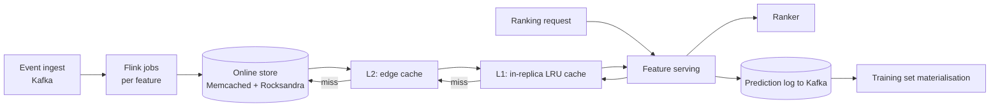

# Pinterest — real-time ML feature serving (2022)

## Problem

Pinterest serves billions of pin recommendations per day. By 2022, the ranking models needed features computed at sub-second freshness: "the pin the user just clicked on," "the board they just opened." Their existing Memcached-fronted online feature store could not absorb the QPS pattern without hot-shard failures.

## Architecture

Three caching tiers; the bottom tier (Online store) only sees the long tail.

## Three load-bearing decisions

1. **Multi-tier caching.** L1 in-process LRU; L2 edge; L3 the durable online store. Each tier absorbs a different traffic distribution.
2. **Per-feature Flink jobs, not one mega-job.** Failure isolation; one feature's bad code doesn't stall every feature.
3. **Prediction logs are the training source.** Logged features at serving time become the training set, eliminating skew.

## What didn't go cleanly

- **Cache coherency.** A streaming feature that updates often vs an L1 cache with a TTL: how stale can the L1 entry be before predictions degrade? Pinterest's post describes per-feature TTL policies — features that update slowly (e.g., user-30-day-history) can cache for longer; features that update fast (e.g., last-minute-clicks) have short TTLs.
- **Hot-key fan-out.** A viral pin spiking from 100 QPS to 50k QPS in seconds breaks naive autoscaling. Pinterest pre-warms candidate hot keys based on early signals.
- **Streaming feature backfills** for retroactive feature additions remain operationally heavy.

## What you should steal

- The **three-tier cache** is the right default for any consumer-scale online feature store.
- **Per-feature failure isolation.** Don't put twenty features in one streaming topology; one bad upstream takes down all twenty.
- The **prediction log as training source.** This is the third place in this course where this pattern is endorsed (after Uber 2017 and Tecton 2020); when three independent teams converge on a pattern, treat it as load-bearing.

## Sources

- "Real-time Machine Learning at Pinterest" (Pinterest Engineering, 2022).
- "Building a Feature Platform at Pinterest" (Pinterest Engineering, 2023).
