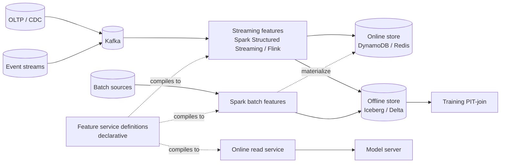

# Tecton — streaming-first feature store (2020)

## Problem

When the Tecton founders left Uber Michelangelo and started Tecton in 2019, they argued that the dominant ML workloads of the next decade — real-time recommendations, fraud, pricing, personalization — would be streaming-first. The previous generation's "warehouse-as-source, online as cache" architecture would invert.

## Architecture

The key inversion: a streaming feature is **the canonical compute**; the offline timeline is what the streaming job emits as it runs. Backfill = replay the streaming job over historical Kafka topics.

## Three load-bearing decisions

1. **Streaming as the primary mode.** Batch features are reformulated as "a streaming feature with an infinitely wide window."
2. **PIT join engine is a first-class product.** Tecton's job is to generate correct PIT SQL for arbitrary feature definitions; this is harder than it sounds.
3. **DataFrames-on-features API.** Data scientists write features in Python with familiar semantics; the compiler handles the streaming / batch / online split.

## What didn't age perfectly

- **Pure streaming-first** is the right framing for high-velocity domains; for many lower-velocity ML problems (daily marketing scores, weekly churn), batch is still the natural shape and "everything is a stream" adds operational cost. By 2024, the Tecton product had matured to support both natively.
- **Spark Structured Streaming** as the initial engine had ergonomic and latency limits that pushed users toward Flink for the most demanding cases.
- **Closed source.** Building on a managed product is a lock-in trade; the Feast open-source counterweight matured during the same period.

## What you should steal

- The framing: **for real-time ML, the offline store is a side-effect of the streaming pipeline**, not a primary source.
- Treat the **PIT-join compiler** as a non-trivial engineering investment if you build in-house. Getting PIT joins right is the single highest-leverage piece of code in a feature store.
- The declarative-feature API. If your data scientists have to write Spark and Flink by hand, they will not write features.

## Sources

- "Feature Store as a Service" (Tecton, 2020).
- "Streaming Feature Pipelines" (Tecton Engineering, 2021-2023).
- Tecton's PIT join documentation (current release).
