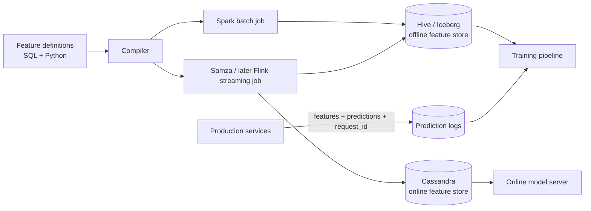

# Uber — Michelangelo feature store (2017)

## Problem

By 2017, Uber had separate ML pipelines for ETA, fraud, surge pricing, marketplace matching, and food delivery. Each team computed its own features. The same logical feature ("user lifetime trips") existed five times with five subtly different implementations. Onboarding a new use case took months because everything was rebuilt.

Michelangelo's feature store solved one thing: **a single feature definition shared across teams and across training and serving**.

## Architecture

## Three load-bearing decisions

1. **Single declaration of a feature.** No team writes its own SQL for "user trips." They look it up in the central registry; if it doesn't exist, they add it.
2. **Online + offline derived from one source.** The compiler turns the declaration into a Spark job (offline) and a Samza topology (streaming). Identical semantics by construction.
3. **Prediction logs as training source.** Logged features at serving time become training data, killing the dominant skew failure mode.

## What didn't go to plan

- **Adoption took political work.** A central platform team owning features meant individual teams couldn't ship features on their own timeline. Uber had to invest in self-service so teams could register features without platform-team review.
- **Samza chosen in 2017; later migrated to Flink** as the streaming ecosystem coalesced. The lesson: the streaming engine is the hardest thing to swap.
- **Cassandra online store** had hot-key issues at consumer scale; subsequent posts describe layered caching to handle Zipfian access.

## What you should steal

- The **logged-features-as-training-data** pattern. It's the highest-ROI single move you can make.
- A **central registry** with a discovery UI. ML engineers should be able to type "user trips" and find the canonical feature, not invent a new one.
- **One compiler, two backends** as the durable answer to skew.

## Sources

- "Meet Michelangelo: Uber's Machine Learning Platform" (Uber Engineering, 2017).
- "Scaling Machine Learning at Uber with Michelangelo" (Uber Engineering, 2019).
- "Real-time Data Infrastructure at Uber" (VLDB 2021).
