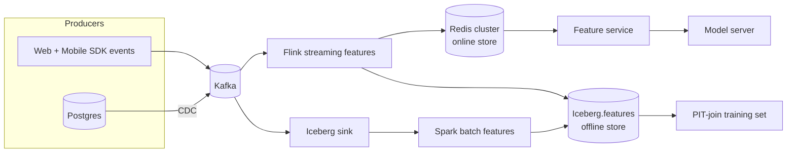

# 02 — Feature Stores exercises

---

### 1. INTERVIEW. Design a feature store for a 50M-user e-commerce site. Spec offline, online, streaming, and the read path.

<details><summary>Solution</summary>



Specs:
- Offline store: Iceberg on S3, partitioned by `event_date`, clustered by `entity_id`.
- Online store: Redis cluster, hash-tagged by user shard, p99 multi-get < 5 ms.
- Streaming: Flink with checkpointed RocksDB state.
- Read path: feature service does one multi-get per request, p99 < 8 ms. Local LRU cache for hot keys, 60s TTL.
- Logging: every served `(features, model_version, request_id, score)` to a Kafka topic for training.

SLOs: feature freshness p95 <= 5s for clickstream, p95 <= 30m for daily features. Online store availability 99.95%.
</details>

---

### 2. INTERVIEW. Walk through, on paper, how a PIT join works for `user_avg_review_score_30d` for a training set of 1B labeled (user, item, ts, label) rows.

<details><summary>Solution</summary>

For each labeled row `(u, i, T, y)`:
1. Look up all reviews by user `u` with `review_time < T` and `review_time >= T - 30d`.
2. Compute the average.
3. Emit `(u, i, T, avg_score, y)`.

Efficient implementation: sort both tables by `(user_id, ts)`. Use a sort-merge join with a custom "as-of-and-windowed" reducer. The Spark / Flink / DuckDB community has standard operators for this (`asof_join`, `range_join`). Feast and Tecton generate this query for you from the feature definition.

Cost: O((labels + reviews) log N) once sorted. With 1B labels and 100M reviews, this runs in tens of minutes on a modest cluster.
</details>

---

### 3. DECISION. Choose between Feast and Tecton for a 50-person ML org with three teams (search, fraud, growth) and ~100 features today, scaling to ~400 in 18 months.

<details><summary>Solution</summary>

The decision hinges on platform-team capacity.

**Feast.** Free, open. Requires you to integrate Flink (for streaming features), an online store (Redis/Dynamo), a registry (Postgres), and your CI/CD. Plan on one platform engineer mostly dedicated to it.

**Tecton.** Commercial. Streaming, batch, online, and registry are all in one product; PIT join engine is mature. Cost: meaningful five-to-six-figure annual contract.

At 100 features and three teams the **operational overhead of Feast adds up** but is manageable. At 400 features the streaming complexity is the bottleneck; Tecton's integrated streaming engine is meaningfully cheaper to own than DIY Flink at that scale.

Default recommendation: start on Feast at 100 features, set a tripwire at 250 features to re-evaluate, expect to migrate or commit to Tecton at 400. Bake in the migration cost; the moves are well-documented (Robinhood 2022, Wayfair 2023 posts).
</details>

---

### 4. DECISION. Your offline AUC is 0.91, online AUC is 0.77. Run the diagnostic playbook in order.

<details><summary>Solution</summary>

1. **Schema parity.** Are the columns, dtypes, and units identical in the offline training table and the online feature payload? Diff them.
2. **Distribution parity per feature.** For each feature, compute KS distance between training and the latest serving-logged distribution. Sort descending. The top three offenders are usually the bug.
3. **Timestamp parity.** Pull 100 random training rows and re-fetch their features from the **online store as it stands now**. Compare. If they differ, the offline path is computing something the online path can't.
4. **Model version.** Is the binary deployed actually the one whose offline AUC you measured? Promote-then-rebuild bugs are common.
5. **Population shift.** Only after the above; compare the population that the training set was drawn from with the production population. Different cohorts, different cohort sizes.

Reorder this list to match what you can test fastest given your tooling.
</details>

---

### 5. INTERVIEW. Streaming feature: "distinct merchants the user transacted with in the last hour." Spec the Flink job.

<details><summary>Solution</summary>

Keyed by `user_id`, sliding window of 1 hour with a 1-minute slide.

```text
source: Kafka topic txn-events, event-time = txn_ts
keyBy:  user_id
window: SlidingEventTimeWindow(size=1h, slide=1min)
state:  per window, HyperLogLog++ for distinct merchant ids
output: every minute, emit (user_id, watermark_ts, distinct_count)
sink:   Redis (online) + Iceberg (offline parity)
```

Three reasons to use HLL++ instead of exact:

1. **Memory.** Exact distinct sets blow up state per user with high-traffic merchants.
2. **Latency.** HLL merges are O(register count).
3. **Bounded error.** ~1-2% error is fine for an ML feature; deterministic exactness is rarely worth the cost.

Watermark policy: bounded out-of-orderness of 60s; events later than that are routed to a side output for offline backfill, not dropped.
</details>

---

### 6. CASE-STUDY READ. Read the Tecton "Feature Store as a Service" post (2020). What's the single architectural decision the post argues for above all others?

<details><summary>Solution</summary>

**Streaming-first architecture.** The post argues that real-time ML applications dominate at maturity (recommendations, fraud, dynamic pricing), and those workloads have a streaming feature pipeline as the natural primary path. The offline store is a *replica* of what the streaming layer produces, not the other way round.

This is the inversion of the older Michelangelo-era pattern where the warehouse was the source of truth and the online store was a serving cache. In the streaming-first model, **the Kafka topic is the source of truth**, the streaming feature job is the canonical compute, and both online (KV) and offline (Iceberg) are sinks.

The benefit: feature parity between training and serving comes for free if you set up the sinks correctly, because both are derived from the same Flink job state.
</details>

---

### 7. DECISION. The fraud team wants to add a "is_user_flagged_by_compliance" boolean feature pulled from a third-party SaaS API at request time. Should you?

<details><summary>Solution</summary>

Probably not at request time. Three problems:

1. **Latency:** an external API call adds 50-300 ms to a fraud check that needs to finish in 100 ms.
2. **Availability coupling:** if the SaaS is down, your fraud check fails or returns garbage.
3. **Cost:** per-request external API calls compound.

The fix: subscribe to the SaaS's change stream (most have webhooks or polling APIs) and materialize the flag into the online store. The feature is then a 1 ms KV read. Trade freshness (minutes-to-hours instead of milliseconds) for latency and availability.

The exception: if the regulator's interpretation requires a real-time check, you accept the cost and isolate it on a separate code path with a strict timeout and a fallback to the cached value.
</details>

---

### 8. INTERVIEW. Walk through the read path for a request that needs 30 features for a ranking model. p99 budget for feature read: 8 ms. How do you hit it?

<details><summary>Solution</summary>

1. **Co-locate the 30 features into 3-5 entity reads.** Group by (user, item, context); each entity becomes one multi-get key in the online store.
2. **Use a single multi-get** to the online store, not 30 round trips.
3. **In-process LRU cache** for hot keys; assume ~50% hit rate, so the average call is much cheaper than the worst case.
4. **Wide rows.** Store all user features in one Redis hash / Dynamo item; one read returns the whole bundle.
5. **Tail latency:** the online store needs p99 single-digit ms. Redis cluster on co-located VMs is easy; Dynamo or ScyllaDB depending on scale.
6. **Backoff strategy.** If the feature read times out, return defaults + log a `feature_fallback` event. Better to score with degraded features than to fail.
</details>

---

### 9. DECISION. A teammate proposes computing features inside the model server "to keep things simple." What's wrong?

<details><summary>Solution</summary>

You're rebuilding the feature store badly. Problems:

1. **Multiple consumers of the same feature.** When a second model wants the same feature, you either duplicate the code or move it to a shared library that then evolves; that's a feature store with extra steps.
2. **Training-serving skew.** The training code path is now divorced from the model-server code path. Welcome back to skew.
3. **Streaming features are impossible** in this design — there's no stateful processor inside a stateless model server.

The right path: keep the model server stateless and let a feature service in front of it do the fetches.
</details>

---

### 10. INTERVIEW. The data is logged as `user_country_code` in payments and `country` in events. The model expects `country` (3-letter ISO). What's the architecturally correct place to reconcile?

<details><summary>Solution</summary>

In the feature definition, not in the model code. The feature definition declares:

```yaml
feature: user_country
entity: user
sources:
  - table: payments
    column: user_country_code
    transform: TO_ISO3()
  - table: events
    column: country
    transform: TO_ISO3()
priority: events_then_payments
```

Compiles to offline SQL and to online lookup logic. The model sees one feature, `user_country`. The reconciliation lives in the compile target, not in three places.

A model that does its own reconciliation has assumptions baked in that next quarter's model will inherit without knowing.
</details>

---

### 11. INTERVIEW. You're inheriting a feature pipeline that has no PIT discipline. Forty features, four years of history, six downstream models. Plan the migration.

<details><summary>Solution</summary>

Phase 1 (weeks 1-4): **instrument**.

- Log served features at the request boundary; emit to a Kafka topic.
- Compute KS-distance between served features and training features per model per day. Plot.
- Identify the worst-offender features (those whose distributions diverge most).

Phase 2 (weeks 4-12): **fix the worst offenders first**.

- For each top offender, rewrite the offline computation to mirror the serving computation by adopting served-feature-as-training-data (logged features become the training source of truth).
- For each rewritten feature, retrain the affected models. Expect a fraction to see online metrics tick up.

Phase 3 (months 3-9): **adopt a feature store**.

- Introduce Feast or Tecton.
- Re-declare features one by one. Keep the legacy pipeline running during migration with diff alerts.
- Cut over one model at a time. Sunset legacy.

The phase-1 instrumentation is the highest-value step; teams that skip it never finish phase 2.
</details>

---

### 12. CASE-STUDY READ. Read "Real-time Machine Learning at Pinterest" (Pinterest Engineering, 2022). What did Pinterest do about hot keys?

<details><summary>Solution</summary>

Pinterest's post describes a multi-layer caching strategy for hot keys in feature serving:

1. **In-server LRU cache** at the feature service replica level for top keys.
2. **Pre-warmed embeddings** for known-hot items (e.g., trending pins) materialized at deploy time into the serving replicas' RAM.
3. **Edge tier** in front of the online store, sized to absorb spikes.

They also mention a streaming-feature backfill pattern: a feature added today is replayed from Kafka retention back N days, with the streaming job consuming both the live tail and the historical replay until the offline timeline is consistent.

The architectural lesson: real-time ML at consumer-scale requires multiple cache layers, not one. A single "cache it in Redis" tier is insufficient when the QPS skew is 100x.
</details>
