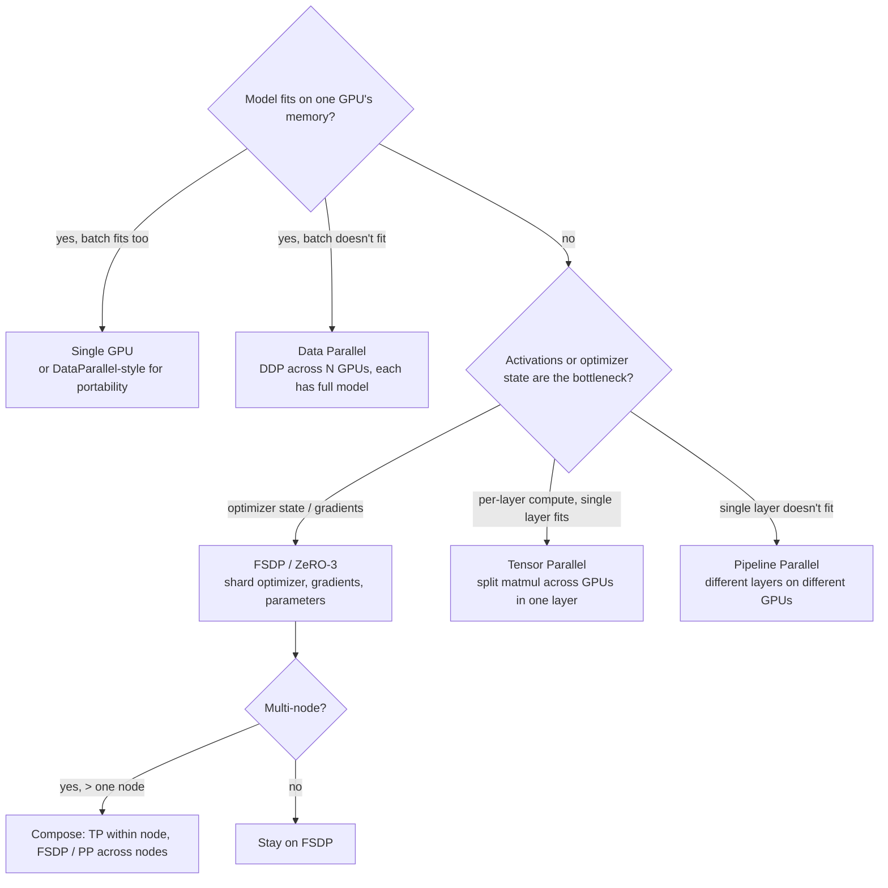
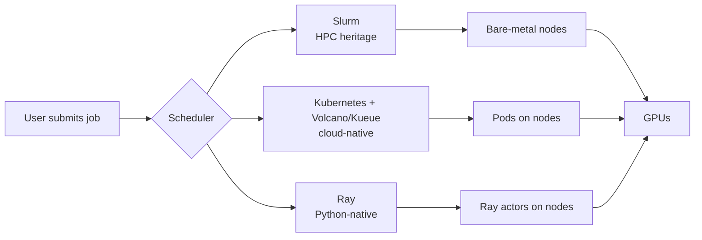
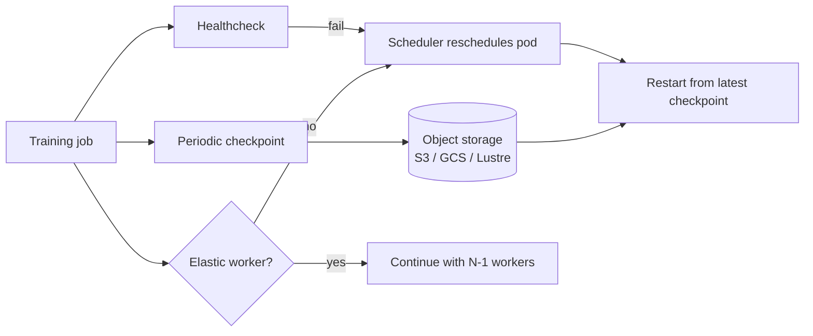

# 03 — Training Infrastructure

> Time budget: 90 minutes. The mental model carries you from a hobbyist single-GPU script to a thousand-GPU pre-training run.

**By the end you can:**

1. Pick a parallelism strategy (DDP / FSDP / TP / PP / hybrid) given a model size and cluster size.
2. Reason about GPU economics: on-prem vs cloud vs spot, H100 vs H200 vs A100 vs L4, MIG.
3. Choose a scheduler (Slurm / Kubernetes-Volcano-Kueue / Ray) for your team.
4. Design fault tolerance for a multi-day training job ("a GPU dies at hour 47").
5. Diagnose when the dataloader, not the model, is your bottleneck.

---

## 1. The parallelism decision tree

A more terse form:

| Setting | Strategy |
|---------|----------|
| Sub-1B model, single node | DDP. Easy, well-trodden. |
| 1B-10B, single node | FSDP. Sharded states fit nicely. |
| 1B-10B, multi-node | FSDP across nodes. |
| 10B-100B | FSDP + TP within node (NVLink) + FSDP/PP across nodes. |
| 100B+ | 3D parallelism: TP + PP + DP/FSDP. This is the Megatron / GPT-3-class regime. |

### What each parallelism actually does

| Parallelism | What it splits | What it costs you | Communication pattern |
|-------------|----------------|--------------------|------------------------|
| **Data parallel (DDP)** | The data; each device has a full model copy. | Memory: full model on every GPU. | All-reduce of gradients each step. |
| **FSDP / ZeRO-3** (Rajbhandari et al., Microsoft, 2020; Zhao et al., Meta, 2023) | Optimizer states, gradients, and parameters across DP ranks. | Latency: parameters are gathered just-in-time. | All-gather params + reduce-scatter grads each step. |
| **Tensor parallel (TP)** (Shoeybi et al., NVIDIA, 2019) | A single matmul across devices. | Bandwidth: must communicate inside each layer; needs fast interconnect (NVLink). | All-reduce within a layer block. |
| **Pipeline parallel (PP)** (Huang et al., GPipe, Google, 2019) | The layers across devices; micro-batches pipeline through. | Latency: pipeline bubble at start and end. | Point-to-point activations between adjacent stages. |
| **Sequence parallel** | The sequence dimension of activations. | Tricky for attention; less common. | All-gather over sequence axis. |

The 2020-2025 trend (PaLM, Llama, GPT, Gemini scale): **3D parallelism** (TP within node, PP across pipeline stages, DP/FSDP across replicas). You don't pick one; you pick a mix.

### Where memory goes

For a transformer training step with parameters `P`, the dominant memory consumers are (Korthikanti et al., NVIDIA, 2022):

| Bucket | Size in bytes | Notes |
|--------|----------------|-------|
| Parameters | `2 * P` (BF16) | 4 bytes if FP32 |
| Gradients | `2 * P` | |
| Optimizer states (AdamW) | `8 * P` | momentum + variance in FP32 |
| Activations | `~ B * S * H * L * c` | B=batch, S=seq len, H=hidden, L=layers, c≈12-30 |
| KV cache (if training with long contexts) | `2 * L * S * B * H` | usually negligible at training-time vs above |

Two heuristics:

1. **For pre-training, activations are usually the largest bucket.** Activation checkpointing (recompute during backward) trades ~25-30% compute for a big memory savings.
2. **For fine-tuning a frozen-base + adapters (LoRA), parameters are tiny but activations are still big.** Don't be fooled by trainable-parameter count.

---

## 2. GPU economics

### The 2026 GPU lineup (illustrative)

| GPU | VRAM | FP16/BF16 TFLOPS (peak) | Notes |
|-----|------|--------------------------|-------|
| **H100 80GB SXM** | 80 GB | ~989 | Industry workhorse for training since 2023. Hopper architecture. |
| **H200 SXM** | 141 GB | ~989 | Hopper refresh with bigger HBM. Better for long-context training. |
| **B100 / B200 / GB200** | 192 GB / 192 GB / 384 GB | ~higher than Hopper (Blackwell) | Newest generation; supply-constrained. |
| **A100 80GB SXM** | 80 GB | ~312 | Pre-Hopper workhorse. Still common in 2026. |
| **L4 / L40S** | 24 GB / 48 GB | ~121 / ~362 | Inference-oriented; useful for small training jobs and dev work. |
| **TPU v5p, v5e, v6e** | up to 95 GB HBM | varies | Google's silicon; competitive on big training jobs; less common ecosystem. |

Numbers per NVIDIA H100, H200, A100 datasheets and Google TPU documentation, ~2024-2025.

### On-prem vs cloud vs spot

| Mode | Reservation horizon | $/H100/hour (rough, 2026) | When it wins |
|------|---------------------|-----------------------------|--------------|
| **On-prem** | Multi-year capex | ~$1.20-1.80 amortized | Continuous heavy use (>60% utilisation) for 2+ years. Adds ops burden. |
| **Reserved cloud** | 1-3 years | ~$2.00-2.80 | Predictable steady demand, no DC operation. |
| **On-demand cloud** | Hourly | ~$3.00-4.00 | Spiky use, short experiments. |
| **Spot / preemptible** | Hourly, can be preempted | ~$1.00-1.80 | Pre-training that already checkpoints frequently. |
| **GPU-first providers (CoreWeave, Lambda, Crusoe)** | Mixed | Often cheaper on-demand than hyperscalers | When the hyperscaler waitlist is real. |

The cost differential moves quarterly. The right answer is **not "always X"**; it's "build for portable code so you can move when prices shift."

### MIG and fractional GPUs

NVIDIA Multi-Instance GPU (MIG) partitions a single A100 / H100 / H200 into up to 7 hardware-isolated slices. Each slice has its own VRAM, SMs, and memory bandwidth quota. The economic point: for inference and small training jobs, an H100 split into 2-4 MIG instances often serves more total useful work than a whole H100 dedicated to a small job.

For pre-training: irrelevant. For platform-wide multi-tenancy: essential. See [Module 12](../12-cost-multitenancy-scaling/README.md).

---

## 3. Schedulers

| Scheduler | Strengths | Weaknesses | Default for |
|-----------|-----------|------------|-------------|
| **Slurm** | Mature. Best-in-class for tightly-coupled MPI-style jobs. Excellent gang scheduling. | Ops-heavy. Limited cloud-native ecosystem. | Academic clusters, on-prem GPU clusters, the supercomputing-tradition organisations. |
| **Kubernetes + Volcano or Kueue** | Cloud-native. Same tooling as serving. Volcano (Huawei, donated to CNCF, 2019) and Kueue (kubernetes-sigs, 2023) add gang scheduling and queueing on top of vanilla K8s. | The default K8s scheduler is bad at gang scheduling; you need the add-ons. More moving parts. | Most modern cloud-native ML platforms. |
| **Ray** | Python-native. Great for distributed training that's not just one big PyTorch job (e.g., RLHF, hyperparameter search, data parallelism + replay). | Less battle-tested at giant scale than Slurm; less mature multi-tenant quota story. | Anyscale-style ML platforms; everything that fans out into many actors. |

In 2026 the cloud-native default has converged on K8s + Kueue + KubeRay where applicable. For pre-training the very largest models, Slurm is still common on bare-metal clusters.

A subtle point: a scheduler is more than "where does the pod run." Three properties matter:

| Property | What it means | Why ML cares |
|----------|----------------|---------------|
| **Gang scheduling** | All workers start together or none do. | Without it, a 64-GPU job can hold 60 GPUs idle waiting on the last 4 to schedule. |
| **Topology awareness** | Schedule workers that need to communicate close (same rack / same NVLink domain). | The difference between 50% and 90% MFU at scale. |
| **Quota / preemption** | Per-team quotas, lower-priority job is preempted by higher-priority. | Multi-tenant platforms live or die on this. |

---

## 4. Fault tolerance — the GPU dies at hour 47

A pre-training run lasts days to weeks. A GPU's MTBF in a 1024-GPU fleet is short enough that **expect to lose hardware mid-run**. Three layers of defence:

| Mechanism | What it gives you | Cost |
|-----------|--------------------|------|
| **Periodic checkpointing** | Resume from minutes ago, not from start. | Disk I/O during checkpoint; total = checkpoint_size / write_bandwidth. |
| **Async / sharded checkpoints** | Checkpoint without stalling training. | More disk; complex. PyTorch DCP (Distributed Checkpoint) does this since 2023. |
| **Elastic training** | Workers can drop and the job continues with fewer ranks. | Loss of statistical efficiency unless you rebalance batch size; requires care. |
| **Hot spares** | Pre-warmed standby ranks take over without restart. | More GPUs idle. Used at the largest scales (Meta, OpenAI, Anthropic). |

The pragmatic default: checkpoint every 1-3% of training compute; size the checkpoint window to recover from a single failure with under 5% wasted work; treat checkpointing latency as part of the training-budget calculation.

Meta's "OPT 175B Logbook" (2022) and "Logging Llama Training" (2023) both describe the realities: across thousands of GPUs, hardware failures are common-cause, and the difference between a 90-day run and a 120-day run is the checkpoint cadence.

---

## 5. Data loading — when the dataloader is the bottleneck

The most common subtle failure: GPUs are 30-50% utilised because the dataloader can't keep up. Symptoms:

- `nvidia-smi` shows GPU utilisation oscillating between 100% and 0%.
- Profiler shows large gaps between step ends and next step start.
- Tweaking `num_workers` helps but only to a point.

### Why this happens

A modern H100 chews through tokens fast. Each step needs the next batch ready. If the data is decoded from JPEGs over a network filesystem, you spend more time fetching than computing.

### Three regimes and their fixes

| Regime | Symptom | Fix |
|--------|---------|-----|
| **Small dataset, fits in RAM** | Slow first epoch, fast after | Pre-load once, dataloader becomes trivial. |
| **Large dataset, distributed file system** | Persistent stall, network-bound | Use streaming dataloaders like WebDataset or Mosaic Streaming that sequentially read shards from object storage and decode in workers. |
| **Massive dataset, multimodal** | Pipeline stalls on decode (image / audio / video) | NVIDIA DALI on GPU; pre-encode to a denser format; shift heavy preprocessing offline. |

### WebDataset / Mosaic Streaming (the modern default)

Pre-shard the dataset into sequentially-readable tar files. Each worker streams a shard; the dataloader reads sequentially from object storage instead of doing millions of small random reads. This pattern is used in MosaicML's MPT training, by Anthropic and OpenAI internally, and is the canonical "your dataloader should be sequential I/O" answer.

Two more rules:

1. **Workers must outnumber the model's hunger.** A modern data-parallel pipeline on H100 typically wants 4-8 workers per GPU. Below that and you stall.
2. **Pinned memory + non-blocking transfer.** PyTorch's `pin_memory=True` plus `to(device, non_blocking=True)` lets the H100 prefetch the next batch while the current one trains. Simple, often forgotten.

---

## 6. Experiment tracking and reproducibility

Mature teams version five things:

| Thing | Versioned how |
|-------|----------------|
| Code | Git commit. |
| Data | Iceberg / Delta snapshot id (see [Module 01](../01-data-platform/README.md)). |
| Features | Feature store version (see [Module 02](../02-feature-stores/README.md)). |
| Configuration | Hydra / OmegaConf / pydantic config in artefacts. |
| Model binary | Hashed binary stored in registry. |

Plus environment: Docker image hash, CUDA version, framework version. Toolkits: MLflow, Weights & Biases, Aim, Neptune, ClearML, Comet. All adequate; the choice rarely matters compared to *whether you log anything at all*.

**Perfect reproducibility is expensive.** What you actually need:

- The ability to **rebuild a model from the same data, code, and config to within statistical noise**.
- The ability to **diff two model versions** at the artefact level: which features changed, which hyperparameters changed, which data slice changed.

Bit-exact reproducibility (the same seed gives the same weights every time) is rarely worth the engineering tax. Distributed reductions are non-associative; floating-point sums change order across runs. Don't optimise for what you don't need.

---

## 7. Cross-links

- [`cheat-sheet.md`](./cheat-sheet.md)
- [`exercises.md`](./exercises.md)
- [`pitfalls.md`](./pitfalls.md)
- [`case-studies/`](./case-studies/)
- Cost: [`../calculators/gpu-cost.ipynb`](../calculators/gpu-cost.ipynb)
- Up next: [04 Serving](../04-serving-online-batch-streaming/README.md)

## Sources

- "Megatron-LM: Training Multi-Billion Parameter Language Models Using Model Parallelism," Shoeybi et al. (NVIDIA, 2019).
- "ZeRO: Memory Optimizations Toward Training Trillion Parameter Models," Rajbhandari et al. (Microsoft, 2020).
- "GPipe: Efficient Training of Giant Neural Networks using Pipeline Parallelism," Huang et al. (Google, 2019).
- "PyTorch FSDP: Experiences on Scaling Fully Sharded Data Parallel," Zhao et al. (Meta, 2023).
- "Reducing Activation Recomputation in Large Transformer Models," Korthikanti et al. (NVIDIA, 2022).
- "Pathways: Asynchronous Distributed Dataflow for ML," Barham et al. (Google, 2022).
- NVIDIA H100 / H200 datasheets, current revision.
- MLPerf Training rules and results, current round.
- Meta "OPT-175B Logbook" (2022); "Llama Training" (2023).
- "WebDataset" GitHub repository and accompanying paper (2020-2023).
