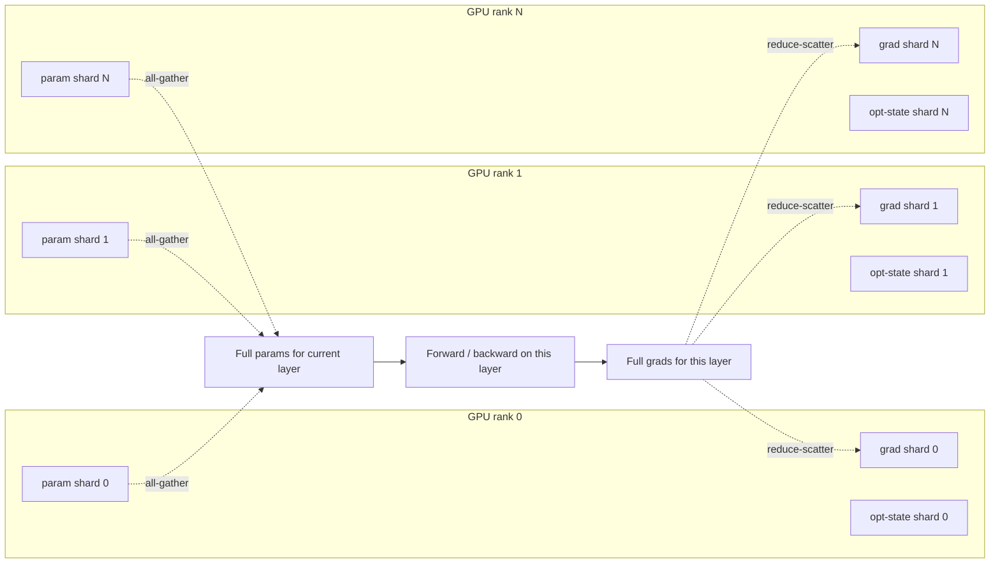

# Meta — PyTorch FSDP at scale (2023)

## Problem

Meta needed a data-parallel-shaped training framework that could train models past the point where a single GPU can hold the optimizer state. ZeRO-3 (DeepSpeed) had pioneered the algorithmic idea (Rajbhandari et al., Microsoft, 2020); PyTorch needed a native implementation that worked across the trillion-parameter regime and integrated cleanly with the PyTorch programming model.

## Architecture

On each training step the framework loops over layers (or units): all-gather the layer's parameters, run forward, free; later all-gather the parameters again, run backward, reduce-scatter the gradients, free; once all gradients are aggregated, each rank runs the optimizer update on its local shard.

## Three load-bearing decisions

1. **Just-in-time parameter materialisation.** Parameters are reconstructed when needed and freed immediately. The compute / memory trade-off can be tuned by sharding granularity (per-layer vs per-parameter).
2. **Overlap of communication with compute.** Pre-fetch the next unit's parameters while the current unit is computing. Hides much of the all-gather latency.
3. **Programming-model compatibility with PyTorch eager mode.** No graph compiler required, no special trainer abstraction. This is why FSDP saw broad adoption faster than the JAX equivalents.

## What didn't work in v1

- **All-gather frequency.** Naive per-module wrapping caused too many small collectives. Per-parameter sharding (later "FSDP2") collapses these.
- **Mixed precision edge cases.** Loss-scaling and grad-clipping behaved subtly differently from DDP. Documentation and APIs evolved.
- **Hybrid sharding** (some axes data-parallel, some sharded) was added later to mix FSDP with tensor parallel inside a node and full data parallel across.

## What you should steal

- The **just-in-time materialisation** pattern. Same idea applies in inference: PagedAttention (vLLM) does it for KV cache.
- **Per-parameter sharding** for cheap communication scaling.
- The discipline that **the framework should not require a special programming model**. PyTorch eager + a few wrappers beats specialised trainer abstractions for adoption.

## Sources

- "PyTorch FSDP: Experiences on Scaling Fully Sharded Data Parallel," Zhao et al. (Meta, 2023).
- "ZeRO: Memory Optimizations Toward Training Trillion Parameter Models," Rajbhandari et al. (Microsoft, 2020).
- PyTorch FSDP documentation, current release.
