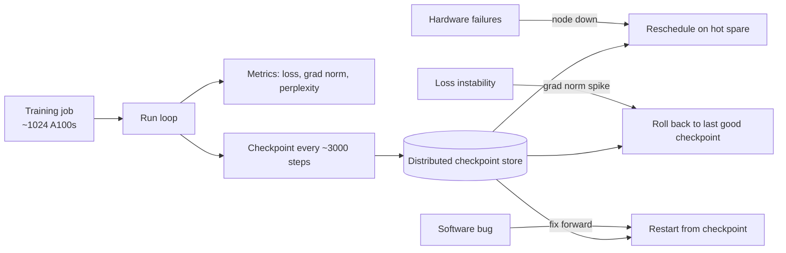

# Meta — OPT-175B logbook and Llama training (2022-2023)

## Problem

Pre-training a 175B-parameter model takes months on a 1000+ GPU cluster. At that scale, hardware failures, software bugs, optimizer instabilities, and human errors are everyday events. Meta's public OPT-175B "logbook" (2022) is a rare honest description of what running such a job actually looks like; the subsequent Llama training notes (2023) extend the picture.

## Architecture (operational, not algorithmic)

The training run is not a single execution. It is a series of execution segments, each separated by an incident. Engineers operate the run; the operating discipline matters as much as the framework.

## Three load-bearing observations

1. **Loss instabilities happen.** Even with careful learning-rate warmup, gradient clipping, and well-tuned hyperparameters, occasional gradient spikes destabilise the run. The mitigation: roll back, lower LR locally, resume. The cost: hours to days per incident.
2. **Hardware failures are common.** At 1000 GPU-scale, expect one GPU failure per day. Without elastic / hot-spare support, every failure is a restart from checkpoint.
3. **Reproducibility-at-the-loss-curve is hard.** Two runs of the same code on the same data with the same seed diverge by step ~1000 due to non-deterministic CUDA reductions. You can recover model quality reliably; you cannot recover the exact loss curve.

## What didn't go to plan

The OPT-175B logbook describes specific failures: a single line of code that mistakenly applied dropout during evaluation, training restarts after node failures losing 8-10 hours each, multiple sub-runs with different hyperparameters that were stitched together to produce the final model. The Llama-1 training notes (2023) describe a similar pattern at higher scale: most of the public 7B / 13B / 33B / 70B run logs include rollback events.

## What you should steal

- The **logbook discipline.** Keep a chronological text log of every incident, every parameter change, every restart. This is forensic gold a year later when someone asks "why did the loss curve do that at step 30k?"
- **Hot spares** as a first-class concept. The cost of idle standby GPUs is less than the cost of stop-restart events.
- The realisation that **training runs are operations, not deployments.** They have shifts, on-call rotations, and runbooks. Plan headcount accordingly.

## Sources

- "OPT-175B Logbook" (Meta AI, 2022).
- "Llama Training Notes" (Meta AI, 2023).
- "Llama 2" technical report (Meta AI, 2023).
- "MosaicML's MPT-7B Training Notes" (MosaicML, 2023). Similar themes at smaller scale.
