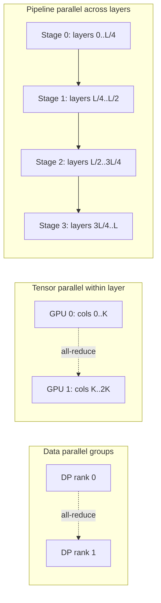

# NVIDIA — Megatron-LM and the 3D-parallelism playbook (2019-2023)

## Problem

By 2019, transformer models had outgrown a single GPU's memory. NVIDIA wanted to demonstrate that very large transformers (billions of parameters) could be trained efficiently on GPU clusters using a parallelism strategy other than naive data parallel. Megatron-LM was the result.

## Architecture (conceptual)

Three orthogonal axes:

| Axis | What's split | Where it lives |
|------|---------------|----------------|
| **Tensor parallel** | The matmul's hidden dimension across GPUs in one layer. | Best within a node, behind NVLink (high bandwidth, low latency). |
| **Pipeline parallel** | The layers across stages; micro-batches pipeline through. | Across nodes (lower-bandwidth links are OK because activations are smaller than gradients). |
| **Data parallel** | The data; replicate the model and aggregate gradients. | The outer axis. |

## Three load-bearing decisions

1. **Paired column / row splits in MLP and attention** so each block produces one all-reduce instead of one per matmul. This is the algorithmic insight that made TP cheap.
2. **Interleaved pipeline schedule (1F1B)** so the pipeline bubble shrinks at large pipeline depths.
3. **Composable with everything.** Megatron-style TP + GPipe-style PP + DP / FSDP have been combined ever since; the convention is "TP within node, PP across pipeline stages, DP across the rest."

## What changed since 2019

- **Sequence parallel** (Korthikanti et al., NVIDIA, 2022) added an axis for splitting the sequence dimension of activations, further reducing memory.
- **Selective activation recomputation** rebuilds only expensive activations, not all of them.
- **Interleaved 1F1B** and **virtual pipeline** stages cut the bubble further.
- **FP8 mixed precision** on Hopper / Blackwell roughly doubles arithmetic throughput for compute-bound layers.
- **FlashAttention** (Dao et al., 2022-2024) removed memory pressure on attention specifically.

## What you should steal

- The **paired-split idea**. Generalises to any matrix-heavy computation where you want to amortise communication.
- The **3D-composability** mental model. Don't think "which parallelism strategy" — think "which combination."
- The discipline that **communication cost is the limiter at scale**, not arithmetic. Designing for cheap communication wins more than designing for high arithmetic throughput.

## Sources

- "Megatron-LM: Training Multi-Billion Parameter Language Models Using Model Parallelism," Shoeybi et al. (NVIDIA, 2019).
- "Reducing Activation Recomputation in Large Transformer Models," Korthikanti et al. (NVIDIA, 2022).
- "Efficient Large-Scale Language Model Training on GPU Clusters Using Megatron-LM," Narayanan et al. (NVIDIA, SC 2021).
- NVIDIA NeMo and Megatron-LM repositories, current releases.
