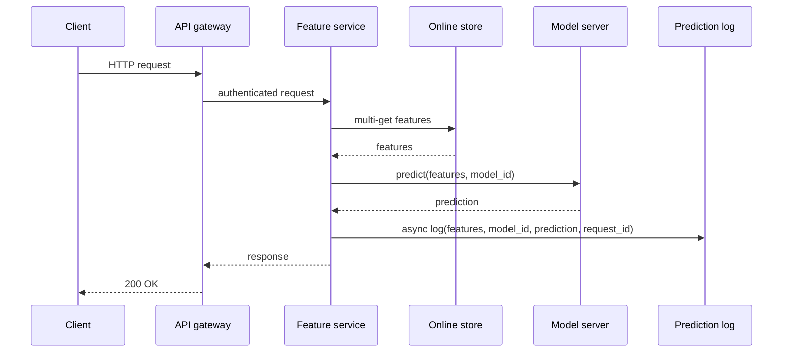
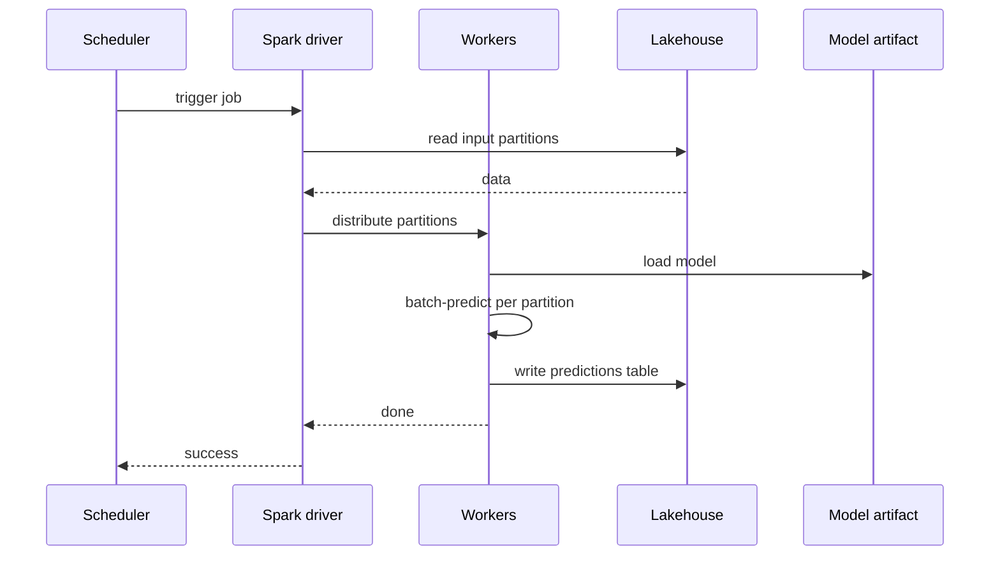
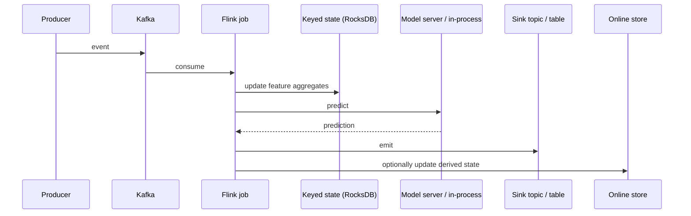
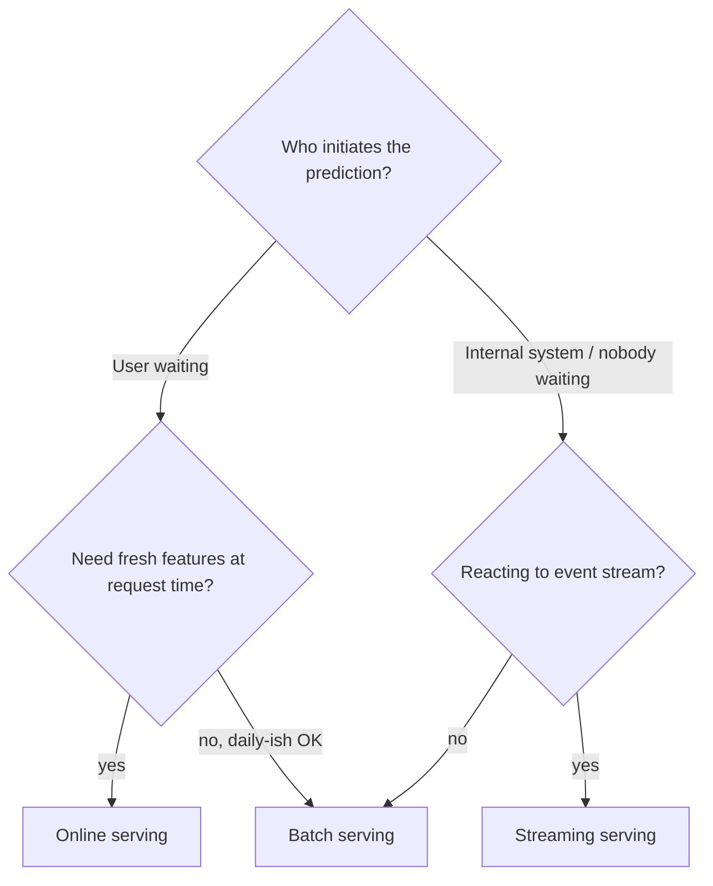
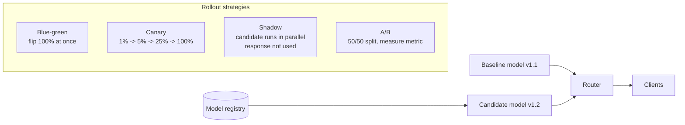

# 04 — Serving: Online / Batch / Streaming

> Time budget: 90 minutes. Serving is where your training investment meets reality. The choices in this module determine whether your model improves the product or costs the company a fortune.

**By the end you can:**

1. Spec online, batch, and streaming inference as three distinct serving shapes.
2. Build a latency budget that adds up to your SLO.
3. Pick a model runtime (Triton vs TorchServe vs TF Serving vs vLLM vs custom).
4. Design canary, shadow, and blue/green rollouts for an ML model.
5. Autoscale GPUs without cold-start pain; configure dynamic batching and (for LLMs) continuous batching.

---

## 1. The three serving shapes — sequence diagrams

### Online (request / response)



Latency budget for a typical 200 ms SLO: gateway 5 ms, feature read 10 ms, model inference 30-80 ms, response build 5 ms, network 20 ms RTT. The async log doesn't count against the SLO.

### Batch (table in, table out)



The model is loaded N times (once per worker). The cost amortises across millions of predictions per worker, so per-prediction cost is tiny.

### Streaming



Streaming inference is the right shape when a system reacts to events; predictions flow continuously, not on demand.

### The three-shape decision tree



---

## 2. Model runtimes — the trade-off table

The choice of model server is mostly determined by **what kind of model you have**, not by team taste.

| Runtime | Strengths | Weaknesses | Pick if |
|---------|-----------|------------|---------|
| **NVIDIA Triton Inference Server** | Multi-framework (TensorRT, ONNX, PyTorch, TensorFlow, Python). Dynamic batching. Model ensemble. Excellent GPU utilisation. | Heavy. Operational complexity. | You're serving heterogeneous models on GPU at scale. |
| **TorchServe** | Native PyTorch. Lightweight. | Less optimised than Triton for the same model. Maintenance has slowed. | You're all-PyTorch and want minimum operational surface. |
| **TensorFlow Serving** | Battle-tested for TF/Keras. RESTful and gRPC. | TF-only. Less useful in the PyTorch era. | You have legacy TF graphs. |
| **vLLM** | Best-in-class LLM inference: PagedAttention, continuous batching, prefix caching. | Designed for transformer-style models specifically. | You serve LLMs. See [Module 06](../06-llm-serving-and-rag/README.md). |
| **TensorRT-LLM / TGI / SGLang** | Vendor / open alternatives to vLLM. TRT-LLM is fastest on NVIDIA hardware. | More integration work for some. | Hardware-specific or feature-specific advantages. |
| **Custom Python (FastAPI + PyTorch)** | Easy to ship. Full control. | No batching, no GPU sharing, no telemetry hooks. | Internal-only services with low QPS. |
| **Edge runtimes (ONNX Runtime, CoreML, TFLite)** | On-device inference. | Limited model size; can't update easily. | Mobile, IoT, privacy-sensitive use cases. |

### Why dynamic batching matters on GPU

A single GPU can compute hundreds of inferences in parallel if you feed it a batch. If each request is a single-element batch, the GPU spends most of its time waiting for data and the cost per prediction is 10-50x what it could be.

**Dynamic batching** collects requests that arrive within a small window (a few ms) and runs them as a single batch. The trade-off:

| Batch wait | Throughput | p99 latency |
|------------|------------|-------------|
| 0 ms | Worst (single-element batches) | Best |
| 5 ms | ~10x better | +5 ms |
| 20 ms | ~30x better | +20 ms |
| 100 ms | Saturates GPU | +100 ms |

Real systems pick 5-20 ms. Triton's dynamic batcher and vLLM's continuous batcher are the standard tools.

For LLMs specifically: **continuous batching** (Yu et al., Orca, OSDI 2022; Kwon et al., vLLM, SOSP 2023) is dynamic batching done right for autoregressive decode. New requests join the in-flight batch every decode step rather than waiting for a fixed window. See [Module 06](../06-llm-serving-and-rag/README.md).

---

## 3. Latency budgets

A 200 ms p99 budget is not a number you achieve once — it's a budget you spend across components. Worked example for an online recsys request:

| Component | Budget (p99 ms) | Rationale |
|-----------|------------------|-----------|
| Network in (client to edge) | 30 | Realistic CDN-aware RTT. |
| Gateway, auth, rate limit | 5 | Light work. |
| Feature read (online store, multi-get) | 15 | Single batched read. |
| Candidate retrieval (ANN over user vector) | 20 | See [Module 05](../05-vector-dbs-and-retrieval/README.md). |
| Ranker (heavy model, GPU) | 60 | Dynamic batch of ~32, ~2 ms per item amortised. |
| Post-processing (rules, diversity) | 5 | CPU-bound. |
| Response build + encode | 5 | Light. |
| Network out | 30 | Same RTT going home. |
| **Subtotal** | **170** | |
| Safety margin | 30 | Don't spend your last 15%. |
| **SLO target** | **200** | |

Three rules:

1. **Don't spend more than 80% of the SLO** at planning time. Production variance eats the rest.
2. **Parallelize what you can.** Feature read and candidate retrieval are independent. Run them concurrently and the budget becomes `max(15, 20) = 20` instead of 35.
3. **Tail dominates.** A 60 ms p50 / 200 ms p99 ranker is a problem; either bound the ranker latency (smaller model, smaller batch) or accept that the p99 is doing the work.

See [`../calculators/latency-budget.ipynb`](../calculators/latency-budget.ipynb) for a parametric version.

---

## 4. Rollout strategies



| Strategy | What it gives you | Cost | Use when |
|----------|--------------------|------|----------|
| **Blue-green** | Atomic switch; instant rollback. | Double the capacity during cutover. | Small models, low risk, fast cutover wanted. |
| **Canary** | Gradual exposure; can rollback fast on metric breach. | Operational complexity. | Default for any production model deployment. |
| **Shadow** | Real production traffic, no user impact. Validates accuracy AND infra (latency, errors). | Double the inference cost during shadow. | Models that are hard to A/B (e.g., changes that affect tail behaviour). |
| **A/B test** | Statistically rigorous comparison. | Power calculation; ~1-4 weeks. | When you need a number, not a vibe. |

A typical production sequence: shadow for 2-7 days to validate infra and offline metrics, then canary at 1%/5%/25%/100% with auto-rollback on latency or quality breach, then a confirmatory A/B test at 50/50 for two weeks.

### Auto-rollback

A canary deployment without auto-rollback is just a slow blue-green. The minimum auto-rollback criteria:

```text
ROLLBACK IF (over a rolling 15-minute window):
  - error_rate(canary) > 2 * error_rate(baseline)
  - p99_latency(canary) > 1.2 * p99_latency(baseline)
  - quality_metric(canary) < baseline_metric - 1.5 * stderr
```

Tune thresholds per service. Document them.

---

## 5. Autoscaling — the GPU cold-start problem

CPU autoscaling on Kubernetes is mature: new pods start in seconds, the load balancer reroutes. GPU autoscaling is harder because:

1. **GPU node startup is slow.** A new GPU node on a cloud provider takes 60-300 seconds from "scale up" to "ready."
2. **Model load is slow.** A multi-gigabyte model takes 20-180 seconds to load into GPU memory.
3. **GPU pods cost real money idle.** You can't just over-provision.

Three patterns:

| Pattern | What it does | Cost | When |
|---------|---------------|------|------|
| **Warm pool** | Keep N pre-initialised pods (model loaded, idle). | Idle GPU cost. | Predictable spikes; latency-critical. |
| **Predictive scaling** | Use traffic history to scale up before the spike (e.g., 9 AM Monday). | Forecasting infra. | Periodic spikes. |
| **Burst to CPU** | First request after scale-up runs on a CPU fallback model; later requests on GPU. | Two models to maintain. | Brief spikes that can tolerate a slightly weaker model. |

For LLM serving specifically: vLLM and TensorRT-LLM both support multiple model snapshots per server with fast switching, reducing the "load a new model" cost to seconds. See [Module 06](../06-llm-serving-and-rag/README.md).

### Replica capacity planning

A useful formula. If a GPU replica can sustain `R` QPS at p99 latency `L` with batch size `B`:

- Peak QPS / replica capacity = number of replicas at peak.
- Add 20-30% headroom for tail variance.
- Add a hot-spare for node failure.

If your service is multi-region, do the math per region; the cluster the model serves from must absorb regional peaks independently.

---

## 6. Edge / on-device inference

For some products (mobile keyboards, on-device camera filters, smart watch heart-rate models), the right place to run the model is on the user's device. The trade-offs:

| Property | Server inference | On-device inference |
|----------|--------------------|---------------------|
| **Latency** | Network round-trip dominates (~30-100 ms). | Tens of milliseconds, no network. |
| **Privacy** | Data leaves the device. | Data stays on the device. |
| **Update agility** | Deploy in minutes. | Tied to app release cycle. |
| **Model size** | No hard limit. | 5-200 MB typical phone, ~1-2 GB for newer devices. |
| **Cost** | Per-inference cost on your bill. | Zero per-inference cost (user's device). |
| **Telemetry** | You see everything. | You see what the device chooses to send. |

Runtimes: ONNX Runtime, TFLite, CoreML, ExecuTorch (Meta, 2024). Quantization (INT8, INT4) and pruning are essential.

A common hybrid: on-device for the latency-critical / privacy-critical path; server-side for the bigger / fresher model the device can call out to. See [Module 13](../13-privacy-fairness-ethics/README.md) for the privacy angle.

---

## 7. Cross-links

- [`cheat-sheet.md`](./cheat-sheet.md)
- [`exercises.md`](./exercises.md)
- [`pitfalls.md`](./pitfalls.md)
- [`case-studies/`](./case-studies/)
- Online ML reference: [`../diagrams-shared/online-ml-reference-architecture.md`](../diagrams-shared/online-ml-reference-architecture.md)
- Latency calc: [`../calculators/latency-budget.ipynb`](../calculators/latency-budget.ipynb)
- Up next: [05 Vector DBs and Retrieval](../05-vector-dbs-and-retrieval/README.md)

## Sources

- "Clipper: A Low-Latency Online Prediction Serving System," Crankshaw et al. (NSDI 2017).
- "Scaling Machine Learning at Stripe" (Stripe Engineering, 2023).
- "Maintaining Machine Learning Model Accuracy Through Monitoring" (DoorDash Engineering, 2022).
- NVIDIA Triton Inference Server documentation, current release.
- "Orca: A Distributed Serving System for Transformer-Based Generative Models," Yu et al. (OSDI 2022).
- "Efficient Memory Management for Large Language Model Serving with PagedAttention," Kwon et al. (vLLM, SOSP 2023).
- "Continuous Batching" (Anyscale, 2023).
