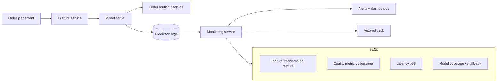

# DoorDash — model monitoring and serving (2022)

## Problem

DoorDash runs ranking and ETA models in the path of every order. The 2022 Engineering post describes how they keep models accurate over time, against drift and against subtle production bugs.

## Architecture

## Three load-bearing decisions

1. **Per-feature freshness SLOs.** Each feature has its own freshness target; a violation pages the owning team, not the ML team.
2. **Quality SLO + auto-rollback.** A rolling quality metric is compared to baseline; sustained breach triggers automatic rollback.
3. **Coverage SLI.** Fraction of requests where the model fired vs the heuristic fallback. Tracks the often-invisible degradation of "model technically up, but degrading because feature pipeline is half-broken."

## What was hard

- **Defining the right quality metric.** A model that ranks orders by ETA needs a different quality SLI than one that estimates delivery time. The team iterated on the metric.
- **Setting threshold tightness.** Too tight: noise triggers rollbacks. Too loose: real regressions slide through. The post describes calibrating against historical incidents.
- **Auto-rollback's blast radius.** A rollback of a ranking model is reversible; a rollback of a pricing model can have customer-facing consequences. The auto-rollback policy has per-model rules.

## What you should steal

- The **coverage SLI**. It catches the silent failure mode that pure latency / availability SLOs miss.
- The **per-feature freshness SLO** with explicit ownership.
- The discipline of **calibrating auto-rollback thresholds against historical incidents**, not against gut feel.

## Sources

- "Maintaining Machine Learning Model Accuracy Through Monitoring" (DoorDash Engineering, 2022).
- "Real-time Predictions at DoorDash" (DoorDash Engineering, 2021-2023).
- DoorDash ML platform talks at MLConf and KubeCon, 2022.
