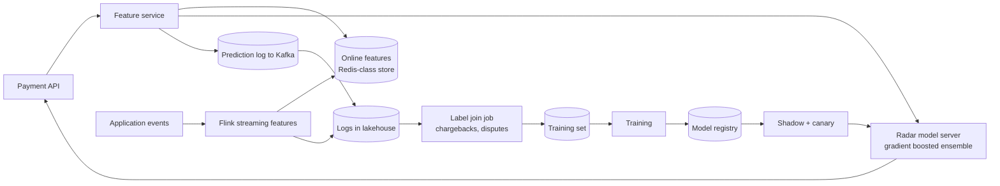

# Stripe — ML platform (2023)

## Problem

Stripe runs ML for fraud detection at every payment. Latency budget: tens of milliseconds. Stakes: regulator-watched. Skew: catastrophic when it happens. The 2023 Engineering post describes how Stripe's ML platform evolved to meet these constraints.

## Architecture

## Three load-bearing decisions

1. **Logged features become the training set.** Stripe's post is explicit: "the safest training data is the data we actually served." A separate offline pipeline reconstructing features is forbidden by policy at the platform level.
2. **One feature definition, two backends.** A declarative feature is compiled to streaming code (Flink) and online lookup code (read path) from the same source.
3. **Per-feature freshness SLO.** Every feature has a measured freshness; an out-of-SLO feature pages the owning team.

## What was hard

- **Late labels.** Chargebacks roll in days to weeks after a payment. The training set is built with a label-availability buffer; models for fast-moving fraud patterns need to balance "wait for true labels" against "deploy faster on noisier signals."
- **Adversarial drift.** Fraudsters adapt. A model that worked last quarter is degraded this quarter not because data drifted but because the adversary noticed.
- **Skew at scale.** Even with the platform discipline, individual teams occasionally compute a one-off feature outside the platform; the audit / lint process is what catches it.

## What you should steal

- The **logged-features mandate.** Not a guideline, a platform-enforced rule.
- The **freshness SLO per feature.** Decouples feature health from model health; pages the right team.
- **Shadow before canary** for every model release. Caught at least one disaster the post describes.

## Sources

- "Scaling Machine Learning at Stripe" (Stripe Engineering, 2023).
- "Radar: How Stripe Detects Fraud at Scale" (Stripe Engineering, 2023).
- Stripe ML platform talks at Strange Loop and QCon, 2023.
