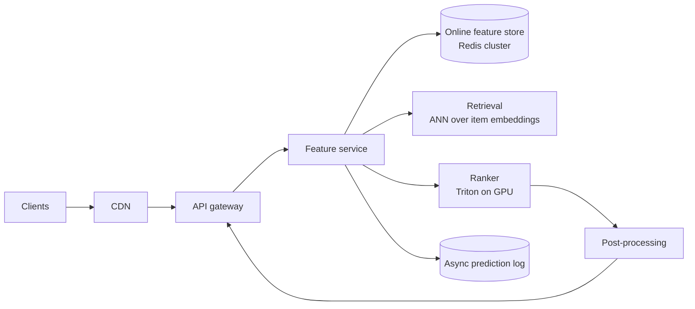
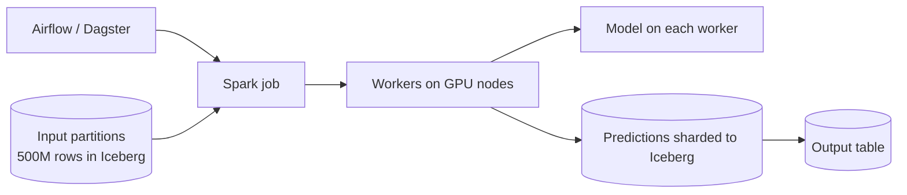

# 04 — Serving exercises

---

### 1. INTERVIEW. Design the serving stack for a recommendation API: 200M users, ~15k peak RPS, 200 ms p99 budget.

<details><summary>Solution</summary>



Capacity sizing:
- 15k peak RPS x 200 ms p99 = up to 3000 concurrent requests.
- Ranker on L4 GPU sustaining ~500 QPS per replica at p99 60 ms => ~30 replicas + 30% headroom => 40 replicas, 2 regions = 80 GPUs.
- Online feature store: Redis cluster sized for ~30k QPS multi-get; one cluster per region.
- ANN: dedicated service, vertically scaled (HNSW in memory).

Rollouts: canary 1%/5%/25%/100% with auto-rollback on error rate, p99 latency, NDCG@10 vs baseline.

SLOs: p99 200 ms, availability 99.95%, feature freshness p95 30s, NDCG@10 within -1% rolling baseline.
</details>

---

### 2. DECISION. The ranker latency is p99 95 ms (target 60 ms). Pick one fix and justify.

<details><summary>Solution</summary>

Likely candidates: smaller model, INT8 quantization, dynamic batching tuning, GPU class upgrade, model distillation.

A pragmatic order:

1. **Check the batch fill.** If the dynamic batcher is timing out at small batches because traffic is bursty, increase the batch wait window from 5 ms to 15 ms — latency goes up by ~10 ms but throughput goes up 4-8x, and per-batch latency drops sharply once you actually saturate the GPU. Net effect on p99 can be negative.
2. **INT8 PTQ.** Free 1.5-2x speedup on a typical tree ensemble or transformer ranker. Accuracy loss often <0.3% NDCG.
3. **Distillation.** Teacher-student to a half-size ranker, ~2x speedup, modest accuracy loss. Two weeks of work.
4. **GPU upgrade.** Move from T4 to L4 or A10. Effective and immediate.

Avoid: rewriting the ranker in a different framework just to chase latency. Diminishing returns; high risk of subtle skew.
</details>

---

### 3. CASE-STUDY READ. Read "Scaling Machine Learning at Stripe" (Stripe Engineering, 2023). What is the single most-emphasised lesson?

<details><summary>Solution</summary>

**Logged features as the training source of truth.** Stripe's post is unusually direct that the only durable defence against train-serve skew is to train on what was actually served, not on what you'd recompute from the warehouse.

The post also emphasises a streaming-feature backbone (Flink), a single declarative feature definition that compiles to both paths, and a discipline of versioning every feature artefact alongside the model. The themes overlap with Uber Michelangelo (2017) and Pinterest (2022) — convergent evolution of the same answer.
</details>

---

### 4. INTERVIEW. Walk through what happens, step by step, when a user opens your app and triggers a recommendation request.

<details><summary>Solution</summary>

1. The mobile client makes an HTTPS request to the nearest edge node (CDN-resolved DNS).
2. Edge terminates TLS, forwards to the regional API gateway.
3. Gateway authenticates (JWT verification), rate-limits, and routes to the recsys service.
4. Recsys service calls feature service.
5. Feature service issues a single multi-get to the online feature store, retrieving ~80 features (user, session, recent activity). 5-10 ms p99.
6. Feature service issues a concurrent ANN call to the retrieval service, returning ~1000 candidate items (10-20 ms p99). Runs in parallel with the feature read.
7. Recsys service calls the ranker (GPU-backed) with batched (~1000 candidates, features). Ranker scores, returns top 100 (50-80 ms p99).
8. Post-processing applies business rules and diversity, returns top 20.
9. Response goes back through the gateway to the edge to the client.
10. Async log writes (features, model_version, scores, request_id) to Kafka. Off the critical path.

Total: ~150-180 ms p99 if the budget is well-spent.
</details>

---

### 5. DECISION. Your team wants to push an LLM behind a chat product. Pick a runtime and justify.

<details><summary>Solution</summary>

For self-hosted: **vLLM** (Kwon et al., SOSP 2023). PagedAttention + continuous batching are the two features that make LLM serving practical at QPS. Alternatives — TensorRT-LLM (faster on NVIDIA hardware, more vendor-specific), SGLang, TGI — are reasonable but vLLM's ecosystem is the largest.

For hosted: an API (Anthropic, OpenAI, Together, Fireworks). The cost-vs-control trade-off is the deciding factor.

What you do NOT want: a custom FastAPI server with one request per GPU invocation. This will saturate at maybe 1 QPS per replica and cost an order of magnitude more than it should.

See [Module 06](../06-llm-serving-and-rag/README.md) for the details.
</details>

---

### 6. INTERVIEW. Spec a canary rollout with auto-rollback for a new ranking model.

<details><summary>Solution</summary>

```text
Stage 0 - shadow (3 days):
  - Route 100% traffic to baseline; replay to candidate; do not return candidate's responses.
  - Measure: candidate's p99 latency, error rate, score distribution.
  - Promote IF: p99 < 1.1x baseline, errors < baseline, score distribution within KS 0.1.

Stage 1 - canary 1% (1 day):
  - Route 1% to candidate; rest to baseline.
  - Auto-rollback IF (rolling 15-min window):
      - canary error rate > 2x baseline error rate
      - canary p99 > 1.2x baseline p99
      - candidate NDCG@10 < baseline NDCG@10 - 2 stddev
  - Else promote.

Stage 2 - canary 5%, 25%, 100% (1 day each):
  - Same gates, tighter quality gate at 100% (1 stddev).

Stage 3 - A/B 50/50 (2 weeks):
  - Statistical comparison on primary product metric (engagement, conversion).
  - Promote permanently or roll back based on result.
```

Tooling: a controller (Flagger, Argo Rollouts, in-house) consumes Prometheus metrics and adjusts traffic weights. The error-budget policy makes failure handling automatic.
</details>

---

### 7. DECISION. You have a daily marketing-uplift batch job that takes 8 hours and is missing its 06:00 SLA. The team proposes "move it online." Argue against.

<details><summary>Solution</summary>

Moving from batch to online increases cost by 100-1000x and doesn't actually solve the SLA problem (which is about throughput, not latency).

Better levers:

1. **Profile the job.** What's slow — feature read, model inference, write? Usually one of the three dominates.
2. **Parallelize.** If the bottleneck is model inference, use more workers or a GPU. Batch model inference on GPU is 20-100x faster than CPU.
3. **Incrementalize.** Score only the ~5% of users whose features changed since yesterday. Cheap because feature change detection is a metadata query, not a full re-score.
4. **Shift the schedule.** If it finishes by 08:00 instead of 06:00, what actually breaks downstream? Sometimes the right fix is to renegotiate the SLA.

Online inference makes sense if there's a genuine per-request trigger; "I need it faster" is rarely that trigger.
</details>

---

### 8. INTERVIEW. The team wants to use INT8 quantization on the ranker. What do you measure, and what's the risk?

<details><summary>Solution</summary>

Measurements:

1. **Offline accuracy delta.** Compute the ranker's NDCG@10 / AUC on the held-out set in FP32 vs INT8 PTQ. Target: <0.5% relative drop.
2. **Latency speedup on production hardware.** Most modern GPUs (L4, A100, H100) have INT8 tensor cores; the speedup is real (1.5-3x).
3. **Throughput improvement at the system level.** Quantized model means smaller VRAM footprint, larger possible batch, higher QPS per replica.

Risks:

1. **Tail-of-distribution behaviour.** Quantization can change the ranking of marginal items more than the average. Verify on the worst slices, not just the average.
2. **Hard-coded thresholds.** Calibration matters. PTQ with a poor calibration set can degrade the model surprisingly.
3. **Mixed-precision pitfalls.** Some layers (softmax, layer norm) need FP16/FP32; an INT8-everywhere model often diverges.

Best practice: quantization-aware training (QAT) gives the smallest accuracy hit; PTQ is fast and usually good enough. Always shadow before A/B.
</details>

---

### 9. INTERVIEW. Walk through GPU autoscaling for a model server when traffic spikes 5x in 60 seconds.

<details><summary>Solution</summary>

Without preparation, you fail:

1. Cluster autoscaler signals "need more GPU nodes." 60-180 s to provision.
2. New pods schedule; model loads in 30-180 s.
3. By the time replicas are ready, ~3-5 minutes have passed; the spike may already be over.

With preparation:

1. **Warm pool** of pre-initialised replicas (model already loaded, idle but ready). Sized to absorb the typical spike.
2. **Predictive autoscaler** triggers scale-up 5-10 minutes before historically-predicted spikes (peak hours, scheduled events).
3. **HPA on a leading indicator.** Don't scale on request rate — by then it's too late. Scale on queue depth or upstream signal (e.g., session-start rate).
4. **Bursting** to a smaller / cheaper / CPU model for the first few seconds of the spike, falling back to full-quality once GPUs catch up.

This is the same set of techniques used in non-ML services for similar problems; ML services need them more because the cold-start cost is higher.
</details>

---

### 10. CASE-STUDY READ. Read "Maintaining Machine Learning Model Accuracy Through Monitoring" (DoorDash, 2022). What does DoorDash do that's worth stealing?

<details><summary>Solution</summary>

DoorDash's post outlines:

1. **A central feature service** as the single read path; serving and training both go through it.
2. **Logged predictions** in a long-retention store, joined to labels (deliveries completed, refunds issued) via request_id to produce training sets.
3. **Per-feature SLOs**: every feature has a freshness target and a deviation-from-baseline tripwire. Pages oncall when violated.
4. **A model-quality SLO** above and beyond the latency / availability SLOs: a rolling NDCG / RMSE compared to a baseline, with auto-rollback if breached for 24 hours.

The themes are the same as Uber, Pinterest, and Stripe: serving-time logged features, centralised feature service, per-feature SLOs. Five posts, one architecture.
</details>

---

### 11. INTERVIEW. Spec a batch inference pipeline that scores 500M rows nightly with a deep model.

<details><summary>Solution</summary>



- Partition input by hash of user_id into ~5000 shards.
- Each worker reads its shards, loads the model once, batch-predicts at GPU-saturating batch sizes (256-2048 depending on model).
- Use TorchScript or ONNX export for the model artefact to avoid heavy framework overhead per worker.
- Write outputs to an Iceberg snapshot; downstream consumers read from the snapshot id.

Scaling: with each worker doing ~50k predictions/sec on an L4, ~50 workers complete in ~3 hours. SLA: done by 06:00, plenty of headroom.

Idempotency: rerunning the same date partition produces the same Iceberg snapshot (or atomically replaces).
</details>

---

### 12. DECISION. You're choosing between Triton and a custom Python server for a fraud-scoring model on an XGBoost ensemble. Argue both sides.

<details><summary>Solution</summary>

**Custom Python (FastAPI + xgboost):**
- Pros: trivial to ship. Easy to debug. Low operational surface. Model is small (tens of MB), so per-replica cost is small.
- Cons: no built-in dynamic batching (XGBoost has its own); no GPU sharing; you'll rebuild observability hooks; CPU efficiency mediocre.

**Triton with FIL backend (Forest Inference Library):**
- Pros: GPU-accelerated forest inference (xgboost / LightGBM / sklearn). Dynamic batching, telemetry, model versioning out of the box.
- Cons: ops overhead. GPU spend if traffic doesn't justify it.

For a low-QPS internal fraud check: custom Python. For a high-QPS user-facing fraud check (e.g., checkout fraud at >1k QPS): Triton with FIL on GPU, or just CPU Triton — the operational benefits dominate.

Threshold: 100 QPS sustained is roughly where Triton starts paying off.
</details>
