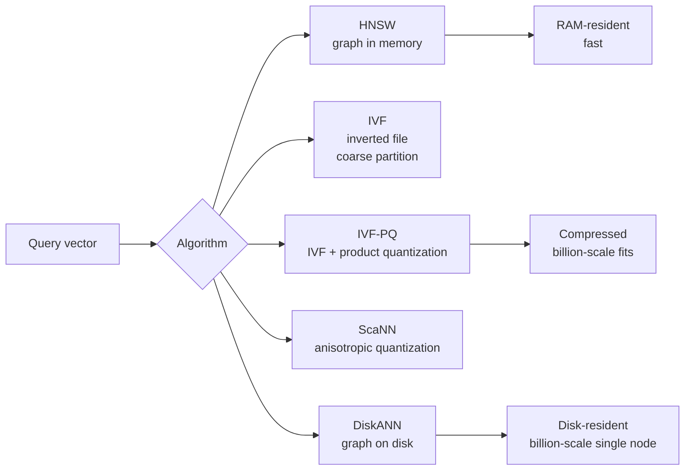
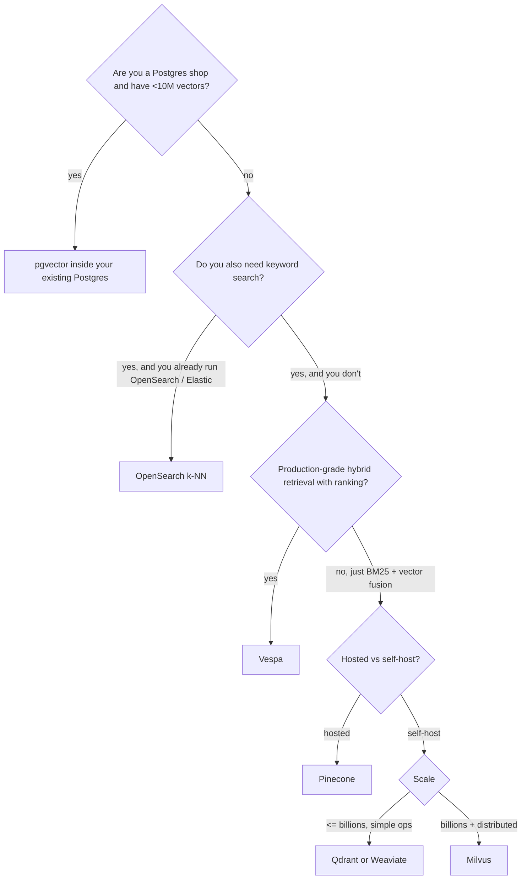
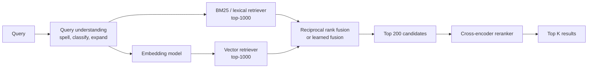

# 05 — Vector Databases and Retrieval

> Time budget: 60 minutes. The 2020-2026 explosion in RAG, recommendations, search, and de-duplication has made vector retrieval an ML-platform building block.

**By the end you can:**

1. Explain HNSW, IVF, IVF-PQ, ScaNN, and DiskANN — when each wins.
2. Pick a vector DB (Pinecone, Weaviate, Qdrant, Milvus, pgvector, Vespa, OpenSearch) by scale, ops burden, hybrid retrieval, multi-tenancy, cost.
3. Design a hybrid (lexical + vector + reranker) retrieval pipeline.
4. Choose between lazy, incremental, and full-rebuild index updates.
5. Estimate $/1B vectors stored and $/1k queries.

---

## 1. The ANN landscape

Exact nearest-neighbour search is `O(N)` per query. At a billion vectors and thousands of QPS, that's not happening. The field has settled on a small set of approximate-nearest-neighbour (ANN) algorithms.

| Algorithm | Index type | Memory | Recall (typ) | Build time | Best for |
|-----------|------------|--------|--------------|------------|----------|
| **HNSW** (Malkov & Yashunin, 2018) | Hierarchical graph | High (raw vectors + graph) | 95-99% @ 10 | Slowish, parallelizes | <100M vectors hot in RAM |
| **IVF** | Coarse Voronoi partitioning | Medium (raw vectors + centroids) | 90-97% | Fast | Large-scale; pairs with quantization |
| **IVF-PQ** | IVF + product quantization | Low (compressed) | 90-95% | Fast | 100M-10B vectors |
| **ScaNN** (Guo et al., Google, 2020) | Anisotropic vector quantization + graph | Medium-low | 95-98% | Slowish | Google-scale, internal |
| **DiskANN** (Subramanya et al., Microsoft, NeurIPS 2019) | Graph on SSD with in-memory navigation | Low RAM | 95-98% | Slow | Billion-scale on a single box |
| **HNSW + PQ** (newer) | HNSW with quantized vectors | Medium | 92-97% | Slowish | Compromise between HNSW and IVF-PQ |

### How HNSW works in one minute

Build: insert vectors into a multi-layer skip-list of small-world graphs. Each level samples fewer nodes. Connections are nearest-neighbour-like.

Query: start at the top layer, greedily walk to the closest neighbour, descend a layer, repeat. The `efSearch` parameter bounds the candidate frontier size — bigger means better recall, slower query.

Trade-offs to remember:
- HNSW indexes are large (raw vectors + ~2x graph overhead). Doesn't fit on disk well; in-memory by design.
- Insertion cost grows with index size; rebuilds aren't cheap.
- Excellent recall at relatively small `efSearch`.

### How IVF-PQ works in one minute

Build: cluster vectors into `nlist` Voronoi cells. Within each cell, compress each vector with product quantization (PQ): split the vector into subvectors, quantize each subvector to a codebook of 256 entries.

Query: find the `nprobe` closest cells to the query. Within those cells, compute approximate distance using the PQ codebook (asymmetric distance computation).

Trade-offs to remember:
- Storage is tiny (e.g., 16 bytes per vector instead of 1.5 KB at dim 384 FP32). Billions of vectors on a single big machine.
- Recall takes a 1-3 percentage point hit vs HNSW.
- Build is fast; updates handled by adding to cells.

The big takeaway: **HNSW for hot data that fits in RAM, IVF-PQ for huge corpora or cold storage**.

---

## 2. The vector DB market — decision matrix

| Product | Scale ceiling | Index types | Hybrid (BM25 + vector) | Multi-tenancy | Ops model | Pricing |
|---------|---------------|-------------|-------------------------|---------------|-----------|---------|
| **Pinecone** | Billions | HNSW + PQ variants | Yes, native (since 2023) | Strong; per-namespace | Fully managed | Per-pod hourly + storage |
| **Weaviate** | Hundreds of millions easy, billions doable | HNSW (+ PQ option) | Yes | Tenant-per-collection | Self-host or cloud | OSS + cloud tiers |
| **Qdrant** | Hundreds of millions easy, billions | HNSW with filtered queries; PQ option | Yes (sparse + dense fusion) | Tenant-per-collection | Self-host or cloud | OSS + cloud tiers |
| **Milvus / Zilliz** | Billions, distributed | IVF, HNSW, DiskANN, ScaNN | Some support | Tenant-per-collection | Self-host (Milvus) or managed (Zilliz) | OSS + cloud tiers |
| **pgvector (Postgres)** | Tens of millions practical | IVFFlat, HNSW | Use Postgres FTS + pgvector | Tenant-per-schema | Self-host | Postgres |
| **Vespa** (Yahoo / open) | Billions, distributed | HNSW + own | Yes, lexical + ML built-in | Strong tenancy | Self-host or cloud | OSS + cloud |
| **OpenSearch / Elasticsearch k-NN** | Hundreds of millions easy | HNSW | Yes, native | Strong | Self-host or cloud | OSS / Elastic |
| **Vespa** as an "everything serving engine" | Designed for ranking + retrieval | Many | Yes — its strongest pitch | Strong | Self-host or cloud | OSS + cloud |

### Decision tree

The decision is mostly **what else does your team already operate?** If you run Postgres for everything, pgvector saves an entire ops surface. If you run OpenSearch, k-NN there saves another. If you're greenfield and need a turnkey vector DB, Pinecone is the cheapest path to production.

A 2024-2026 observation: **most production "vector DB" deployments end up being one of three things**:

1. OpenSearch / Vespa with vectors (because hybrid retrieval is mandatory in production and these are mature for that).
2. Pinecone (if vector-only is acceptable and ops budget is tight).
3. pgvector or Postgres-native (if scale is modest).

The standalone-vector-DB market is real but smaller than the noise suggests.

---

## 3. Hybrid retrieval — why pure vector rarely wins in production

A well-known and well-documented production lesson (Pinterest 2022; LinkedIn 2023; OpenAI / Anthropic engineering posts): **pure vector retrieval underperforms BM25 + vector + reranker** on most real-world retrieval tasks.

Two reasons:

1. **Rare terms.** A user query mentioning a specific product SKU, license plate, error code, or person's name should retrieve documents that mention that exact token. Vector embeddings smooth over rare tokens; BM25 handles them perfectly.
2. **Out-of-distribution queries.** The embedding model was trained on a corpus that may not perfectly cover all query types. BM25 has no such failure mode for keyword-style queries.

### The canonical hybrid pipeline

Reciprocal Rank Fusion (RRF): `score(d) = sum over retrievers of 1/(k + rank(d, retriever))`. Tunable, parameter-free, robust.

A cross-encoder reranker is a model that takes (query, document) as one input and outputs a score. Slow per pair (compared to bi-encoder vector search), so apply only to the top 100-200 from the fusion step.

The cost trade-off:

| Stage | Latency (typical) | Cost per query |
|-------|--------------------|-----------------|
| Lexical retrieval (BM25 on OpenSearch) | 10-50 ms | Tiny |
| Vector retrieval (HNSW) | 5-30 ms | Small |
| Cross-encoder rerank top-100 | 30-100 ms on GPU | Real |
| Total | 50-150 ms | Dominated by reranker |

The reranker is by far the biggest single quality lever. Investing in it pays back faster than tweaking the embedding model.

---

## 4. Index updates — lazy, incremental, full

A real corpus changes. New documents arrive, old ones are deleted or updated. The index has to keep up.

| Strategy | What it does | Cost | Latency to availability |
|----------|---------------|------|--------------------------|
| **Lazy** | Documents written to a delta segment; periodic background merge into main index. | Low write amplification; query path may hit delta. | Seconds to minutes. |
| **Incremental** | New documents inserted into the live index immediately. | High write amplification; queries see new docs immediately. | Sub-second. |
| **Full rebuild** | Periodic offline rebuild from scratch on the source of truth. | Cheap per document amortised; expensive job. | Periodic (hours / days). |

Real systems combine: **full rebuild weekly + incremental for new + lazy for deletes**. OpenSearch's segment model is exactly this; Vespa uses a similar pattern.

### Tombstones for deletes

Most vector indexes don't physically delete; they mark with a tombstone and skip at query time. Compaction during the next full rebuild reclaims space. Naive "just delete" implementations either skip vectors silently (correctness bug) or break the graph (correctness disaster).

---

## 5. Cost model — what a billion vectors cost

A 1B vector corpus at dim 768, FP32:

| Index | Storage | RAM | Notes |
|-------|---------|-----|-------|
| **HNSW raw** | 3 TB raw + ~1 TB graph | All in RAM | Multiple big-memory nodes. |
| **IVF-PQ (16 bytes/vec)** | 16 GB compressed + centroids | Fits in one large machine | 1-3% recall hit. |
| **DiskANN** | ~3 TB on SSD | ~50 GB RAM | Single node feasible. |

Per-query cost at 1k QPS:

| Approach | Per-query latency | Per-query compute cost |
|----------|--------------------|--------------------------|
| HNSW in RAM | 5-30 ms | Memory bandwidth dominates; cheap |
| IVF-PQ | 10-50 ms | More distance comps but cheaper memory |
| DiskANN | 10-50 ms | SSD I/O; cheaper hardware |
| Pinecone managed | ~30 ms p99 | Per-pod hourly + per-query (typical pricing) |

Public price ranges in 2025-2026: hosted vector DBs land at $50-500/month per 1M vectors depending on tier and query volume. Self-hosted Qdrant or Milvus on commodity hardware can be 5-10x cheaper at scale but adds 0.5-1 FTE of ops.

See [`../calculators/ann-recall-vs-cost.ipynb`](../calculators/ann-recall-vs-cost.ipynb).

---

## 6. The two engineering pitfalls that kill vector deployments

### Embedding lock-in

You ingest 100M documents, embed them with model X, build the index. Two months later, model Y appears and is 5% better on your eval. To use it, you re-embed everything — 100M model inferences, hours to days of compute, gigabytes of new vectors. The cost is real; plan for it before you commit.

Mitigations:

- **Start with an open embedding model you can host yourself.** Hosted embedding APIs lock you in by both price and unique vocabulary.
- **Version the index.** Build the new index alongside the old; cut over with a shadow comparison.
- **Bound the corpus.** A 1M-document corpus is re-embeddable in hours; a 1B-document corpus is days and substantial dollars.

### Recall-latency-cost is a Pareto, not a single number

Tuning HNSW: bigger `efSearch` -> higher recall, slower query. Tuning IVF-PQ: more `nprobe` -> higher recall, slower query.

Pick **one target metric** (e.g., recall@10 >= 0.97) and **measure the others as outcomes**. Don't try to optimise all three at once; you'll oscillate.

---

## 7. Cross-links

- [`cheat-sheet.md`](./cheat-sheet.md)
- [`exercises.md`](./exercises.md)
- [`pitfalls.md`](./pitfalls.md)
- [`case-studies/`](./case-studies/)
- RAG reference: [`../diagrams-shared/rag-reference-architecture.md`](../diagrams-shared/rag-reference-architecture.md)
- Cost calc: [`../calculators/ann-recall-vs-cost.ipynb`](../calculators/ann-recall-vs-cost.ipynb)
- Up next: [06 LLM Serving and RAG](../06-llm-serving-and-rag/README.md)

## Sources

- "Efficient and robust approximate nearest neighbor search using Hierarchical Navigable Small World graphs," Malkov & Yashunin (TPAMI 2018).
- "DiskANN: Fast Accurate Billion-point Nearest Neighbor Search on a Single Node," Subramanya et al. (NeurIPS 2019).
- "ScaNN: Accelerating Large-Scale Inference with Anisotropic Vector Quantization," Guo et al. (Google, ICML 2020).
- "Billion-scale similarity search with GPUs," Johnson, Douze, Jégou (Facebook, 2019).
- "Reciprocal Rank Fusion outperforms Condorcet and individual rank learning methods," Cormack et al. (SIGIR 2009).
- Pinecone, Weaviate, Qdrant, Milvus, Vespa, OpenSearch documentation (current releases).
- ann-benchmarks.com (community benchmark suite, ongoing).
