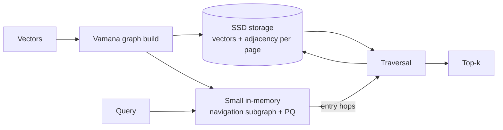

# Microsoft — DiskANN (2019)

## Problem

By 2019, billion-scale embedding indexes were expensive: HNSW required all data in RAM, which meant clusters of big-memory machines. Microsoft wanted a way to serve billion-scale ANN from a single commodity machine with most of the index on SSD.

## Architecture

Key design: each node's vector and adjacency list co-located on a single 4 KB SSD page. A small in-memory subgraph (or PQ codes) bootstraps each query and identifies an entry node; from there, the query reads ~50-200 SSD pages to converge.

## Three load-bearing decisions

1. **Vamana graph construction.** Graph designed with both long-range and short-range edges, optimised for bounded-hop convergence under the SSD page-cost model.
2. **Co-location of vector + adjacency.** One SSD seek returns enough to take the next hop. No second seek per hop.
3. **PQ-compressed in-memory subgraph.** The first few hops use PQ-compressed approximate distances; only the final refinement reads raw vectors from disk.

## What didn't fit

- **Updates.** The original DiskANN was build-once. The "Fresh DiskANN" follow-up (Singh et al., Microsoft, 2021) added incremental updates but the operational pattern remains rebuild-heavy.
- **Filtering.** Like all graph indexes, filtered queries hurt performance. DiskANN's filtered variants are an active research area.
- **SSD wear.** Production deployments need awareness of SSD read endurance under heavy ANN traffic — usually not a problem at typical loads but worth measuring.

## What you should steal

- The framing: **SSD pages are the new RAM lines.** If your access pattern is bounded-sequential page reads, SSDs are fast enough.
- **Co-location of related data** on the same page to amortise seek cost. The same idea applies broadly in storage systems.
- The willingness to **accept slightly worse recall** in exchange for dramatic cost reduction. DiskANN trades 1-3 points of recall for ~10x cheaper hardware at billion-scale.

## Sources

- "DiskANN: Fast Accurate Billion-point Nearest Neighbor Search on a Single Node," Subramanya et al. (Microsoft, NeurIPS 2019).
- "Fresh DiskANN: A Fast and Accurate Graph-Based ANN Index for Streaming Similarity Search," Singh et al. (Microsoft, 2021).
- Microsoft's DiskANN open-source repository.
