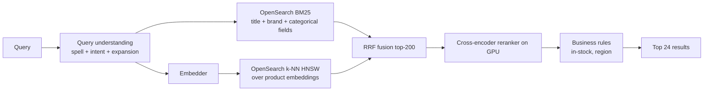

# 05 — Vector DBs exercises

---

### 1. INTERVIEW. Design retrieval for a product-catalog search across 50M items.

Solution

OpenSearch holds both the lexical and the vector index — one operational surface, hybrid retrieval native.

For 50M items at dim 768: HNSW fits in RAM on a few r6i.4xlarge nodes (~80 GB). Plenty of headroom.

Per-query latency: 20 ms BM25 + 20 ms ANN (parallel) + 40 ms rerank + 5 ms post = ~70 ms with parallelization.

---

### 2. DECISION. Scale the same product catalog from 50M to 5B items. What changes?

Solution

HNSW at 5B is not feasible — RAM costs are prohibitive. The migration:

1. **IVF-PQ** or **DiskANN** for the vector index. Each compresses by 50-100x.
2. **Sharded index** across nodes; each shard responsible for a partition (often by category or product family).
3. **Two-stage retrieval**: a small fast HNSW over the *top categories* identified from the query, then a larger IVF-PQ within those categories.
4. **Reranker capacity** scales linearly with QPS but doesn't change shape.

Cost: storage drops from ~15 TB raw FP32 to ~80 GB IVF-PQ at 16 bytes/vec. RAM requirement drops accordingly.

Recall: typically 1-3 percentage points worse than RAM HNSW. Often acceptable given the cost ratio.

Vendor: Milvus, Vespa, or Pinecone in their billion-scale tiers; in 2026 hosted offerings reach billion-scale routinely.

---

### 3. CASE-STUDY READ. Read the DiskANN paper (Subramanya et al., NeurIPS 2019). What's the single algorithmic trick that makes it work?

Solution

**Storing the graph adjacency lists on disk in a layout that aligns with the search traversal pattern**, plus a small in-memory "navigation" subgraph that bootstraps each query.

Specifically: each node's neighbour list is stored together with the node's vector data on a single 4 KB SSD page. The Vamana algorithm builds the graph with both long-range and short-range edges so that traversal converges in a small, predictable number of hops. Each hop is one page read. SSDs can do hundreds of thousands of 4 KB reads per second; the per-query cost is dozens of reads, so the per-query latency lands in single-digit to tens of milliseconds.

The breakthrough is realising you don't need everything in RAM if your access pattern is **bounded sequential page reads**. SSD page-fetch latency is similar to a cache miss; you can afford a hundred of them per query.

---

### 4. DECISION. The team proposes using pgvector for a system that will grow to 500M vectors. Argue against.

Solution

pgvector is excellent up to roughly 10-30M vectors. At 500M, you hit:

1. **Index build times** measured in tens of hours.
2. **Query latency** that doesn't beat dedicated vector DBs.
3. **Postgres write amplification** on the underlying table that competes with your transactional workload.

What you actually want at 500M:

- Either Postgres for *metadata* + a dedicated vector DB (Qdrant, Pinecone, Milvus) for vectors, linked by id.
- Or OpenSearch / Vespa if you need hybrid lexical + vector together.

The exception: if your access pattern is heavily filter-then-vector (e.g., always filtering on `tenant_id` and `is_active`), pgvector's tight integration with Postgres filters can actually win. But this is a niche; profile before committing.

---

### 5. INTERVIEW. Spec the reranker stage for a RAG system. Per-query latency budget: 100 ms.

Solution

Inputs: top 100-200 (query, document) pairs from the fusion stage.

Model: a cross-encoder, typically a 100-300M parameter encoder (e.g., DeBERTa-v3-base, ms-marco-MiniLM-L6 or stronger). Fine-tuned on your domain or a domain-relevant labeled set.

Throughput: on an L4 GPU with dynamic batching, a 100M cross-encoder serves ~500-2000 (q, d) pairs per second. Top-100 rerank per query => 100 pairs per query => 5-20 QPS per L4. Scale by replicas.

Latency: batched on GPU, top-100 rerank in 30-60 ms p99.

Quality lift: typically +5 to +15 percentage points NDCG@10 over BM25 + vector alone, depending on domain. Single highest-impact change in a retrieval system.

Subtleties:

- **Cache the rerank score** for stable (q, d) pairs. RAG hot questions hit the same docs repeatedly.
- **Tune the cutoff.** Reranking the top 200 vs the top 100 buys a small recall lift at 2x reranker cost.
- **Late interaction (ColBERT-style)** is an alternative if reranker cost dominates; precomputes per-token document embeddings and does lightweight late-stage scoring.

---

### 6. DECISION. The corpus updates 100k documents/hour. Pick an update strategy.

Solution

100k/hour is ~28 per second. Easily within an "incremental" index's headroom.

Recommended hybrid:

- **Incremental writes** to the live index: HNSW inserts or IVF-PQ adds. Most engines handle 100s of writes/sec without breaking a sweat.
- **Tombstones for deletes**, never in-place mutations of the graph.
- **Weekly full rebuild** during low-traffic windows to clean up tombstones and re-optimise the graph.

The full rebuild also gives you the chance to swap embedding models if needed (with a shadow comparison before cutover).

Avoid: index-per-day "rolling" strategies — they add a layer of complexity that the simpler hybrid handles natively.

---

### 7. CASE-STUDY READ. Read the Pinecone "Hybrid Search" announcement (2023). What did Pinecone learn from production traffic that drove the feature?

Solution

Pinecone's hybrid-search post explicitly cites the gap between offline benchmarks (where pure vector retrieval tops the charts) and production usage (where users routinely include exact phrases, product IDs, codes, and other rare-token features that vector embeddings smooth over). The pure-vector recall on these queries was bad enough that customer-quality issues drove the team to ship sparse + dense hybrid retrieval.

The lesson generalises: **academic ANN benchmarks measure recall on academic queries**. Production queries have a long tail of "user types a part number"-shaped tasks. Always evaluate on real queries.

---

### 8. INTERVIEW. The product team has a "show me similar items" feature, currently using BM25 on titles. They want to switch to vector. Sketch the migration.

Solution

1. **Ship a candidate embedding model** that produces sensible item embeddings (text + image multimodal, or text-only depending on item content).
2. **Embed the catalogue** in a one-time job. Store embeddings in a vector DB.
3. **Build an HNSW index** of item embeddings.
4. **Shadow comparison.** For every "similar items" request, return BM25 results as before but also compute vector results in the background; log both. Compare offline.
5. **A/B test 5% / 25% / 50% / 100%** on a primary engagement metric (clicks on similar-items module).
6. **Keep BM25 as a fallback** for queries where vector fails (cold-start items with no good embedding, niche categories).

Pitfalls:
- Cold-start items have no view signal, so any embedding model trained on user behaviour will mis-place them. Use content-based (text/image) embeddings for new items; switch when behaviour signal accumulates.
- Reranking is still worth it. The vector retrieval gives candidates; a small ranker over (query item, candidate, context) gives final order.

---

### 9. DECISION. You have 10M user vectors and want to find each user's "top 10 most similar users." Online or batch?

Solution

Almost certainly **batch**. Per-user top-10 across 10M:

- Online ANN per query: ~10 ms x ~10k QPS sustained gives a continuous ANN service.
- Batch: build the HNSW once, run 10M queries against it overnight. 10M queries x 5 ms = ~14 hours single-threaded; parallelize trivially to under an hour.

Batch is 1000x cheaper because you amortise the index build, the queries run on cheap CPU, and there's no online tail-latency tax.

Exception: if "similar users" is queried at request time *for a specific just-onboarded user* whose embedding doesn't exist in the index yet, you do need online inference of the new user's embedding plus an online ANN against the batch-built index of existing users. Mixed shape.

---

### 10. CASE-STUDY READ. Read the HNSW paper (Malkov & Yashunin, 2018). What's the role of the upper layers in the graph?

Solution

The upper layers are **sparse small-world graphs** that serve as a "highway" — long-range edges that let a search descend rapidly to a region near the target before fine-grained local search takes over.

Each node is randomly assigned a maximum layer; only the layer-0 graph contains all nodes. The probability of being assigned to higher layers decays geometrically, so the upper layers are very sparse and have long edges.

A query starts at the top layer's entry point, greedily descends to local nearest neighbours, then drops to the next layer at the current best node, repeats. This gives expected `O(log N)` traversal length at any layer plus bounded local exploration, which produces overall sub-logarithmic query complexity in practice.

The "skip-list of small-world graphs" framing is a useful mnemonic. It's why HNSW is robust to graph topology choices — the layered structure provides good navigation even when individual edges are noisy.

---

### 11. INTERVIEW. The team is adding "filter by category" to vector retrieval. What goes wrong if you do it naively?

Solution

Naive approach: retrieve top-1000 by vector, then filter to the requested category. If the filtered category has only 5 of the top 1000 results, you return 5 instead of 1000.

Better approaches:

1. **Pre-filter.** Apply the category filter before vector search — only search within the subgraph of nodes in the category. Qdrant, Vespa, OpenSearch support this with varying efficiency.
2. **Per-category indexes.** If categories are stable and few, build a separate index per category. Best recall, more storage.
3. **Over-retrieve.** Retrieve top-10000 by vector, then filter. Wasteful but simple; works if the filter is permissive.

The right answer depends on filter selectivity. If a typical filter cuts results to ~5% of the corpus, pre-filtering wins. If filters are loose, over-retrieve wins.

Edge case: a very selective filter (~0.01% of corpus) makes both approaches bad — the index doesn't help much. Sometimes the right move is a database query plus a small in-memory cosine search over the filtered subset.

---

### 12. DECISION. You're choosing between OpenAI embeddings (hosted), Cohere embeddings (hosted), and bge-large (self-host). Frame the choice.

Solution

Three axes:

| Axis | Hosted (OpenAI / Cohere) | Self-host (bge) |
|------|---------------------------|------------------|
| **Quality** | Top-tier; current frontier. | Slightly behind frontier, often within 1-3% on real tasks. |
| **Cost per embedding** | ~$0.01-0.10 per 1M tokens depending on tier. | Hardware + ops; cheaper at scale (>~100M docs). |
| **Lock-in** | Re-embedding to switch providers. | Self-controlled; can update on your timeline. |
| **Latency at ingest** | API rate limits constrain bulk ingest. | Self-controlled. |
| **Latency online** | API call adds 30-100 ms. | In-process or local network; ~5 ms. |
| **Compliance** | Data leaves your VPC. | Data stays. |

Defaults:

- **<100M documents and no strict data-residency:** hosted. Cheaper to prototype, faster to ship.
- **>100M documents or regulated data:** self-host. The break-even is real.
- **Both, with an abstraction layer.** Many production teams run both — hosted for ergonomics, self-host as a fallback / for scale paths.

