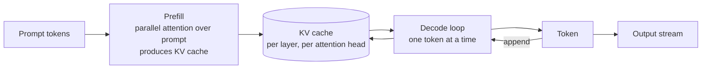
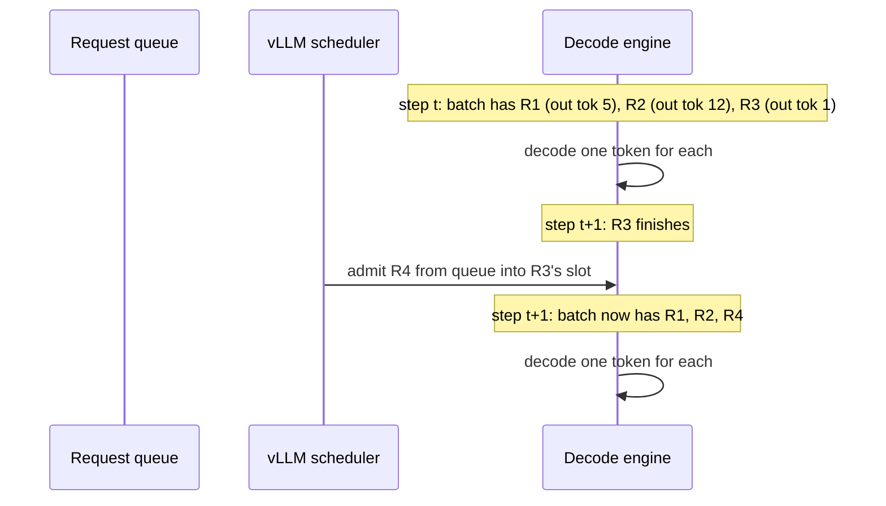
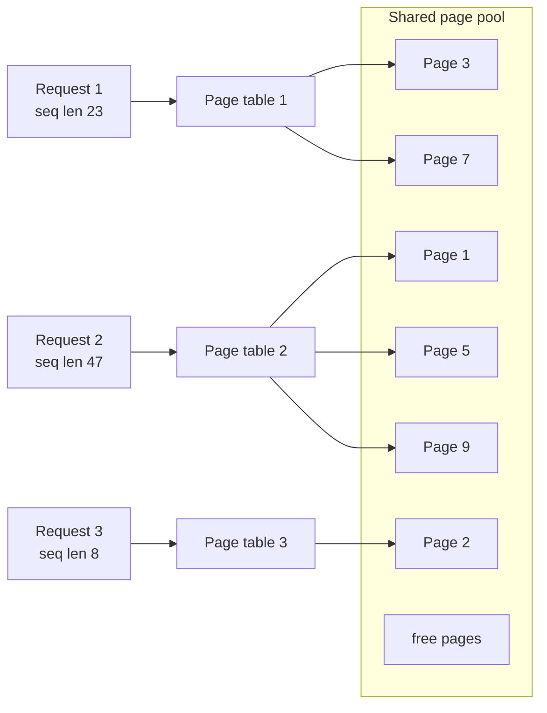
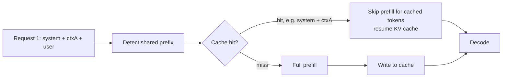
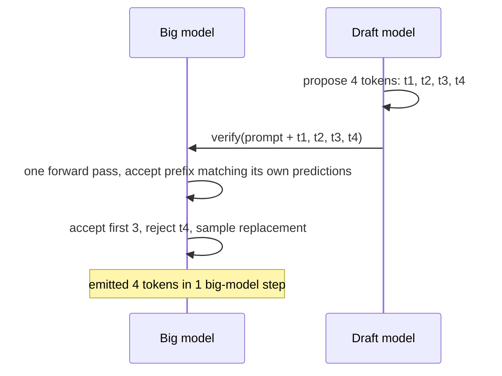
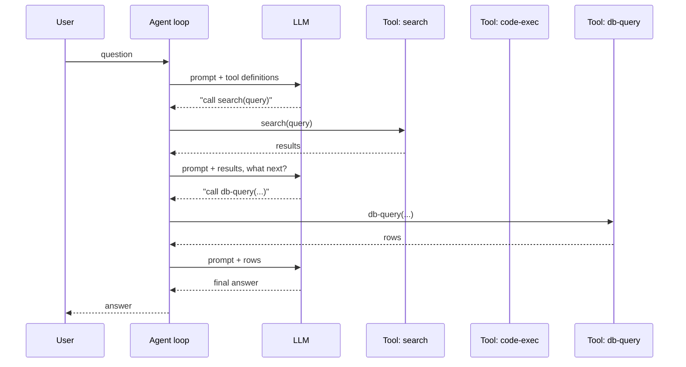
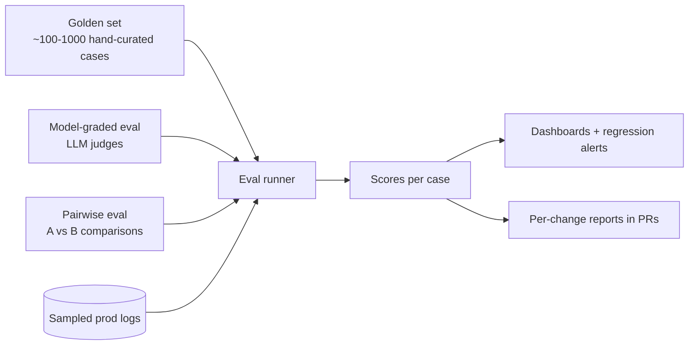

# 06 — LLM Serving and RAG

> Time budget: 120 minutes. This is the longest module because the LLM serving and RAG stack is where most ML system work happens in 2026.

**By the end you can:**

1. Reason about LLM inference internals at a system level: prefill vs decode, KV cache, paged attention, continuous batching, speculative decoding, prompt caching.
2. Design a RAG system end-to-end and identify the seven decisions that determine quality.
3. Pick chunking strategies, embedding models, and context-packing policies.
4. Build an eval harness (golden sets, model-graded eval, pairwise) as infrastructure, not a notebook.
5. Reason about token economics: input vs output, cache hits, model routing, output-length constraints.

---

## 1. LLM inference internals (the system level)

LLM inference has two phases:



| Phase | Compute | Memory | What dominates |
|-------|---------|--------|----------------|
| **Prefill** | Massive parallel matmuls; entire prompt at once. | KV cache size grows with prompt length. | Compute-bound. GPU TFLOPS utilised well. |
| **Decode** | One token at a time. Sequential. | Reads grow with output length. | Memory-bandwidth-bound. GPU TFLOPS underutilised. |

The KV cache is the **biggest single memory consumer** during decode. For a 70B transformer at FP16 with 80 layers and 128 heads, the per-token KV cache is megabytes. A 4096-token conversation can need gigabytes of KV memory.

### Why this shapes serving design

- **Prefill is the dollar.** Long prompts cost real compute. Cache them.
- **Decode is the wall clock.** Output tokens are slow. Constrain output length.
- **The GPU is idle during decode.** Continuous batching shares that idle compute across many in-flight requests.

---

## 2. Continuous batching (the single most important serving idea)

Dynamic batching (the classic technique, see [Module 04](../04-serving-online-batch-streaming/README.md)) collects requests in a small window and runs them as one batch. For LLM inference, this is **insufficient** because each request takes a wildly different number of decode steps. A short response and a long response can't be batched together if the batch waits for the longest.

**Continuous batching** (Yu et al., Orca, OSDI 2022; popularised by vLLM, SOSP 2023): admit new requests to the in-flight batch at every decode step. When a request finishes, its slot is filled by a queued request. Iterations of the batch don't wait for the slowest request.



The throughput uplift (vLLM benchmarks, 2023; subsequent papers): 5-20x vs naive dynamic batching at the same latency budget.

---

## 3. PagedAttention (vLLM's KV-cache trick)

The KV cache traditionally lives in a contiguous block of GPU memory per request. Problem: variable-length sequences waste memory (allocated for the max, used for the actual). For high-throughput serving with many concurrent requests, this fragmentation makes the KV cache the bottleneck.

PagedAttention (Kwon et al., SOSP 2023): treat the KV cache like virtual memory — fixed-size blocks (pages), per-request page tables. Allocations are demand-driven; fragmentation drops to near zero.



The result: 2-4x more concurrent requests on the same GPU. Pretty much every modern LLM inference engine has adopted some variation.

---

## 4. Prompt caching (the dominant cost lever in 2024-2026)

A typical RAG prompt looks like:

```text
[system prompt: 500 tokens]
[retrieved context: 3000 tokens]
[user message: 100 tokens]
```

Of those 3600 tokens, the system prompt is identical across requests, and large parts of the retrieved context recur (popular docs, popular queries). Re-running prefill over identical tokens is wasted compute.

**Prompt caching** (Anthropic launched commercially 2024; OpenAI, Google, vLLM, SGLang all support variants): store the KV cache for shared prompt prefixes. The next request with the same prefix skips prefill and starts decode immediately.



Cost impact (Anthropic / OpenAI public pricing, 2024-2025):

| Token type | Price relative to standard input |
|------------|------------------------------------|
| Input, uncached | 1.0x |
| Input, cache write | ~1.0-1.25x |
| Input, cache read | ~0.1x (90% cheaper) |
| Output | 5x |

A 70% cache hit rate on a 3000-token shared prefix saves roughly two-thirds of the input bill.

### How to maximise cache hits

1. **Stable prefix.** System prompt, tool definitions, persona — frozen across requests. Put them first.
2. **Stable middle.** Retrieved chunks if you can. RAG systems benefit when popular docs sit in the same position across requests.
3. **Variable suffix.** User message at the end.

Hosted APIs cache automatically with a TTL (typically minutes). Self-hosted vLLM / SGLang let you control the cache explicitly.

---

## 5. Speculative decoding

The decode phase is memory-bandwidth-bound: most of the time is spent reading model weights and the KV cache from HBM, not doing arithmetic. Speculative decoding (Leviathan et al., Google, ICML 2023; Chen et al., DeepMind, 2023): use a small "draft" model to propose multiple tokens cheaply; the big model verifies them all in a single forward pass.



Throughput uplift: 1.5-3x typical, depending on draft model quality. The draft model can be a smaller distilled version of the big model, or a "Medusa" head (Cai et al., 2024) that predicts multiple positions in one pass.

---

## 6. The RAG reference architecture

See [`../diagrams-shared/rag-reference-architecture.md`](../diagrams-shared/rag-reference-architecture.md) for the canonical map. Below: the seven decisions and how each affects quality.

### Seven decisions

| Decision | What it controls | Cheap default | Quality lever rank |
|----------|-------------------|----------------|---------------------|
| **Chunk size + overlap** | Granularity of retrieval | 500-1000 tokens, 10-20% overlap | Medium-high (often overlooked) |
| **Embedding model** | Recall of relevant chunks | Strong open model (BGE, E5) or hosted (OpenAI, Cohere, Voyage) | High |
| **Index type** | Latency / scale trade-off | HNSW or IVF-PQ as per [Module 05](../05-vector-dbs-and-retrieval/README.md) | Low (capacity, not quality) |
| **Hybrid retrieval** | Coverage of rare-token queries | BM25 + vector + RRF | High |
| **Reranker** | Quality of top-K | Cross-encoder over top 100-200 | Very high |
| **Context packing** | What the LLM actually sees | Order by relevance, fit in budget | Medium |
| **Eval harness** | Whether you can measure any of the above | Golden set + model-graded + pairwise | Existential |

### Chunking — the most underrated lever

```text
"Big chunks (3000+ tokens)" — high recall per chunk, low precision; the model wastes tokens on irrelevant context.

"Tiny chunks (50-100 tokens)" — high precision per chunk, low recall (no chunk covers the answer alone); the model can't connect facts split across chunks.

"Semantic chunks (variable size, split on heading / paragraph / topic boundary)" — best of both worlds, more work to implement.

"Sentence-window chunks" — embed each sentence, but at retrieval time return a sliding window around the hit (Llama Index pattern, 2023).
```

Most production RAG systems land at: semantic split on headings, 500-1000 token chunks, 10-20% token overlap. Tune by eval, not by feel.

### Embedding model — the long shadow of lock-in

Three considerations:

1. **Quality.** Use the MTEB leaderboard (massive text embedding benchmark, 2022-2026) as a starting point. The top of the leaderboard moves quarterly.
2. **Cost.** Hosted at scale gets expensive; self-host kicks in around the 10-100M document mark.
3. **Lock-in.** You cannot easily swap embedding models once you've embedded 100M docs.

A reasonable strategy: prototype with a hosted embedding model, lock in your eval, then evaluate a self-hosted candidate that's strong on your domain before going to scale.

### Context packing

You have 16-200k tokens of context window (varies by model). You have 30 retrieved chunks at 800 tokens each. You can fit them all. Should you?

**Lost-in-the-middle** (Liu et al., 2023): LLMs underweight content in the middle of long contexts. Moving the most-relevant chunk from middle to top can swing quality by 10-20 percentage points.

Practical packing rules:

1. **Order by relevance** (reranker score), with the highest at the front and the second-highest at the very end. Beats relevance-only ordering.
2. **Cut aggressively.** A reranker-confidence threshold often beats "fill the context."
3. **Leave headroom.** A 100k context with 95k of retrieval leaves the model nowhere to think.
4. **Tag chunks with metadata.** `[source: docs/foo, chunk 12]` lets the model cite and your post-processor verify.

---

## 7. Tools and agents

A modern LLM application often makes calls — fetch a document, run code, query a database. This is **tool use**, also called **function calling**.



Anthropic's "Building Effective Agents" post (2024-2025) is the cleanest distillation of how to think about this. Key system-level concerns:

| Concern | What to do |
|---------|------------|
| **Tool calls cost tokens** | Each call adds prompt + result to the context; long loops blow context windows and cost. |
| **Retries** | Tools fail; agents must retry with backoff and at some point give up. Budget the retry count. |
| **Sandboxing** | Code-execution and shell tools must run in a hermetic sandbox (gVisor, Firecracker, Docker with strict seccomp). Treat tool inputs as untrusted. |
| **Timeouts** | Tool calls without timeouts hang the agent loop. |
| **Eval** | Agent quality is a function of the loop, not just the model. Eval the loop. |

A pragmatic discipline: **simpler is better**. Most production "agentic" systems are at most 3-5 tool calls deep; long loops compound errors.

---

## 8. Evals as infrastructure

You cannot ship an LLM system without evals. Without evals, every prompt tweak feels like an improvement and your system regresses unnoticed.



| Eval type | When to use | Strengths | Weaknesses |
|-----------|-------------|-----------|------------|
| **Golden set** | Regression detection on canonical cases. | Stable, fast, debuggable. | Quickly becomes the only thing you optimise for; covers only what you thought of. |
| **Model-graded** | Open-ended generations where exact match is meaningless. | Scales. Can evaluate "helpful, harmless, honest." | The judge has biases; calibrate against human-graded subset. |
| **Pairwise** | Comparing two model / prompt versions on the same input. | Powerful for "is B better than A?" | Doesn't tell you absolute quality. |
| **Production logs** | Real coverage of user behaviour. | Real distribution. | Hard to label; consent / privacy concerns. |
| **Red-teaming** | Adversarial behaviour. | Catches harm vectors. | Always incomplete. See [Module 13](../13-privacy-fairness-ethics/README.md). |

**Treat the eval set as a production artefact.** Version it. Review changes. Block PRs that drop the eval score below a threshold without explanation.

A useful sequencing: golden set + model-graded for fast iteration on every PR, weekly pairwise on candidate model changes, monthly red-team sweep.

---

## 9. Token economics — the new TCO

A typical RAG application's monthly bill, broken out:

| Bucket | Share of bill (typical RAG @ 1M queries/day) |
|--------|-----------------------------------------------|
| LLM inference (input + output tokens) | 85-95% |
| Embedding generation (one-time + incremental) | 2-5% |
| Vector DB storage + reads | 2-5% |
| Reranker compute | 1-3% |
| Everything else | <1% |

**LLM inference is the bill.** Five levers, in priority order:

1. **Prompt cache hit ratio.** Maximise shared prefixes; minimise variation in middle.
2. **Output token length.** Output is 5x input. Constrain outputs with concise system prompts.
3. **Model routing.** Cheap model for simple queries; expensive only when needed. A classifier or rule-based router can save 50-70% on routine cases.
4. **Smaller models for the cheap path.** A 7B model is 10-20x cheaper per token than a 70B; for 60% of queries it's good enough.
5. **Retrieved-context size.** Halving retrieved context halves the input bill on uncached prompts.

See [`../calculators/rag-tco.ipynb`](../calculators/rag-tco.ipynb) for a parametric model.

---

## 10. Cross-links

- [`cheat-sheet.md`](./cheat-sheet.md)
- [`exercises.md`](./exercises.md)
- [`pitfalls.md`](./pitfalls.md)
- [`case-studies/`](./case-studies/)
- RAG reference: [`../diagrams-shared/rag-reference-architecture.md`](../diagrams-shared/rag-reference-architecture.md)
- Cost calc: [`../calculators/rag-tco.ipynb`](../calculators/rag-tco.ipynb)
- Up next: [07 Recommendation Systems](../07-recommendation-systems/README.md)

## Sources

- "Efficient Memory Management for Large Language Model Serving with PagedAttention," Kwon et al. (vLLM, SOSP 2023).
- "Orca: A Distributed Serving System for Transformer-Based Generative Models," Yu et al. (OSDI 2022).
- "Fast Inference from Transformers via Speculative Decoding," Leviathan et al. (Google, ICML 2023).
- "Accelerating Large Language Model Decoding with Speculative Sampling," Chen et al. (DeepMind, 2023).
- "Retrieval-Augmented Generation for Knowledge-Intensive NLP Tasks," Lewis et al. (Facebook AI, NeurIPS 2020).
- "Lost in the Middle: How Language Models Use Long Contexts," Liu et al. (TACL 2023).
- Anthropic prompt caching documentation and "Building Effective Agents" (Anthropic, 2024-2025).
- "FlashAttention: Fast and Memory-Efficient Exact Attention with IO-Awareness," Dao et al. (NeurIPS 2022).
- MTEB Leaderboard (Hugging Face, ongoing).
