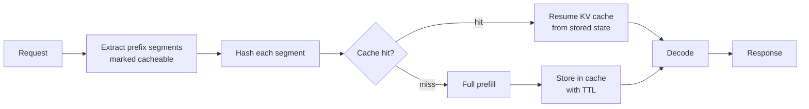

# Anthropic — Prompt caching (2024)

## Problem

By 2024, RAG and agent workloads had emerged with a characteristic shape: every request shared a large stable prefix (system prompt, tool definitions, retrieved context) followed by a small variable suffix (user message). Re-running prefill over identical prefix tokens on every request wasted compute and money. Anthropic's prompt caching (launched 2024) made the cached portion ~10% the price of fresh input tokens.

## Architecture

The API lets a developer mark which prompt segments are "cacheable." Each segment is hashed; cache hits skip prefill for that segment.

## Three load-bearing decisions

1. **Developer-controlled cache boundaries.** Callers know which parts of their prompts are stable; the system trusts them rather than inferring.
2. **Token-priced visibility.** Cache reads cost ~10% of fresh inputs; cache writes cost ~25% more than fresh inputs. The economics nudge developers to design for cache hits.
3. **TTL-bounded.** Cache entries expire (typically minutes). Keeps the cache fresh and bounds memory pressure on Anthropic's serving fleet.

## What's hard about it (industry-wide)

- **Subtle invalidation.** A single token change anywhere in a "cached" prefix invalidates the cache from that point onward. Developers who concatenate variable strings into nominally-stable prefixes silently destroy their cache hit rate.
- **Position-locked caching.** Two cached segments can't be reordered without invalidating the cache; cache hits assume the segments appear in the same positions.
- **Measuring hit rate.** Without server-side telemetry the developer can't easily tell what's hitting cache and what isn't. Anthropic's API exposes a usage breakdown (cached vs uncached tokens) for this reason.

## What you should steal

- **Stable prefix at the top, variable suffix at the bottom** as the universal prompt structure for cache-friendly RAG.
- The discipline of **measuring cache hit rate per request** and treating it as a first-class metric, like p99 latency.
- The framing: **prompt caching is the new dominant cost lever for LLM applications**. Before it existed, the highest-leverage move was model choice; now it's prompt structure.

## Sources

- "Prompt Caching" (Anthropic, 2024-2025).
- Anthropic prompt-caching documentation and pricing pages, current release.
- "Building Effective Agents" (Anthropic, 2024-2025).
- Comparable systems: OpenAI prompt caching (2024), Google Gemini context caching (2024-2025), DeepSeek context caching (2024), vLLM prefix-caching and SGLang RadixAttention.
