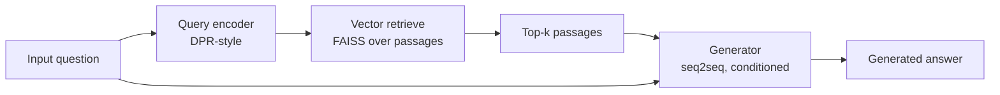

# Facebook AI — RAG (2020)

## Problem

Generative language models pre-2020 had a "frozen knowledge" problem: facts memorised at training time decayed and couldn't be updated without retraining. Lewis et al. (Facebook AI, NeurIPS 2020) proposed Retrieval-Augmented Generation as a hybrid: retrieve relevant documents at inference time, condition the generator on them.

## Architecture

The 2020 paper specifically used Dense Passage Retriever (DPR) + BART. The contribution was the **end-to-end training** of retriever and generator, plus the conceptual framework that has since become the default for grounded-LLM applications.

## Three load-bearing decisions

1. **Separation of retrieval from generation.** Two models, two responsibilities. Retrieval is a search problem; generation is a language problem.
2. **End-to-end training (research contribution).** Both models trained jointly so retrieval learns to surface passages the generator can use. In practice, most production RAG systems train them separately for simplicity.
3. **Marginalisation over retrieved passages.** The generator considers multiple retrievals and the system marginalises (academically) or selects top-K (practically).

## What didn't survive contact with production

- **End-to-end training is rare in industry.** The "joint training" research contribution is academically beautiful but operationally fragile; production RAG separates retrieval and generation.
- **Marginalisation over passages.** Production systems pick top-K and concatenate into the context, not formally marginalise.
- **DPR specifically.** Production retrievers in 2026 are typically much stronger (BGE, E5, OpenAI / Cohere / Voyage hosted), and the hybrid (BM25 + vector + reranker) wins on real queries vs pure dense retrieval.
- **"Frozen knowledge" framing.** The 2020 paper positioned RAG as a fix for outdated knowledge. In 2024-2026 it's more often a privacy / personalisation / source-citation tool: even with a fresh model, you still want grounding in your private corpus.

## What you should steal

- The **conceptual decomposition** (retrieval as a search problem; generation as a language problem) is the right framing for modern systems.
- The **citation discipline.** A RAG answer that cites the source it grounded on is verifiable; a freeform answer isn't.
- The **eval framing.** RAG quality is two-part: retrieval recall (did we find the right passages?) and generator faithfulness (did we ground on them?). Measure separately.

## Sources

- "Retrieval-Augmented Generation for Knowledge-Intensive NLP Tasks," Lewis, Perez, Piktus, Petroni, Karpukhin, Goyal, Küttler, Lewis, Yih, Rocktäschel, Riedel, Kiela (Facebook AI, NeurIPS 2020).
- "Dense Passage Retrieval for Open-Domain Question Answering," Karpukhin et al. (Facebook AI, EMNLP 2020).
- LangChain and LlamaIndex framework documentation, current releases.
- "Building production-grade RAG systems" engineering posts at OpenAI, Anthropic, and others, 2024-2025.
