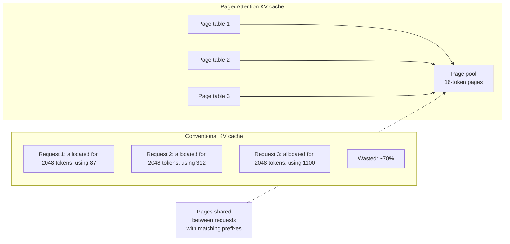

# UC Berkeley / vLLM — PagedAttention (2023)

## Problem

By early 2023, LLM serving infrastructure was a bottleneck on production deployments. The KV cache was the dominant memory consumer; existing servers (HuggingFace TGI, NVIDIA FasterTransformer in its early form) allocated contiguous KV-cache buffers per request, sized for max sequence length. Result: most KV memory was unused at any moment, GPU concurrency was limited, throughput was poor.

## Architecture

## Three load-bearing decisions

1. **Fixed-size KV pages** (typically 16 tokens worth). Allocations are page-granularity, not request-granularity.
2. **Per-request page tables.** A request's KV cache is a list of page indices; pages can be physically anywhere in the pool.
3. **Prefix sharing.** Multiple requests with the same prompt prefix point to the same physical pages — the basis for self-hosted prompt caching.

## What had to be solved

- **Custom CUDA kernel** for paged attention. The attention kernel must follow the page table per request rather than reading contiguous memory. Non-trivial; vLLM's PagedAttention kernel is a major implementation effort.
- **Eviction policy** for the page pool when memory pressure rises. Mostly LRU with a preference for evicting older requests' pages.
- **Integration with continuous batching.** PagedAttention is the memory layout; continuous batching is the scheduling. Both are needed; one without the other underperforms.

## What you should steal

- The **OS-style virtual memory analogy** as a framework for thinking about variable-size workloads. Applies broadly beyond LLMs.
- **Prefix sharing** as a way to amortise expensive prefill across requests. The technique is now table-stakes for hosted LLM APIs.
- The willingness to **write custom kernels when the standard tools don't fit the workload**. vLLM's adoption was rapid because the speedup was unignorable.

## Sources

- "Efficient Memory Management for Large Language Model Serving with PagedAttention," Kwon, Li, Zhuang, Sheng, Zheng, Yu, Gonzalez, Zhang, Stoica (UC Berkeley, SOSP 2023).
- vLLM GitHub repository and documentation, current release.
- "vLLM: Easy, Fast, and Cheap LLM Serving with PagedAttention" (UC Berkeley Sky Lab, 2023).
