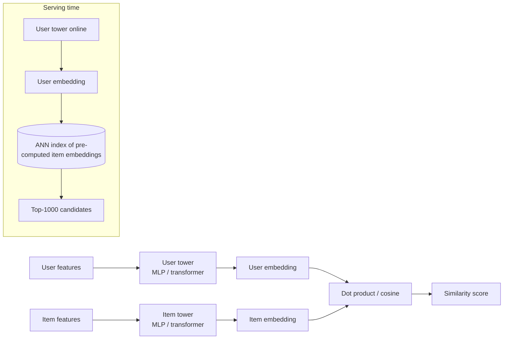
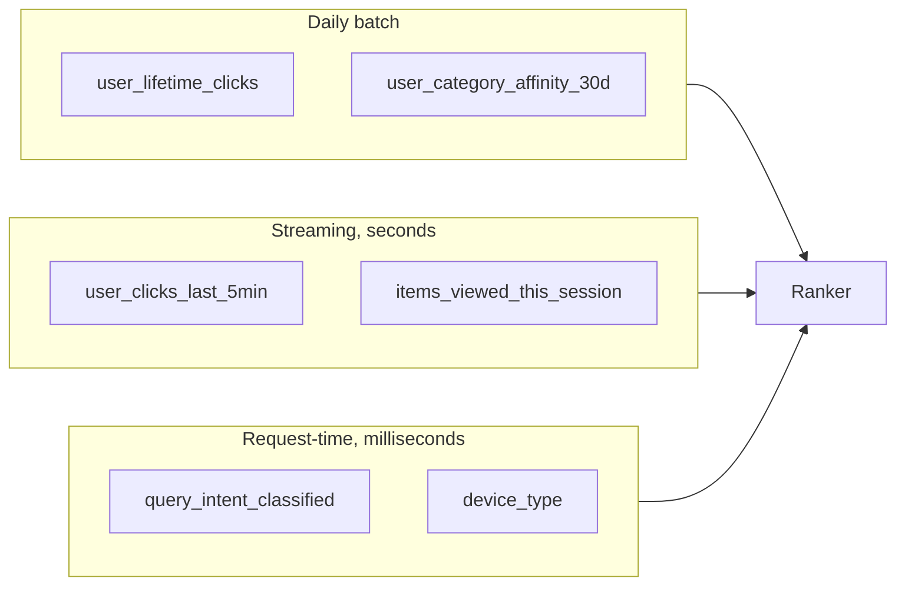
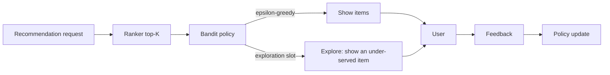
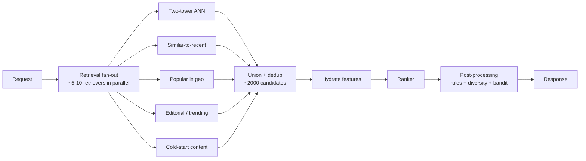

# 07 — Recommendation Systems

> Time budget: 90 minutes. Recsys is the workhorse of consumer-internet ML. Most of what you'll see in production is a variation on the patterns in this module.

**By the end you can:**

1. Lay out a retrieval -> ranking -> filtering pipeline and reason about each stage's cost / latency budget.
2. Design a two-tower candidate generation model and train it with negative sampling.
3. Pick a learning-to-rank loss (pointwise / pairwise / listwise) for a given product metric.
4. Distinguish real-time from batch signals and decide which a feature needs to be.
5. Design a contextual bandit for exploration and reason about cold-start across users, items, and both.

---

## 1. The two-stage architecture

See [`../diagrams-shared/recsys-two-stage.md`](../diagrams-shared/recsys-two-stage.md) for the canonical diagram.

In one line: **retrieval** narrows the corpus from millions to thousands cheaply; **ranking** orders those thousands precisely. Most production recsys also has a **post-processing** stage for business rules and diversity.

| Stage | Goal | Metric | Latency | Model |
|-------|------|--------|---------|-------|
| **Retrieval** | High recall of relevant items | recall@1000 | ~10-20 ms | Two-tower, heuristic, popularity union |
| **Ranking** | Precise top-K | NDCG@K, engagement | ~30-80 ms | GBDT, DLRM, transformer |
| **Post-processing** | Diversity, filters, exploration | Long-term engagement, fairness | ~5-10 ms | Rules + bandit |

The two-stage idea isn't required by physics; it's required by the math of "score every item with the heavy model." At 100M items and 50 ms p99, you can score maybe 10k items per request. Anything more needs cheap filtering first.

---

## 2. Two-tower candidate generation

The dominant retrieval architecture since Covington et al. (YouTube, RecSys 2016) and its evolution at Google (Yi et al., RecSys 2019), Pinterest (PinSage, KDD 2018), Meta, and elsewhere.

Why this shape:

1. **Decoupling.** User embedding is computed at request time (it depends on session context). Item embeddings are computed offline and stored in an ANN index. Retrieval is one ANN call.
2. **Cheap retrieval.** ANN over millions of items in ~10-20 ms (see [Module 05](../05-vector-dbs-and-retrieval/README.md)).
3. **Trainable on real data.** Negative sampling makes training tractable on billions of impressions.

### Training: in-batch negatives

The two-tower loss is typically softmax over the in-batch items: for each positive pair (u, i+), all other items in the same batch are negatives. This is computationally cheap.

The problem: **sampling bias** (Yi et al., 2019). Popular items appear more often in batches, so are penalised more in training. The model under-recommends popular items.

The fix: **log-q correction**. Multiply the in-batch similarity by `-log(P(i in batch))` for the negative items. Pinterest, YouTube, and Meta all describe this fix in their papers.

### Hard negatives

In-batch negatives are *random*. Most are easy (a cooking video paired with a random gaming user — trivially "not similar"). Hard negatives — items that look similar but aren't — sharpen the model.

Practical sources of hard negatives:

- Items that were retrieved but not clicked.
- Items that were displayed alongside the positive but not clicked.
- Items in the same category as the positive.

Pinterest's PinSage (Ying et al., KDD 2018) and Google's various recsys papers describe specific hard-negative mining strategies.

---

## 3. Ranking

The ranking stage scores ~1000 candidates with a heavier model and outputs top-K.

### Three families of LTR loss

| Family | What it optimises | When to use |
|--------|--------------------|-------------|
| **Pointwise** | Predict each (user, item) score independently. | Easy. Loss is regression / classification. Baseline. |
| **Pairwise** | For each pair (positive, negative), make the positive's score higher. | RankNet (Burges et al., 2005). Often the best engineering trade-off. |
| **Listwise** | Optimise the metric over the whole list. | ListNet / ListMLE / LambdaRank. State-of-the-art on benchmarks; more complex. |

In production: pairwise loss with carefully constructed pairs is typically the sweet spot. The complexity of listwise is rarely worth it.

### Model architecture

Common ranker shapes:

1. **Gradient-boosted trees (XGBoost / LightGBM / CatBoost).** The default until ~2022. Strong on tabular features, fast inference, well-understood.
2. **Deep learning recsys (DLRM, DCN, DeepFM, Wide & Deep).** Sparse embeddings + dense crosses + a deep network. Beat trees when feature interaction is high-order or sequential signals matter.
3. **Transformer ranker (BST, SASRec).** Sequence-aware ranking. Wins when user history is a strong signal (video watch, music play).
4. **LLM-as-ranker.** Emerging in 2024-2026. Expensive; works for low-QPS / high-stakes recsys (long-tail content, expert recommendations).

The pragmatic order of attempts: trees first, then deep learning if trees plateau on a metric that matters, then transformer for sequence-heavy domains.

### Features that move the needle

Three categories:

| Category | Examples | Where computed |
|----------|----------|----------------|
| **User** | demographics, long-term taste, engagement statistics | Mostly offline, refreshed daily; some session-scoped online |
| **Item** | category, age, popularity, embedding | Mostly offline; embedding refreshed when retrained |
| **Context** | device, time of day, location, query, session sequence | Online, per-request |
| **Interaction** | "user clicked item before?", "user-category affinity" | Mixed: long-term batch, short-term streaming |

A pragmatic feature-engineering observation: **session-context features** and **short-term interaction features** are typically the highest-leverage additions to a ranker. Daily-batch features matter less than people think.

---

## 4. Real-time vs batch signals

A single feature can come from any time scale:

The decision per feature: **how stale can it be?** A feature that's 24 hours old (e.g., monthly trend) is fine in a batch. A feature that's 60 seconds old (e.g., session activity) needs streaming. A feature derived from this exact request (query intent) is request-time.

Cost shapes:

| Source | Storage cost | Compute cost per request | Freshness |
|--------|---------------|----------------------------|-----------|
| Batch | High (cold rows in warehouse) | Low (precomputed) | 24 h |
| Streaming | Medium (online KV store) | Low (precomputed feature) | seconds |
| Request-time | None | High (computed every request) | live |

Pinterest (2022) and DoorDash (2022) both publish that the highest-impact feature additions in the last few years have been streaming session signals, not new batch features.

---

## 5. Cold start

Three flavours, three different fixes.

| Cold start | What's missing | Fix |
|-----------|-----------------|-----|
| **Item cold start** | No interactions for a new item. | Content embeddings (text / image / audio). PinSage's image-based item embeddings are the canonical example. |
| **User cold start** | No interactions for a new user. | Bootstrap from registration signals + popular items + bandit exploration. Sparingly. |
| **Both cold** | New user, new item. | Pure content matching + exploration. Hard. |

A useful pattern: **content-and-behaviour ensemble**. The model has both a content-based embedding (computed from item properties) and a behaviour-based embedding (learned from interactions). For an item with lots of interactions, the behaviour signal dominates; for a cold item, the content signal carries.

This is exactly what PinSage does (Ying et al., 2018): each pin's embedding is a graph aggregate over its content features and its neighbour pins' embeddings. New pins join the graph with a content-based embedding; they accumulate behaviour signal as interactions roll in.

---

## 6. Bandits and exploration

A ranker trained on observed clicks is **biased toward what was historically displayed**. If you never show item I to user U, you never learn whether U would have liked I. This is the **selection bias** problem (or the explore-exploit problem in disguise).

### Multi-armed bandits

Common policies:

| Policy | Pros | Cons |
|--------|------|------|
| **Epsilon-greedy** | Trivial to implement. | Exploration is uniform; wasteful. |
| **Thompson sampling** | Bayesian; explores in proportion to uncertainty. | Needs a posterior model. |
| **LinUCB / Upper Confidence Bound** | Strong theoretical guarantees. | Linear model assumption. |
| **Contextual bandits with neural policy** | Captures non-linear context. | More moving parts. |

Spotify's BaRT (Bandits for Recommendations as Treatments, RecSys 2020) describes a production-grade contextual bandit applied to the home-screen recommendations. The key idea: treat each shelf / module as an arm, condition on user features, learn a policy that maximises long-term engagement.

### How much to explore

A common discipline: dedicate a small fraction (1-5%) of impressions to exploration. The data this generates closes the feedback loop and prevents the ranker from collapsing onto a narrow set of items.

---

## 7. Diversity and serendipity

A ranker optimised for click probability tends to over-concentrate: 10 results, all variations of the same theme. Users get bored; long-term engagement drops.

Two common diversity tools:

1. **Maximal Marginal Relevance (MMR).** Score = relevance - lambda * max similarity to already-selected items. Iteratively select the highest-scoring item.
2. **Determinantal Point Processes (DPP).** Probabilistically prefer diverse sets. More mathematically elegant; more expensive.

A blunter approach: per-source / per-category caps in post-processing. "At most 3 items per creator in the top 20."

This isn't a niche concern. Instagram, YouTube, TikTok, and Pinterest all publish that diversity-aware ranking improves long-term engagement metrics even when it costs short-term click probability.

---

## 8. The retrieval-ranking-filtering pipeline at scale

Production recsys at consumer scale typically looks like:

The reason for multiple retrievers: each captures a different intent. Two-tower captures "what this user generally likes"; similar-to-recent captures "what they're thinking about right now"; trending captures "what's hot." A single retriever loses one of these.

YouTube and Pinterest both publish that >50% of clicks come from items only one retriever surfaced; removing any single retriever measurably hurts engagement.

---

## 9. Cross-links

- [`cheat-sheet.md`](./cheat-sheet.md)
- [`exercises.md`](./exercises.md)
- [`pitfalls.md`](./pitfalls.md)
- [`case-studies/`](./case-studies/)
- Two-stage reference: [`../diagrams-shared/recsys-two-stage.md`](../diagrams-shared/recsys-two-stage.md)
- Cost calc: [`../calculators/recsys-cost.ipynb`](../calculators/recsys-cost.ipynb)
- Up next: [08 Search and Ranking](../08-search-and-ranking/README.md)

## Sources

- "Deep Neural Networks for YouTube Recommendations," Covington, Adams, Sargin (Google, RecSys 2016).
- "Graph Convolutional Neural Networks for Web-Scale Recommender Systems (PinSage)," Ying et al. (Pinterest, KDD 2018).
- "Sampling-Bias-Corrected Neural Modeling for Large Corpus Item Recommendations," Yi et al. (Google, RecSys 2019).
- "BaRT: Bandits for Recommendations as Treatments," McInerney et al. (Spotify, RecSys 2020).
- "Wide & Deep Learning for Recommender Systems," Cheng et al. (Google, DLRS 2016).
- "Deep Learning Recommendation Model (DLRM) for Personalization and Recommendation Systems," Naumov et al. (Meta, 2019).
- "Instagram's Explore Recommender System" (Meta Engineering, 2023).
- "Real-time Machine Learning at Pinterest" (Pinterest Engineering, 2022).
- "Real-time Predictions at DoorDash" (DoorDash Engineering, 2021-2023).
