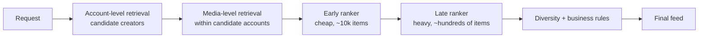

# Meta — Instagram Explore recommender (2023)

## Problem

Instagram's Explore surface recommends content (photos, Reels, carousels) to over a billion users from a corpus of billions of media items. The 2023 Engineering post describes how the recommender is structured to handle this scale while balancing freshness, diversity, and engagement.

## Architecture

Three-stage retrieval and two-stage ranking (early + late). Each stage's output set is an order of magnitude smaller than its input.

## Three load-bearing decisions

1. **Two-stage retrieval.** Account-level then media-level. Cheaper than a single-stage media-level retrieval over billions of items.
2. **Early + late ranker.** The early ranker is cheap and prunes the candidate set 10x; the late ranker is heavy and runs only on the survivors.
3. **Heterogeneous content types** (Reels, Photos, Carousels) handled with content-type-specific features but a shared ranking framework.

## What was hard

- **Co-tenanting Reels and Photos.** Different engagement signals (play through rate vs likes); naive joint ranking biases toward one format. The post describes per-type calibration to make scores comparable.
- **Cold-start at scale.** New accounts and new media every second; exploration policy is a first-class concern.
- **Inference cost.** Two retrieval stages + two rankers + diversity is a lot of computation per request. The post describes aggressive caching and request-coalescing techniques.

## What you should steal

- The **multi-stage retrieval** when the corpus is truly enormous. Stage your filtering; each stage is cheap on its own.
- The **early + late ranker** pattern. The early ranker doesn't have to be great — it just has to prune the candidate set so the late ranker can afford to be heavy.
- The discipline of **per-content-type calibration** when mixing heterogeneous outputs. Scores from different models are not directly comparable without it.

## Sources

- "Instagram's Explore Recommender System" (Meta Engineering, 2023).
- "Building Instagram Reels' Recommender System" (Meta Engineering, 2023).
- "Deep Learning Recommendation Model (DLRM) for Personalization and Recommendation Systems," Naumov et al. (Meta, 2019).
