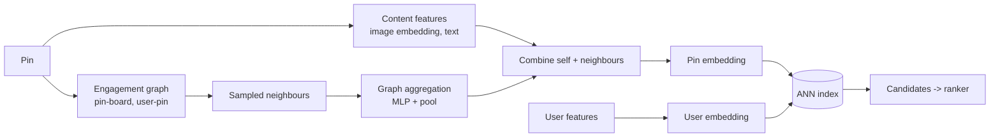

# Pinterest — PinSage (2018)

## Problem

Pinterest's recommender needed embeddings for billions of pins. Behaviour-only embeddings struggled with cold-start; content-only embeddings missed the user-driven semantics that make Pinterest's pin-to-board structure meaningful. PinSage combined the two using graph convolutional networks.

## Architecture

Random walks sample neighbours efficiently; the importance-sampled neighbour aggregation is the key trick.

## Three load-bearing decisions

1. **Graph aggregation over neighbours.** Each pin's embedding is influenced by the pins around it in the engagement graph. Captures multi-hop semantics that flat embeddings miss.
2. **Random-walk neighbour sampling.** Full neighbour aggregation at Pinterest's scale is intractable. Importance-sampled walks pick the most-informative neighbours efficiently.
3. **Two-tower retrieval on graph embeddings.** Train the pin embeddings, then use them in a standard ANN retrieval. The graph aggregation is an offline preprocessing step.

## What didn't translate to every domain

- **Graph density matters.** Pinterest has a dense pin-board graph; YouTube and Spotify graphs are sparser, and the lift from GraphSAGE-style aggregation is smaller. Don't assume PinSage will give you 10 points of recall in a different domain.
- **Training cost.** Random walks + neighbour aggregation makes training meaningfully more expensive than flat two-tower; engineering investment is real.
- **Inference cost** (for new pins): a new pin's embedding requires neighbour aggregation at insertion time. Manageable but not free.

## What you should steal

- The **content-and-behaviour ensemble**. New items benefit from content; established items benefit from behaviour. The same vector encodes both.
- **Importance sampling** for graph aggregation at scale. The full neighbourhood is intractable; the right sample is tractable and almost as good.
- The discipline of **measuring cold-start performance separately** from steady-state performance. Many recsys metrics hide cold-start failures.

## Sources

- "Graph Convolutional Neural Networks for Web-Scale Recommender Systems (PinSage)," Ying, He, Chen, Eksombatchai, Hamilton, Leskovec (Pinterest / Stanford, KDD 2018).
- "Real-time Machine Learning at Pinterest" (Pinterest Engineering, 2022).
