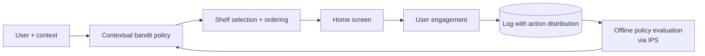

# Spotify — BaRT (2020)

## Problem

Spotify's home screen is a grid of "shelves" — personalised modules ("Recently played", "Made for you", "Discover Weekly", editorial picks). Which shelves to show in which order is a high-leverage decision: it controls what users see first. Static rules were missing personalisation; supervised learning on offline labels was biased by what had previously been shown. Spotify needed an online learning approach.

## Architecture

## Three load-bearing decisions

1. **Treat each shelf as a bandit arm.** The policy chooses which shelves to show and how to order them, conditioned on user context.
2. **Log the action distribution.** At decision time, log not just which action was taken but the probability of each action. This enables unbiased offline policy evaluation via inverse propensity scoring (IPS).
3. **Reward shaping.** Reward is a composite engagement metric (listens, saves, skips, with weights). Not raw clicks.

## What was hard

- **High-dimensional context.** Spotify's user features are rich; the bandit's policy class has to handle that without overfitting.
- **Delayed feedback.** Some engagement signals (saves, follow-ups) arrive minutes-to-days after the impression. The reward is partially observed at decision time.
- **Reward gaming.** A naive "maximise clicks" policy promoted clickbait; reward shaping had to be tuned to long-term engagement.

## What you should steal

- The **IPS-based offline evaluation** discipline. Logging action distributions makes counterfactual evaluation tractable; without it, you can't safely compare a new policy to the current one.
- **Composite rewards** that balance short-term and long-term signals. Optimising one metric in isolation produces local maxima that hurt the product.
- The pattern of **online policies trained offline**: the bandit's policy is updated from logged data nightly, not via in-flight gradient updates. Far safer than true online learning.

## Sources

- "BaRT: Bandits for Recommendations as Treatments," McInerney, Lacker, Hansen, Higley, Bouchard, Gruson, Mehrotra (Spotify, RecSys 2020).
- "Recommending Music on Spotify with Deep Learning" (Spotify Engineering, 2014).
- "Algorithmic Effects on the Diversity of Consumption on Spotify," Anderson et al. (Spotify, 2020).
