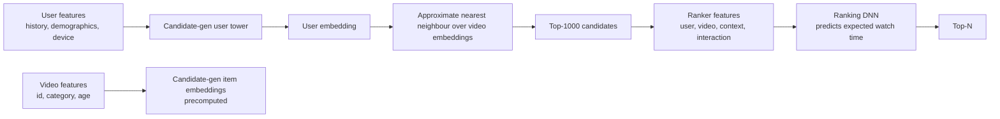

# YouTube — Deep neural network recommendations (2016-2019)

## Problem

YouTube serves recommendations to a billion-plus users across a corpus of hundreds of millions of videos. By 2015 the previous recsys (matrix factorisation + heuristics) was hitting limits. The team needed an architecture that scaled to the corpus size while learning richer user representations.

## Architecture

## Three load-bearing decisions

1. **Two-stage architecture.** Candidate generation is a separate model from ranking. This is the standard now, but in 2016 the paper popularised it.
2. **Watch-time as the prediction target.** Clicks are noisy; clicked-and-immediately-closed isn't valuable. Watch time correlates with revenue and is harder to game.
3. **In-batch negative softmax.** Treats recommendation as extreme multiclass classification (millions of classes) using sampled softmax over in-batch items.

## What evolved

- **Sampling bias correction.** The 2019 follow-up (Yi et al., RecSys 2019) introduces log-q correction to fix the in-batch-popularity-penalty bug.
- **Session sequences.** Later YouTube papers and posts emphasise treating user history as a sequence (transformer-style) rather than aggregated features.
- **Multi-objective ranking.** The 2019 "Recommending what video to watch next" paper describes a multi-task DNN that jointly predicts engagement and satisfaction metrics, then combines them — handling the "click but didn't enjoy" failure mode.
- **Continuous experimentation.** YouTube's exploration / A/B framework lets them ship hundreds of model changes per quarter, each rigorously measured.

## What you should steal

- The **two-stage architecture** as the default for consumer-scale recsys.
- **Watch-time-class compound metrics.** Don't optimise clicks alone.
- **Negative-sampling math discipline.** Log-q correction is a one-line fix that nobody implements until they read the paper.
- The **multi-objective ranking** pattern when you have multiple signals that disagree.

## Sources

- "Deep Neural Networks for YouTube Recommendations," Covington, Adams, Sargin (Google, RecSys 2016).
- "Recommending What Video to Watch Next: A Multitask Ranking System," Zhao et al. (Google, RecSys 2019).
- "Sampling-Bias-Corrected Neural Modeling for Large Corpus Item Recommendations," Yi et al. (Google, RecSys 2019).
