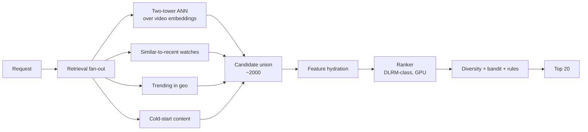

# 07 — Recommendation Systems exercises

---

### 1. INTERVIEW. Design a video recommendation system for a 100M-DAU app. 30-minute sketch.

<details><summary>Solution</summary>

This is the capstone in miniature. See [Module 15](../15-capstone/README.md) for the full version. Short version:



Capacity: 100M DAU x 4 sessions/day = 400M requests/day, ~5k QPS mean. Peak ~15-20k QPS.
Latency budget: 200 ms p99 (50 ms retrieval, 80 ms ranking, 30 ms post, 40 ms overhead + network).
Cost lever: ranker on L4 GPU with dynamic batching is ~3x cheaper per request than CPU.
SLOs: p99 < 200 ms, NDCG@10 within 1% rolling baseline, feature freshness p95 30s, coverage >= 99%.

Full version in the capstone.
</details>

---

### 2. CASE-STUDY READ. Read "Deep Neural Networks for YouTube Recommendations" (Covington et al., RecSys 2016). What's the single architectural decision that the paper popularised?

<details><summary>Solution</summary>

**The two-stage retrieval-then-ranking architecture.**

The paper isn't the first to introduce this idea, but it's the canonical statement: a separate "candidate generation" model that retrieves a few hundred from millions, then a "ranking" model that scores those few hundred precisely. Every consumer recsys for the next decade has adopted this shape.

The paper also popularised:

- Treating recommendation as **extreme multiclass classification** (softmax over all items, sampled).
- Using **watch time** (not clicks) as the primary metric, because clicks are noisier and watch time correlates with revenue.
- **Continuous + categorical + sequence features** in a single deep network — the precursor to DLRM, Wide & Deep, and modern DLRMs.
</details>

---

### 3. DECISION. Your two-tower model recall@1000 is 70%. Pick three things to try, in order of expected impact.

<details><summary>Solution</summary>

1. **Hard negative mining.** In-batch negatives are mostly easy. Sample 20-50% of negatives from "candidates retrieved but not clicked" or from items in the same category as the positive. Typical lift: 3-8 points of recall@1000.
2. **Log-q correction.** If you haven't applied it, popular items are systematically under-retrieved. Two-line fix; typical lift: 2-5 points.
3. **Bigger user tower / better user features.** Add session signals (last 5 items, dwell time on each). Typical lift: 1-3 points.

Things that look promising but rarely deliver: larger item embedding dim (saturates fast), different loss function (BPR / triplet usually similar to softmax), graph neural network (PinSage-style, big lift IF you have a real graph structure).

If those three don't get you to 80-85% recall, the problem is probably the data — your training labels are too noisy or too sparse.
</details>

---

### 4. INTERVIEW. Walk through how you'd handle item cold start in a video platform.

<details><summary>Solution</summary>

For a new video V with no interactions:

1. **Content embedding.** Compute V's embedding from its content: title, description, thumbnail (image embedding), audio fingerprint, transcript. A multimodal embedding model (CLIP-style or in-house) produces V's vector.
2. **Insert into the ANN index** alongside behaviour-trained embeddings. The two-tower model treats V's vector as just another item.
3. **Boost during exploration window.** The bandit / exploration policy gives V higher exposure for the first hour / day. Some platforms explicitly tag new content and route 1-5% of impressions to it.
4. **Trending detection.** As V accumulates interactions, the system promotes / demotes based on engagement velocity.
5. **Graceful fallback to content.** If at any point the behaviour signal disagrees with content signal (sometimes a content-similar item has terrible engagement), the system trusts behaviour for hot items and content for cold.

Pitfall: do not require new items to have a click before they can be recommended. That's a chicken-and-egg trap.
</details>

---

### 5. DECISION. The product team wants to "use a transformer for ranking, like all the new papers." When do you do it?

<details><summary>Solution</summary>

Transformers in ranking win when **sequence matters** — the order and timing of recent user actions is highly predictive. Video, music, news feed: yes. E-commerce search where the query is the dominant signal: usually not.

Diagnostic:

1. **Plot a sequence model's offline AUC** vs the current ranker on a held-out set. If the lift is <0.5% AUC, don't bother; serving cost will dominate.
2. **Check the production session length distribution.** If most sessions are 1-3 items, sequence helps less. If users browse 20+ items per session, sequence helps more.
3. **Measure feature engineering cost.** A transformer ranker on user history needs that history to be stored and served as a sequence at request time. Non-trivial feature plumbing.

Common compromise: a "behavioural sequence" feature (last 50 items) computed offline and fed to a tree ensemble. Captures most of the sequence signal at 10% the serving cost.
</details>

---

### 6. CASE-STUDY READ. Read PinSage (Ying et al., Pinterest, KDD 2018). What does the GraphSAGE-style aggregation give Pinterest that a simple two-tower doesn't?

<details><summary>Solution</summary>

PinSage builds an embedding for each pin by **aggregating over its neighbours in the engagement graph** — pins that have been pinned to the same board, pins that have appeared together in user sessions. The neighbour aggregation is essentially: take the embeddings of (sampled) neighbours, transform, pool, combine with the pin's own features.

What this gives Pinterest:

1. **New-pin cold start handled naturally.** A new pin's neighbours (the boards it's pinned to, the user that pinned it) carry signal; the aggregation surfaces a useful embedding from day one.
2. **Robustness to sparse interactions.** Pins with few direct interactions inherit signal from related pins.
3. **Capture of multi-hop relationships.** A pin's "neighbour of neighbour" influences its embedding, capturing patterns that a flat two-tower can't.

The cost: a more complex training pipeline (random walks, neighbour sampling), and slower training. The benefit was substantial at Pinterest scale; whether it's worth it at your scale depends on graph density.
</details>

---

### 7. INTERVIEW. The team wants to add a bandit for the home-screen module. Spec it.

<details><summary>Solution</summary>

```text
Arms: modules (e.g., "Recently watched", "Trending", "For you", "New from creators you follow")
Context: user features, time of day, device, recent engagement

Policy:
  - Thompson sampling or LinUCB initially; can move to neural bandit if context becomes high-dimensional.
  - Maintain per-arm posteriors of reward.
  - At request time: sample / score each module, rank, present in chosen order.

Reward: composite metric (engagement-weighted, e.g., a click is weight 1, a play >30s is weight 5, a like is weight 3).

Logging:
  - Every impression with the action distribution at time of decision (needed for unbiased offline evaluation via inverse propensity scoring).
  - Outcome (reward) joined back later.

Offline eval:
  - Replay logged data with inverse propensity weighting (IPS) to estimate counterfactual reward of new policies.
  - Holdout slice for online A/B before full rollout.

Safety:
  - Cap per-arm minimum exposure to avoid starving arms with sparse data.
  - Floor / ceiling for reward (clip extreme values).
```

Spotify's BaRT (2020) describes a production-grade version of this exact setup.
</details>

---

### 8. DECISION. You're choosing between training the ranker daily, hourly, and continuously. What guides the decision?

<details><summary>Solution</summary>

The right answer depends on the rate of distribution shift in the system:

| Shift rate | Retrain cadence | Why |
|------------|------------------|-----|
| Slow (months) — taste, demographics | Daily | Cheap, captures trends. |
| Fast (days) — trending content, seasonality | Hourly | Daily is too coarse. |
| Real-time (minutes) — fast-moving fads, news | Frequent batch (every 15-30 min) | Hourly leaves money on the table. |
| Continuous shifts | Online learning | Rare in practice; usually a frequent-batch approach is cheaper and safer. |

A useful diagnostic: train two models a week apart on the same architecture / hyperparameters but different data slices; compare offline AUC across the gap. If the week-old model loses 0.5% AUC vs the fresh one, you need to retrain at least weekly.

Most consumer recsys land at **daily or twice-daily retrain** for the ranker, with **streaming feature updates** filling the gap between retrains. Online learning is unusual and risky.
</details>

---

### 9. INTERVIEW. The retrieval stage's recall@1000 is 92%, but downstream ranking only sees 70% of clicks ending up in the top 20. Where do you look?

<details><summary>Solution</summary>

Recall@1000 = 92% means 92% of the relevant items are in the top 1000 retrieved. Top 20 click coverage = 70% means 30% of clicks went to items that were retrieved but didn't make it into the top 20 after ranking.

The bottleneck is the **ranker**, not the retriever.

Diagnostics:

1. **Per-position click distribution.** Are clicks falling off the expected curve? If clicks are happening at positions 21-50, the ranker isn't promoting them.
2. **Ranker calibration.** Plot predicted score vs actual click rate. Miscalibration means the ranker's score ordering is OK but boundaries are off.
3. **Feature importance drift.** Compare feature importances now vs at training. A drift in a key feature is silently degrading the ranker.
4. **Slice analysis.** Maybe the 30% is one user segment (cold users? specific geo?). The fix may be a segment-specific ranker or fallback.

Fixes are usually: retrain the ranker on fresher data, add a missing session feature, fix a feature-pipeline bug.
</details>

---

### 10. CASE-STUDY READ. Read "Instagram's Explore Recommender System" (Meta Engineering, 2023). What's their account-level vs media-level split, and why?

<details><summary>Solution</summary>

Instagram's Explore retrieves at two levels:

1. **Account-level retrieval.** Find accounts (creators) the user might like. Cheaper, captures long-term taste.
2. **Media-level retrieval.** Within candidate accounts, surface recent media items.

Why split: candidate space is huge (billions of media items). A pure media-level retrieval at that scale is expensive and noisy. Account-level retrieval narrows the corpus to ~100-1000 accounts; media-level fanning out from those produces ~10k-30k items, then ranked.

This is a refinement of the two-stage idea: **two-stage retrieval** before the heavy ranker. Each stage is cheap on its own but composes into precise retrieval over enormous corpora.

The post is also frank about cold-start tactics (mixing in fresh accounts) and the engineering challenges of co-tenanting Reels, Photos, and Stories in one ranking system. Three different content types with different engagement signals don't compose trivially.
</details>

---

### 11. INTERVIEW. Design the offline evaluation for a new ranker model. What metrics, what slices?

<details><summary>Solution</summary>

Metrics:

- **NDCG@10 / @20** as the primary ranking metric.
- **AUC** as a sanity check (more robust to position bias).
- **Calibration plots** to ensure predicted probabilities make sense.
- **Per-segment NDCG** for the slices below.

Slices (a model that wins on aggregate but loses on a slice is suspect):

- Cold users (< 5 interactions).
- Power users (top decile by interaction count).
- New items (< 24 h old).
- Long-tail items (items with < 100 interactions).
- Cohort by geography, device class, app version.
- Cohort by time-of-day (different patterns at 8 AM vs 11 PM).

Methodology:

- **Time-based split**, not random. Train on data up to T-7d, evaluate on T-7d to T-0d.
- **Reserve a held-out test set** that's NEVER tuned against (i.e., not even hyperparameter selection).
- **Compare against the current production model**, not just against a baseline.

Online: shadow + A/B for definitive answer.
</details>

---

### 12. DECISION. The team proposes "use an LLM to re-rank the top 20." When does that pay off?

<details><summary>Solution</summary>

LLM-as-reranker (Sun et al., 2023; emerging production patterns 2024-2026) works when:

1. **Long-tail or expert content.** Niche items where the LLM's world knowledge fills gaps the trained ranker doesn't have.
2. **Low QPS, high stakes.** LLM inference per request is expensive; the math works for 1-100 QPS, not for 10k QPS.
3. **Explainable / personalised reasoning required.** "Why this recommendation?" requires generation; an LLM can both score and explain.

Doesn't pay off for:

- High-QPS consumer feed (cost prohibitive).
- Domains where engagement signal is rich (the trained ranker captures everything the LLM might add).

Engineering: LLM reranks top 20-50 candidates only. Output is a permutation. Latency budget: 200-500 ms p99 for the LLM call; significantly higher than a tree ranker.

A pragmatic middle path: a small LLM (1-7B) distilled for the rerank task. Captures most of the lift at a fraction of the cost.
</details>
