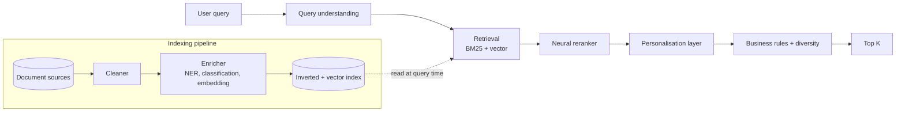
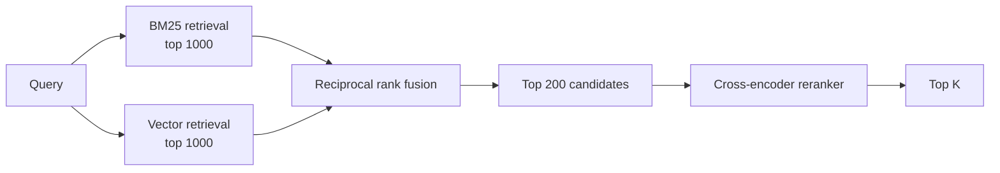
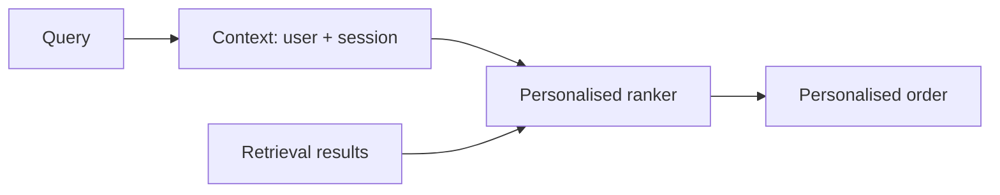
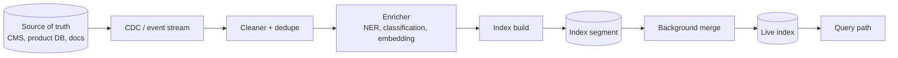

# 08 — Search and Ranking

> Time budget: 60 minutes. Search shares plumbing with recsys but has its own concerns: query understanding, lexical retrieval, and personalisation.

**By the end you can:**

1. Sketch a query-understanding stack (spelling, intent, expansion).
2. Combine BM25 with a neural reranker (the bread-and-butter hybrid).
3. Layer personalisation on top of relevance.
4. Spec an indexing pipeline that keeps up with corpus changes.

---

## 1. The end-to-end search pipeline

Most production search engines look like this. The differences are which stages are mandatory and how heavy each is.

---

## 2. Query understanding

Most product search isn't a single string-match. The user's intent has to be classified before retrieval can do its job.

| Stage | What it does | Tools |
|-------|--------------|-------|
| **Spell correction** | "iphne 14 pro" -> "iphone 14 pro" | Symspell, statistical models, neural seq2seq |
| **Tokenization + normalization** | Strip case, expand contractions, handle Unicode | Off-the-shelf in any search engine |
| **Intent classification** | "iphone 14 pro" = product; "shipping address" = help-doc | Lightweight classifier (logistic regression, small transformer) |
| **Query expansion** | "iphone 14" -> "iphone 14 OR iphone-14 OR Apple iPhone 14" | Synonyms, learned from co-click data |
| **Entity recognition** | Identify product, brand, location entities | NER model, often built into the engine |
| **Query rewriting** | "cheap flights to bali next weekend" -> structured query | LLM-driven rewrites becoming common 2024-2026 |

Each stage costs latency. A common discipline: **stages run in parallel when independent**; lightweight stages (spelling, normalization) run in milliseconds.

LLMs for query understanding (2024-2026 trend): query rewriting via a small LLM costs ~50-200 ms and yields meaningful relevance lift for complex queries, but adds cost. Most production deployments use LLM rewriting only for a slice of traffic where rules-based rewriting is known to underperform.

---

## 3. BM25 + neural reranker — the canonical hybrid

For most search products, the strongest cost-effective pipeline is:

| Stage | Latency | Cost | Quality contribution |
|-------|---------|------|----------------------|
| BM25 | 10-30 ms | Tiny | Excellent on rare-term queries; baseline for everything else |
| Vector | 10-30 ms | Small (HNSW in RAM) | Helps on semantic / paraphrased queries |
| RRF fusion | <1 ms | Free | Free quality lift over either alone |
| Cross-encoder rerank top-200 | 30-100 ms | Real (GPU) | Single largest quality lever |

The same architecture appears in [Module 05](../05-vector-dbs-and-retrieval/README.md) for vector retrieval, [Module 06](../06-llm-serving-and-rag/README.md) for RAG, and here for search. The shape generalises because the underlying problem — find the best K from millions — is the same.

### Why pure neural retrieval often loses

Three reasons, in production rather than benchmarks:

1. **Rare terms** (product IDs, license plates, error codes) need exact match; embeddings smooth them.
2. **Out-of-distribution queries.** The embedding model wasn't trained on your product's vocabulary in proportion to its usage.
3. **Diagnostic clarity.** When a result looks wrong, "did BM25 match this token?" is far easier to debug than "is the vector close to the query vector?"

---

## 4. Personalisation

A pure-relevance ranker treats all users the same. A personalised ranker adjusts for the individual: their past clicks, their search history, their cohort.

Three layers of personalisation, in increasing complexity:

| Layer | What it adds | Implementation |
|-------|--------------|----------------|
| **Cohort** | Personalise by user segment (geo, language, device, premium vs free). | Cohort-specific features fed to the ranker. |
| **Long-term** | Personalise by historical preference. | User embeddings, "user-category affinity" features. |
| **Session** | Personalise by current session signal. | Streaming features: recent clicks, recent dwell time. |

The diminishing returns are real: cohort gives ~3-5% lift, long-term another 2-4%, session another 1-3%. Beyond that the noise drowns the signal.

A consequential trade-off: **personalisation reduces diversity**. A heavily personalised system shows each user a narrower slice of results. Some products want this (Spotify Discover Weekly); others want the opposite (Google Search). Decide deliberately.

---

## 5. Indexing pipelines

A search engine is useless if it doesn't keep up with the corpus. Real indexing pipelines do five things:

| Stage | Cadence | Failure mode |
|-------|---------|--------------|
| **CDC / event ingest** | Real-time | Lag: index falls behind reality. |
| **Cleaning + dedup** | Per-event | Bad data poisons downstream. |
| **Enrichment (NER, embedding)** | Per-event | Slow models clog the pipeline. |
| **Index segment write** | Bursts | Small segments = high overhead. |
| **Background merge** | Periodic | Too aggressive = write amplification; too lazy = read amplification. |

A pragmatic OpenSearch / Elasticsearch / Vespa deployment:

- New documents land in segments within seconds.
- Background merge runs continuously to keep segment count low.
- Full reindex (typically weekly) cleans up tombstones and recomputes embeddings if needed.

---

## 6. Learning to rank in search

The ranker over candidates uses many of the same techniques as recsys (see [Module 07](../07-recommendation-systems/README.md)):

| Feature category | Examples |
|------------------|----------|
| **Query** | length, classified intent, entity types |
| **Document** | freshness, quality score, popularity, source authority |
| **Query-document interaction** | BM25 score, vector similarity, reranker score, click history on this pair |
| **User** | cohort, geo, device, long-term preference |
| **Context** | time of day, session signal |

Training data: typically (query, clicked-document, non-clicked-documents) tuples mined from click logs, with **position bias correction**. A clicked document at position 1 is not 10x better than one at position 10 — it's mostly that it was seen first. Standard methods (pairwise loss + position discounting, or causal estimators) correct for this.

---

## 7. Personalised vs query-driven shapes

Two shapes of search:

| Shape | Query is primary signal | Personalisation matters |
|-------|--------------------------|--------------------------|
| **Web search** | Yes | Some, but relevance dominates |
| **Product search** | Yes | Some (geo, language, history) |
| **App search (in-product)** | Yes, but small vocabulary | More (you know the user well) |
| **Site search on a help site** | Yes | Some (account context) |
| **Feed search** (Pinterest, Instagram search) | Less | Heavy |

A product team often confuses these. "Search" on a video feed is closer to ranking-with-a-query than to web search; personalisation matters more than they think.

---

## 8. Cross-links

- [`cheat-sheet.md`](./cheat-sheet.md)
- [`exercises.md`](./exercises.md)
- [`pitfalls.md`](./pitfalls.md)
- [`case-studies/`](./case-studies/)
- Vector retrieval: [05 Vector DBs](../05-vector-dbs-and-retrieval/README.md)
- LTR for recsys: [07 Recsys](../07-recommendation-systems/README.md)
- Up next: [09 Real-time ML](../09-real-time-ml/README.md)

## Sources

- "Probabilistic Relevance Framework: BM25 and Beyond," Robertson & Zaragoza (2009).
- "ColBERT: Efficient and Effective Passage Search via Contextualized Late Interaction over BERT," Khattab & Zaharia (SIGIR 2020).
- "Real-time Personalization at Etsy" (Etsy Engineering, 2022).
- "How Algolia Builds Search Infrastructure" (Algolia Engineering, current).
- "Pre-training Tasks for Embedding-Based Large-Scale Retrieval," Chang et al. (Google, ICLR 2020).
- "Doc2Query: Document Expansion by Query Prediction," Nogueira et al. (2019).
- "Reciprocal Rank Fusion outperforms Condorcet and individual rank learning methods," Cormack et al. (SIGIR 2009).
- Vespa, OpenSearch, Elasticsearch documentation, current releases.
