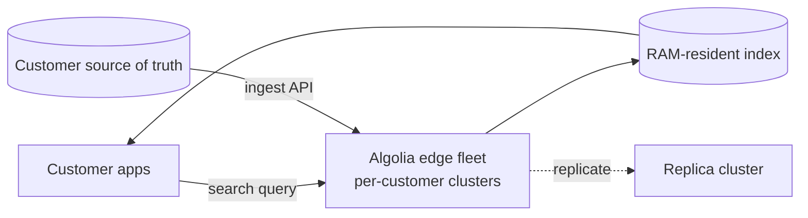

# Algolia — Hosted search architecture (current)

## Problem

Many product teams need fast, ergonomic search and don't want to operate a search cluster. Algolia (founded 2012, hosted from day one) built a managed search product on the bet that RAM-resident, vertically-scaled indices with great ergonomics would beat self-hosted Elasticsearch for the median product team.

## Architecture

Per-customer dedicated clusters (or shared in lower tiers) — index entirely in RAM, replicated across regions.

## Three load-bearing decisions

1. **RAM-resident index by default.** All searches run against in-memory data structures; p99 latency in single-digit ms.
2. **API-first ingestion.** No connectors, no CDC; customers PUT documents. Simpler, more predictable.
3. **Heavy investment in client SDKs** (frontend, backend, mobile). The DX is part of the product.

## What this approach can't do

- **Truly massive indices.** Algolia's pricing makes large indices expensive because they sit in RAM. Customers with billions of documents typically self-host.
- **Custom ranking models.** Algolia's ranking is configurable but not arbitrarily ML-extensible. For teams that want to plug a custom DLRM, Algolia is the wrong tool.
- **Tight coupling with internal data lakes.** API-first ingestion is a feature for SaaS customers and an obstacle for enterprises with deeply-integrated data infrastructure.

## What you should steal

- The framing: **for a customer-facing product, search ergonomics and latency dominate over algorithmic sophistication**. A 30 ms p99 with mediocre relevance often outperforms a 300 ms p99 with brilliant relevance.
- **RAM-resident as a design choice**, when index size permits. It eliminates a whole class of cache-management complexity.
- **Frontend SDK as a feature**, not an afterthought. The InstantSearch widgets are why Algolia spreads inside customer teams.

## Sources

- Algolia Engineering blog (current).
- "How Algolia Builds Search Infrastructure" (Algolia, current).
- Algolia documentation: search, ranking, indexing.
