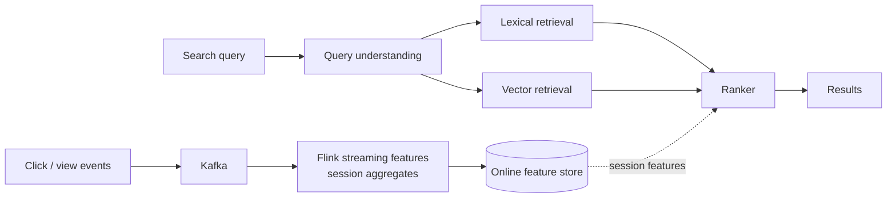

# Etsy — Real-time personalization in search (2022)

## Problem

Etsy's search is the dominant traffic source. Their 2022 post describes how they moved from daily-batch personalisation to streaming session-context features and the impact on search relevance metrics.

## Architecture

## Three load-bearing decisions

1. **Streaming session features into the ranker.** Last-N clicks, dwell time on each, categories engaged with this session.
2. **Sub-minute end-to-end freshness** for the streaming pipeline. Session features lose value if they're 10 minutes stale.
3. **Ranker retrained frequently** to capture shifting taste / seasonality.

## What was hard

- **Feature parity.** Online streaming features had to match historical features used in training. Etsy used logged-features-as-training-data (the now-standard pattern).
- **Sparse session data.** Many sessions have only one or two events; features had to degrade gracefully.
- **Cold sessions.** A user just opening the app has nothing to personalise on. Heuristic fallback for the first few clicks.

## What you should steal

- **Session signals are the highest-leverage feature additions** in modern recsys / search, not new batch features.
- The discipline of **measuring per-cohort impact**. Etsy's metrics show different cohorts respond differently to personalisation.
- **Logged-features-as-training-data** as the durable fix for skew (third time we've seen this pattern: Uber 2017, Pinterest 2022, now Etsy 2022).

## Sources

- "Real-time Personalization in Search" (Etsy Engineering, 2022).
- "How We Built Etsy's Search Platform" (Etsy Engineering, 2021).
- Etsy Engineering blog, ML / search archive.
