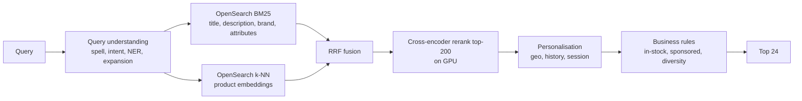
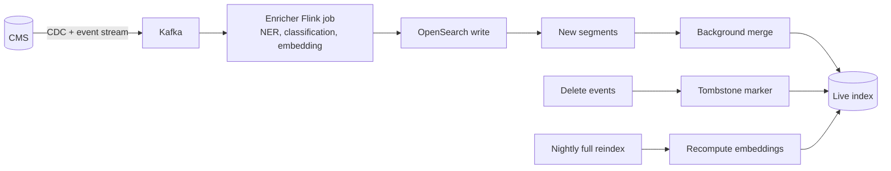

# 08 — Search and Ranking exercises

---

### 1. INTERVIEW. Design search for an e-commerce marketplace with 50M products and 100M user queries/day.

Solution

Sizing: 100M queries/day = ~1200 QPS mean, ~5k QPS peak. OpenSearch sharded across nodes; reranker on a small fleet of L4 GPUs.

SLOs: p99 < 250 ms, top-K relevance NDCG@10 vs offline labels, click-through rate vs baseline, in-stock-rate >= 95% in top 10.

Indexing: CDC from product catalogue -> enrichment (categorisation, embedding) -> OpenSearch index. End-to-end staleness target p95 < 60 s.

Edge cases: queries with no results (rewrite with broader synonyms; show "no results, try X"), zero-result queries logged for query-understanding improvements.

---

### 2. CASE-STUDY READ. Read "Real-time Personalization at Etsy" (Etsy Engineering, 2022). What was the one architectural change that moved their search metrics most?

Solution

Etsy's post highlights **session-context features** computed in a streaming pipeline as the dominant lift over their previous batch-based personalisation. Specifically: features like "last clicked categories in this session," "items dwelled on for >5 seconds," fed to the search ranker.

The architectural change: a Flink-based streaming feature pipeline writing to a low-latency online store, plus a search ranker that includes those features. Previously these signals were available only via daily batch and were stale by hours.

Why it worked: Etsy's user behaviour is highly session-driven (browsing a wedding, then a baby shower, then back to home decor). Daily-batch personalisation can't tell the difference between "user who recently shopped for weddings" (was last week) and "user shopping for weddings right now" (this session). The streaming features capture the latter.

---

### 3. DECISION. Your search team proposes "replace BM25 entirely with a neural retriever." Argue against.

Solution

Pure neural retrieval loses where it counts in production:

1. **Rare-term queries.** Product IDs, model numbers, error codes, exact phrases. BM25 nails them; neural smooths them.
2. **OOD queries.** The embedding model wasn't trained on your domain's full vocabulary distribution.
3. **Debuggability.** "Why did we surface this?" — for BM25, the answer is "tokens X, Y matched with weights..."; for neural, it's "the vectors were close in some embedding space."
4. **Cold-start docs.** A new document with no behavioural signal needs lexical match to surface initially.

The right move: hybrid (BM25 + neural + reranker). The neural part adds paraphrase / semantic coverage; BM25 keeps rare-term and OOD recall.

Pinecone and many vendors' 2023-2024 posts pivoted explicitly to "hybrid is what works." Don't relitigate it.

---

### 4. INTERVIEW. Spec the indexing pipeline for a content platform with 1M documents/day churning (new, updated, deleted).

Solution

Decisions:

- **Enrichment is the bottleneck.** Embedding 1M docs/day at ~100 ms/doc requires ~12 worker-CPUs sustained, or 1-2 GPU workers. Plan capacity.
- **End-to-end staleness target.** Most content products want sub-minute. Achievable; just expensive on enrichment.
- **Tombstones for deletes.** Don't try to in-place delete; the index will fight you.
- **Nightly reindex** to clean up and to re-embed if the embedding model changed.

Failure modes: enrichment stalls -> index falls behind. Have alerting on enrichment lag and a fallback path that publishes documents to the index with embedding-not-yet-computed (vector retrieval misses them but BM25 finds them) until enrichment catches up.

---

### 5. DECISION. The product team wants to add an LLM-based query rewriter. When is it worth the cost?

Solution

LLM query rewriting helps most for:

- **Complex multi-clause queries** ("cheap red wedding dresses for outdoor summer ceremony under 200").
- **Conversational queries** ("show me what I should buy for my dad's birthday, he likes golf").
- **Long-tail queries** that rules-based rewriting handles poorly.

It doesn't help for:

- **Single-token queries** ("iphone").
- **Already-well-formed queries.**
- **High-volume head queries** where rules-based rewriting is well-tuned.

Engineering: route only a slice of traffic (e.g., long queries, low-result queries, sessions where short queries failed) to the LLM rewriter. Cost is real (~50-200 ms latency, 1-3 cents per query at hosted LLM prices).

Measurement: A/B test the rewritten-query slice against the original; expect 2-8% lift on click-through-rate for the affected slice. If the lift is <1% it's not worth the cost.

---

### 6. CASE-STUDY READ. Read ColBERT (Khattab & Zaharia, SIGIR 2020). How does it bridge the cost-quality gap between bi-encoder and cross-encoder?

Solution

A **bi-encoder** produces one vector per query and one per document; similarity is a dot product. Cheap (one inference per document offline) but loses information.

A **cross-encoder** runs the model jointly on (query, document); expensive at inference (run the model for every (q, d) pair).

ColBERT's compromise: **per-token document embeddings**. Each document is represented as N vectors (one per token). At query time, compute per-token query vectors. Score = sum over query tokens of max(similarity to any document token).

The "late interaction" gives most of the cross-encoder's quality at a fraction of the runtime cost: query token vectors are computed once; document token vectors are precomputed; scoring is N x M dot products per (q, d).

Storage cost: 10-30x more than a bi-encoder (per-token instead of per-doc). Often worth it.

ColBERT-v2 and PLAID (Santhanam et al., 2022) optimise the storage further with quantization and clustering. Production deployments at search-heavy companies (e.g., Vespa's "late interaction" support) use these techniques.

---

### 7. INTERVIEW. The search team is asked to add "personalisation" to results. The PM is vague. How do you scope it?

Solution

Pin specifics:

1. **Which user signal?** Long-term history? This session? Cohort (geo, language)? Each is a different feature plumbing problem.
2. **Where does it sit?** In the ranker? Post-processing reordering? A separate "personalised module" alongside organic results?
3. **What metric improves?** CTR on the click-position? Time-to-action? Revenue per query? Different metrics drive different design.
4. **What's the diversity floor?** Heavy personalisation narrows results. Are we OK with that?

A pragmatic phasing:

- Phase 1: cohort features (geo, language, device) into the ranker. Often the biggest lift per unit of work.
- Phase 2: long-term user features (history-derived).
- Phase 3: session features.
- Phase 4: personalised modules (e.g., "based on your recent activity").

Each phase shipped on its own A/B test. Personalisation that doesn't move a metric on a slice that matters isn't real.

---

### 8. DECISION. Click-through rate for your top-1 position is 30%. The ranker is trained on click data. What's the bias problem?

Solution

Position bias. Position 1 gets 30% CTR partly because it's at position 1, not because it's intrinsically the best. A model trained on raw click data will reinforce this bias — items shown at position 1 get more clicks, which feeds back as training labels suggesting they should be at position 1.

The result: the ranker converges on whatever the previous ranker promoted, regardless of whether that was actually best.

Fixes, in increasing complexity:

1. **Position-discounted loss.** Weight clicks at lower positions higher in the loss; clicks at high positions count less.
2. **Inverse Propensity Scoring (IPS).** Estimate `P(click | shown at position)` and divide; this gives an unbiased click estimator.
3. **Bandit-style exploration** that randomises position within the top K with known probability, giving direct unbiased data.
4. **Counterfactual ranker training** (Joachims et al., 2017): combine logged data + IPS into a counterfactual estimator.

Production teams typically combine (1) and (3). (2) and (4) require careful logging discipline that many systems lack.

---

### 9. INTERVIEW. Explain what reciprocal rank fusion does and why it's robust.

Solution

RRF (Cormack et al., SIGIR 2009): given multiple ranked lists, score each document as `score(d) = sum over lists of 1/(k + rank(d, list))`. Sort by this score for the final ranking.

`k` is a small constant (typically 60) that dampens the contribution of high ranks.

Why robust:

1. **Parameter-free in practice.** `k=60` works across many domains; tuning rarely beats the default.
2. **Scale-invariant.** It doesn't matter if BM25 scores range 0-10 and vector scores 0-1 — RRF uses only ranks, not raw scores.
3. **Outlier-resistant.** A single retriever returning a wildly high-scoring document doesn't dominate the fusion.
4. **Compositional.** You can add a third or fourth retriever and RRF still works.

The downside: it doesn't exploit fine-grained score information. A retriever with confidently-good scores treats its top 1 the same as a retriever that's barely ahead.

A more sophisticated approach: learned fusion (a small model takes per-retriever scores and outputs a unified score). Beats RRF in benchmarks; rarely worth the operational cost.

---

### 10. INTERVIEW. The query "blue formal dress for a wedding next month size 8" has 0 results. What's wrong, and what do you do at request time?

Solution

Likely culprits:

1. **Over-restrictive AND match.** BM25 with all-tokens-required filters out documents that don't have every token. Loosen to "match most tokens."
2. **Filter explosion.** "Size 8" applied as a hard filter knocks out documents missing the size attribute even if they'd be relevant.
3. **Spelling / synonyms.** "Formal" might not match "evening," "elegant," etc., depending on the synonym graph.

Request-time recovery:

1. **Progressive relaxation.** Re-issue with fewer required tokens; remove the most restrictive filter.
2. **Use vector retrieval as a fallback.** If BM25 returned nothing, vector might find paraphrased matches.
3. **Show "no exact match" with broader suggestions.** Better UX than an empty page.

Offline: log the zero-result query and the user's subsequent behaviour. If they refine to a different query, that's a synonym candidate. If they abandon, the query is genuinely unmet.

Continual improvement: weekly review of top zero-result queries; route to query-understanding team for synonyms / expansion fixes.

---

### 11. CASE-STUDY READ. Read Algolia's architecture posts (current). What's the single design choice that makes Algolia fast for hosted search?

Solution

Algolia keeps **the entire index in RAM** (across a fleet of dedicated servers per customer cluster). All operations — retrieval, ranking, filtering — happen against RAM-resident data structures.

The cost: you can't have arbitrarily large indices on a single Algolia cluster; the index size is bounded by the RAM you (or the customer) pays for.

The benefit: tens-of-milliseconds p99 latencies even with complex queries and filters. No disk seeks; no cache misses against a different tier.

Architectural lesson: when you can afford to hold the data in RAM, the architectural simplification is massive. You skip the entire question of "what's hot vs cold; how do we cache; how do we evict." This is why Algolia, Vespa (in-memory mode), and OpenSearch heap-resident indices all win on latency at moderate scale.

For very large indices (billions of documents), this approach hits a wall and you have to move to disk-resident (DiskANN-style) or distributed.

---

### 12. DECISION. You're choosing between OpenSearch, Vespa, and Algolia for a new product. Frame the decision.

Solution

| Dimension | OpenSearch | Vespa | Algolia |
|-----------|------------|-------|---------|
| **Open source** | Yes | Yes | Hosted only |
| **Built-in ranking** | Basic | Strong (ML ranking native) | Strong |
| **Vector + lexical** | Yes (k-NN plug-in) | Yes, native | Yes |
| **Multi-tenancy** | Index per tenant; ops-heavy | Native | Native |
| **Operational burden** | Medium | High (more knobs) | Zero (hosted) |
| **Cost at scale** | Self-host cheap; hosted moderate | Self-host cheap; hosted moderate | Pricing scales with traffic |
| **Customisation** | High | Highest | Limited |

Defaults:

- **Small / fast-moving team, modest scale, willing to pay:** Algolia. Ship in days; no ops.
- **Hybrid retrieval, on-prem or hyperscaler, mid scale:** OpenSearch. Most generally applicable.
- **ML-heavy ranking, custom features, large scale:** Vespa. Steepest learning curve, highest ceiling.
- **Already running Elasticsearch:** stay on it; only migrate if pain is real.

