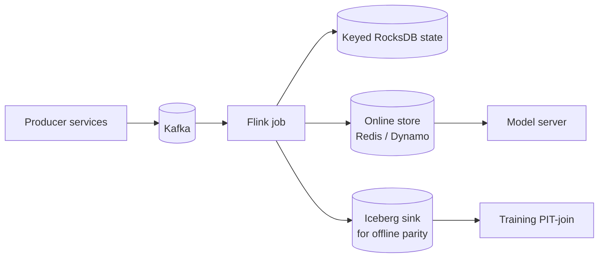
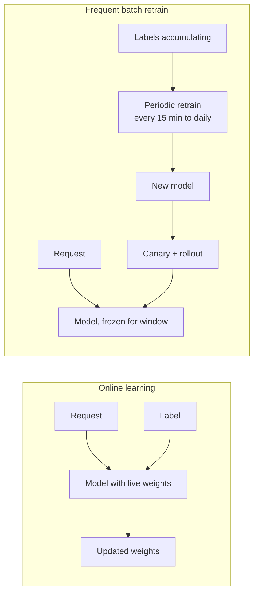
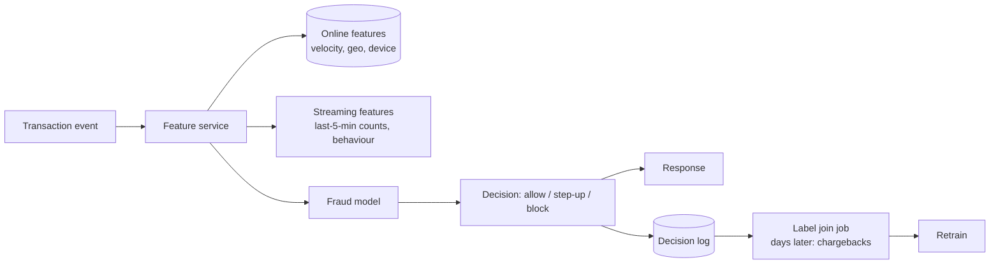
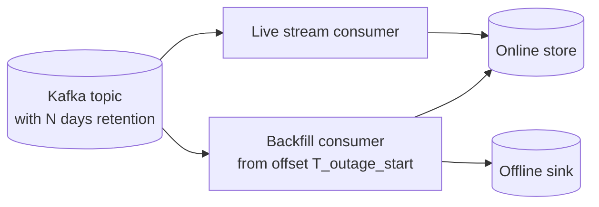

# 09 — Real-time ML

> Time budget: 90 minutes. Real-time ML is overhyped and under-implemented. This module gives you the tools to tell when "real-time" is the right answer.

**By the end you can:**

1. Design a streaming feature pipeline from Kafka to a model server.
2. Decide between online learning and frequent batch retraining (and pick the latter, almost always).
3. Build a streaming anomaly / fraud detector.
4. Handle the "ground truth arrives 30 days later" problem (chargebacks, marketing uplift).
5. Spec a backfill that catches a streaming pipeline up after an outage.

---

## 1. What "real-time" means in ML

The word "real-time" is overloaded. Pin a number:

| Latency band | Architecture | Examples |
|--------------|--------------|----------|
| **Tens of ms** | Online inference, streaming features pre-computed | Recsys, search ranking, fraud check |
| **Seconds** | Streaming pipeline, model fires as events arrive | Anomaly detection, real-time bidding |
| **Minutes** | Frequent batch (5-15 min) | Surge pricing, near-real-time leaderboards |
| **Hours** | Hourly batch | Trending detection |
| **Daily+** | Daily batch | Marketing scores, churn |

"We need real-time" usually means "we need fresher features," not "we need streaming inference." Disambiguate before designing.

---

## 2. The streaming feature pipeline

This is the same diagram as in [Module 02](../02-feature-stores/README.md), focused here on the stream-processing details.

### Three subtleties stream processing forces you to confront

| Concept | What | Why ML cares |
|---------|------|--------------|
| **Event time vs processing time** | Time the event happened vs when it arrived in the system. | A "5-minute rolling sum" defined in processing time is wrong when events are late. |
| **Watermarks** | "I believe I've seen all events up to time T." | Tells the engine when to emit a window's final result. |
| **State backend** | Where the per-key aggregation state lives. | RocksDB-on-disk gives unbounded state; in-memory hits a wall. |

Flink and Kafka Streams handle these correctly when configured. The most common bug: defining windows in processing time and being surprised that 1% of events change feature values silently.

### Exactly-once semantics

For ML features, "approximately correct" is usually fine. Exactly-once exists (Flink + idempotent sinks, Kafka transactions) but adds operational complexity. For most ML features, **at-least-once delivery with idempotent aggregations** is the right trade-off:

- Counting events: idempotent if you key by event_id.
- Summing amounts: needs deduplication (event_id-based) to avoid double-counting.
- HLL++ distinct counts: idempotent within tolerance.

---

## 3. Online learning vs frequent batch retraining

Online learning sounds magical. In production it almost always loses to frequent batch retraining.

| Property | Online learning | Frequent batch |
|----------|-----------------|----------------|
| **Adversarial robustness** | Bad. Bots can poison weights in minutes. | Good. Bad batch caught in retrain QA. |
| **Rollback** | Hard. Weights have evolved. | Easy. Just promote previous artefact. |
| **Determinism** | Diverging replicas hard to debug. | Deterministic per artefact. |
| **Quality** | Marginal advantage at fastest-changing signals. | Captures 95% of the upside if cadence is right. |
| **Operational complexity** | High. Online updates, coordination. | Medium. Standard MLOps. |

Online learning wins in a narrow band: bandits with bounded action spaces (see [Module 07](../07-recommendation-systems/README.md)), some control / RL applications, sometimes ad bidding. Most "we need online learning" requests are actually "we need 15-minute retraining," which is dramatically safer.

A common, safer middle path: **frequent batch retrain (every 15-60 minutes) of the model + streaming feature updates**. Captures the same freshness benefit; keeps the rollback story intact.

---

## 4. Fraud and anomaly detection patterns

Real-time fraud is the canonical streaming-ML use case. The architecture:

Four hardness sources unique to fraud:

| Hardness | What | Mitigation |
|----------|------|-----------|
| **Adversarial drift** | Fraudsters adapt to your model. | Frequent retraining, ensemble of models, hidden rules. |
| **Late labels** | Chargebacks roll in over weeks. | See section 5. |
| **Imbalanced data** | Fraud is <1% of traffic. | Sampling, class weighting, anomaly-style detectors. |
| **Cost asymmetry** | Missing fraud is expensive; false positives annoy customers. | Calibrated thresholds, step-up auth instead of block. |

Two model families dominate:

1. **Supervised classifiers (GBDT, DNN).** Strong when you have labels.
2. **Unsupervised / semi-supervised anomaly detectors.** Strong when label coverage is sparse or fraud patterns are new.

Stripe Radar (2023) combines both: a supervised model for known fraud patterns, an unsupervised anomaly stream for emerging patterns. The two outputs feed a calibrated decision layer.

---

## 5. Late ground truth — the "30 days later" problem

For some products, the true label is unavailable at decision time:

- **Fraud:** chargebacks land 30-90 days later.
- **Marketing uplift:** the user's conversion happens weeks after the impression.
- **Loan default:** the default event is months out.
- **Medical outcome:** the relevant outcome is months to years.

This breaks naive online learning (you don't have the label yet) and complicates supervised learning (training data is delayed).

### Three working patterns

| Pattern | What it does |
|---------|--------------|
| **Proxy labels** | Use a fast-arriving signal as a proxy. E.g., "card declined the same day" for fraud; "30-second watch" for retention. |
| **Label-buffered training** | Build training sets only with labels at least N days old; accept a freshness gap. |
| **Continual / multi-vintage training** | Maintain multiple model versions: a fresh one (proxy-trained), a mature one (true-label-trained), and route by confidence. |

Stripe's posts describe the "label-buffered" pattern: training data is always at least 60 days old for the supervised component; the unsupervised anomaly component fills the gap.

---

## 6. Backfills and replay

A streaming pipeline goes down for 4 hours. When it comes back up, you have a 4-hour gap in features. What do you do?

Two approaches:

| Approach | Pros | Cons |
|----------|------|------|
| **Replay from Kafka** | Simple if retention covers the gap. | Retention must be set high enough; expensive at large data volumes. |
| **Recompute from offline truth** | Always works (warehouse is durable). | More complex; offline pipeline diverges from live in subtle ways. |

A pragmatic default:

- Set Kafka retention to ~3-7 days (depending on data volume / cost).
- For longer outages, fall back to recomputing from the lakehouse.
- During backfill, the live consumer continues; the backfill consumer writes to the same online store with a "do not overwrite newer values" semantic.

### Adding a new streaming feature

Same problem in disguise: a new feature has no historical timeline. To train a model that uses it, you must either:

1. **Replay** Kafka history through the new Flink job, producing a historical feature timeline.
2. **Wait** for natural accumulation (often impractical).
3. **Approximate** the feature from existing offline data (always slightly wrong).

Production teams use (1) routinely; Flink's savepoint + replay machinery is designed for it.

---

## 7. Anomaly detection at scale

A common request: "detect unusual events." Three approaches:

| Approach | Strength | Weakness |
|----------|----------|----------|
| **Statistical (z-score, percentile, EWMA)** | Cheap, interpretable. | Misses multivariate anomalies. |
| **Density estimation (Isolation Forest, autoencoders)** | Catches multivariate. | Needs tuning; explains poorly. |
| **Time-series-specific (Prophet, deep AR, ESPredictor)** | Captures seasonality, trend. | Heavy; per-series. |

For an event firehose at scale, the typical pattern is:

1. **Stream-level filter** (statistical): cheap, fires on extreme outliers.
2. **Mid-tier model** (ML-based): per-entity anomaly scoring on a smaller subset that passed the stream filter.
3. **Human review queue** for the highest-scored cases.

This staged design lets you afford expensive scoring for the small fraction of events that warrant it.

---

## 8. Cross-links

- [`cheat-sheet.md`](./cheat-sheet.md)
- [`exercises.md`](./exercises.md)
- [`pitfalls.md`](./pitfalls.md)
- [`case-studies/`](./case-studies/)
- Streaming features: [02 Feature Stores](../02-feature-stores/README.md)
- Monitoring: [10 Monitoring and Drift](../10-monitoring-and-drift/README.md)

## Sources

- Apache Flink documentation, current release.
- "Real-time Data Infrastructure at Uber," Uber Engineering (VLDB 2021).
- "Radar: How Stripe Detects Fraud at Scale" (Stripe Engineering, 2023).
- "Streaming SQL Foundations" (Apache Flink, current).
- "Stateful Stream Processing at Scale" Flink Forward talks, 2019-2023.
- "Online Learning for Recommender Systems," Bennett & Lanning (Netflix Prize retrospective, 2009).
- "Anomaly Detection: A Survey," Chandola, Banerjee, Kumar (ACM Computing Surveys, 2009).
