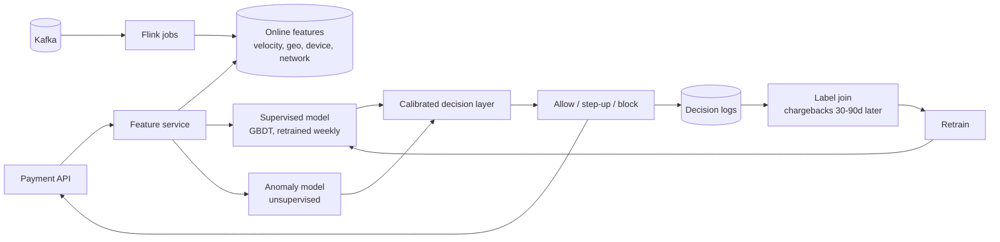

# Stripe — Radar fraud detection (2023)

## Problem

Stripe's Radar makes fraud decisions on every payment, at single-digit-millisecond budgets, against an adversary that actively adapts. The 2023 Engineering post describes the architecture and the specific design choices that make Radar both fast and durable against evolving attacks.

## Architecture

## Three load-bearing decisions

1. **Supervised + unsupervised combo.** Supervised handles known patterns; unsupervised flags novel ones; calibration layer balances.
2. **Hidden features.** Some signals are never exposed to customer-facing artefacts. Adversaries cannot easily reverse-engineer what to optimise against.
3. **Logged-features-as-training-data.** Train on what was actually served (the now-standard pattern; this is the fifth case study in this course endorsing it).

## What was hard

- **Adversarial drift.** Models that worked last month are degraded this month not from data drift but from adversary adaptation. The retraining cadence is set by adversary speed, not by classical drift metrics.
- **Late labels.** Chargebacks dispute weeks after the transaction. Training has a built-in label-buffering window.
- **Calibration vs accuracy.** A model with 99% accuracy that always rejects high-amount Eastern European transactions is broken in a way accuracy doesn't capture. Per-cohort calibration is essential.

## What you should steal

- The **supervised + unsupervised ensemble** for any production fraud / anomaly problem.
- **Hidden features** as a defense in depth. The model knows things the attacker doesn't.
- The **per-cohort calibration** discipline. Aggregate accuracy hides fairness problems and operational fragility.

## Sources

- "Radar: How Stripe Detects Fraud at Scale" (Stripe Engineering, 2023).
- "Scaling Machine Learning at Stripe" (Stripe Engineering, 2023).
- "Real-time Fraud Detection at Stripe" (Stripe talks at QCon, 2023).
