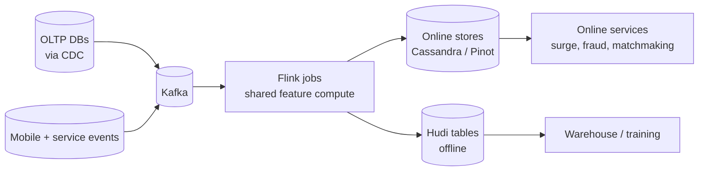

# Uber — Real-time data infrastructure (VLDB 2021)

## Problem

By the late 2010s, Uber had grown into a marketplace where surge pricing, fraud, matchmaking, ETA, and a dozen other systems all required sub-second freshness on shared signals. The Lambda-architecture-era split between batch and streaming caused subtle divergences; the platform team set out to build a unified streaming-first stack.

## Architecture

Streaming as canonical; offline sinks derive from the same streaming jobs.

## Three load-bearing decisions

1. **Streaming-first as a platform decision**, not a per-team choice. Every new feature pipeline must be expressible as a Flink job.
2. **Hudi for the offline sink**, providing upsert semantics so the same logical entity (a trip, a user) has a single row in Hudi that reflects the latest streaming state.
3. **Shared feature definitions across batch and streaming.** One definition compiles to either path.

## What was hard

- **Migration cost.** Moving from Lambda to streaming-first took multiple years of platform investment; existing batch features had to be re-expressed.
- **Stateful job operability.** Flink jobs with large keyed state (per-user trip history) need careful checkpoint, savepoint, and recovery practices.
- **Multi-region.** Cross-region state replication is non-trivial; Uber's approach is per-region streaming with eventually-consistent shared catalogs.

## What you should steal

- The framing: **streaming as the canonical compute path**, with offline as a sink, eliminates a whole class of "batch and streaming disagree" bugs.
- **Hudi or equivalent upsert-capable table format** for the offline sink. Append-only doesn't fit when the entity has state.
- The discipline of **platform-mandated streaming-first**: a per-team choice would result in a patchwork; a platform mandate forces convergence.

## Sources

- "Real-time Data Infrastructure at Uber," Mishra et al. (Uber Engineering, VLDB 2021).
- "Streaming Data Processing at Uber" (Uber Engineering, 2020-2023).
- "Apache Hudi: Streaming Data Lake Platform," Vinoth Chandar et al. (Apache, 2021).
