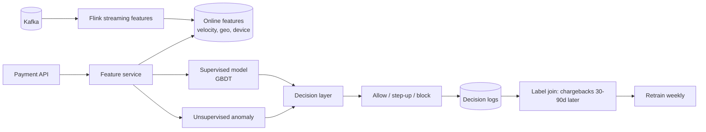
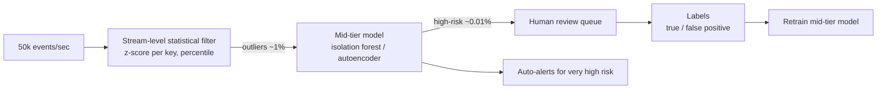

# 09 — Real-time ML exercises

---

### 1. INTERVIEW. Design a real-time fraud detection pipeline for a payments platform at 10k TPS.

<details><summary>Solution</summary>



SLOs: p99 < 80 ms inference, feature freshness p95 < 5 s for velocity features, false-positive rate <= 0.5% of legitimate traffic.

Streaming features: per-card / per-IP / per-device velocity counts over 5 min, 1 h, 24 h. Per-merchant fraud rate trailing. Per-user "is this their usual pattern" features.

Models: a GBDT on supervised labels + an isolation forest on raw transaction features for anomaly. Combine via a calibrated linear stack.

Adversarial defenses: rotate some features periodically (so attackers can't reverse-engineer); keep a private set of features visible only to the model; manual review queue for borderline cases.
</details>

---

### 2. CASE-STUDY READ. Read Stripe Radar's architecture post (2023). What's their take on the supervised + unsupervised combo?

<details><summary>Solution</summary>

Stripe Radar uses a **supervised classifier** for known fraud patterns (the model has labels and learns) plus an **unsupervised anomaly stream** for emerging patterns (no labels, but deviations from normal flag interesting cases).

Why both:

1. Supervised alone misses novel attacks — they're not in training data yet.
2. Unsupervised alone has poor precision — too many "different but legitimate" transactions flagged.
3. Combined: supervised catches the head; unsupervised surveils the tail; calibration layer balances precision / recall.

The post also emphasises:

- **Continual retraining**: supervised model retrained as labels arrive.
- **Hidden features**: some signals don't appear in customer-facing artifacts so adversaries can't optimise against them.
- **Calibrated thresholds**: thresholds tuned to a target false-positive rate, not to maximise accuracy abstractly.

The architecture is convergent with similar fintech production systems (e.g., Capital One, PayPal posts circa 2022-2024).
</details>

---

### 3. DECISION. The team wants to implement online learning for their recsys ranker. Push back.

<details><summary>Solution</summary>

Three lines of argument:

1. **Adversarial poisoning.** A botnet that emulates clicks on specific items can move the ranker's weights in minutes. With frequent-batch retraining (and label sanitisation in the data prep step), the same attack is detected and the bad batch never gets promoted.

2. **No rollback.** Online-learned weights aren't versioned the way batch artefacts are. If today's drift looks bad, you cannot easily revert to "the ranker as it was yesterday at noon."

3. **Marginal benefit.** With 15-minute batch retraining + streaming features, you capture ~95% of the freshness benefit and none of the risk.

The counter-argument they'll make: "but the most recent X seconds of behaviour matter." Counter-counter: streaming features pick up the most recent behaviour and are read by the model at request time. The ranker itself doesn't need to update for the model to incorporate fresh signal.

The exception: a constrained contextual bandit with bounded action space and conservative update rule. See [Module 07](../07-recommendation-systems/README.md).
</details>

---

### 4. INTERVIEW. Spec a streaming feature: "fraction of a user's transactions in the last hour that were declined."

<details><summary>Solution</summary>

```text
Source: txn-events Kafka topic, event_time = txn_ts
KeyBy: user_id

Window: SlidingEventTimeWindow(size=1h, slide=1min)
State:
  - declined_count (long)
  - total_count    (long)

Reducer: for each event, increment total_count; if status='declined' increment declined_count
Watermark: bounded out-of-order 30s
Late events: side output, joined to backfill table

Emit:
  Every minute (slide), emit (user_id, watermark_ts, declined_fraction = declined_count / max(total_count, 1))

Sinks:
  - Online store: Redis HSET user:{user_id} declined_frac_1h <value>
  - Offline sink: Iceberg.streaming_features partitioned by event_date
```

Edge cases:

- **Empty window** (no transactions): emit nothing (or emit 0; product decision).
- **First event for a user**: feature is 0 or 1 depending on status; downstream consumers must handle "new user with little data."
- **State growth**: keyed state on `user_id` grows with active users. Use RocksDB backend with TTL on inactive keys.
</details>

---

### 5. DECISION. Your team accidentally turned off the streaming feature pipeline for 12 hours. Plan the recovery.

<details><summary>Solution</summary>

1. **Inventory the impact.** Which features depend on the pipeline? Which models read those features? Which products use those models?
2. **Quantify the staleness.** For each affected feature, what's the typical update frequency vs the gap? A daily-summary feature is fine; a 5-minute window is broken.
3. **Replay from Kafka.** If Kafka retention covers the gap (which it should — set retention to be longer than the longest plausible outage), restart the Flink job from the savepoint just before the outage.
4. **Run a backfill consumer in parallel** to the live one. Configure the sink to "write only if newer than existing value" so the backfill doesn't overwrite fresh values that arrived after recovery.
5. **Monitor recovery.** Per-feature freshness metric returning to normal; per-model coverage metric stabilising.
6. **Postmortem.** Document the outage; add alerting on Flink job liveness; add a synthetic event that validates end-to-end freshness.

If Kafka retention doesn't cover the gap (12 h is usually within retention; weeks are usually not), fall back to recomputing from the lakehouse — same data, replayed through the Flink job from an offline source.
</details>

---

### 6. CASE-STUDY READ. Read "Real-time Data Infrastructure at Uber" (VLDB 2021). What's the most under-appreciated design choice?

<details><summary>Solution</summary>

Uber's data infrastructure shifted from a Lambda-architecture (separate batch and streaming paths producing equivalent results, joined at query time) to a **streaming-first** architecture where the streaming layer is canonical and offline is a sink of the same data.

The under-appreciated piece: **the catalog and feature definitions are shared across batch and streaming code paths**. Uber's Hudi tables + Flink + Pinot stack is configured so a single feature definition compiles to the same logic in either execution mode.

Why it matters: the Lambda architecture's main failure mode (batch and streaming producing slightly different numbers) is silently eliminated when there's only one canonical compute. The 2021 paper makes this case formally; the operational benefit dwarfs the conceptual elegance.

This is the same pattern Tecton built commercially (see [Module 02](../02-feature-stores/README.md)). Convergent evolution.
</details>

---

### 7. INTERVIEW. The marketing team wants real-time uplift modeling. The label (conversion) arrives weeks later. How do you ship?

<details><summary>Solution</summary>

You can't use late labels directly; the model would need them at training time and they're not available. Three pragmatic moves:

1. **Proxy labels.** A click within 30 minutes of an impression is a proxy for the downstream conversion. The proxy is biased but cheap; you train a proxy-uplift model that runs in real-time.
2. **Lagged true-label model.** Build a "real" uplift model on labels older than the conversion window (e.g., 30 days). This model is mature but stale.
3. **Ensemble.** Combine: the proxy-uplift model handles the fresh slice; the true-label model handles the mature slice. As true labels accumulate for recent users, blend.

A key discipline: **never train the proxy model on data the true-label model hasn't seen.** Otherwise you reinforce the proxy's bias. Separate training sets, separate eval.

Online metric: blended uplift estimate per impression, fed back to the marketing platform's bidding.
</details>

---

### 8. DECISION. The data team wants exactly-once semantics on the feature pipeline. The infra team says it's expensive. Frame the trade-off.

<details><summary>Solution</summary>

Exactly-once gives you:
- No duplicate events counted.
- No lost events.
- Stronger guarantees for downstream consumers.

It costs:
- 20-50% throughput tax in Flink with idempotent sinks + Kafka transactions.
- Operational complexity (more failure modes, harder to debug).
- Tight coupling: the sink must support transactional commits.

For ML features:

| Feature type | Exactly-once needed? | Why |
|--------------|----------------------|-----|
| Sum of amounts | Often yes — double-counting affects $ figures | Idempotent dedup at event_id is enough |
| Count of events | At-least-once + dedup is fine | Approximate counting tolerates noise |
| Distinct count | Approximate (HLL++) | Inherently approximate |
| Sliding-window average | At-least-once + dedup | Approximate tolerance |

Recommendation: at-least-once + event-id deduplication on the sink. Exactly-once only where the feature directly drives a money number (chargebacks, payouts).
</details>

---

### 9. INTERVIEW. You're adding a new streaming feature: "user-merchant pair count in the last 30 days." This is a new computation. How do you backfill?

<details><summary>Solution</summary>

Two options:

1. **Replay Kafka.** Set the Flink job's source offset to 30 days ago. Run the job; it consumes 30 days of events, builds keyed state, emits current feature values. Done.
2. **Recompute from lakehouse.** Run a Spark / Flink batch job over the historical event table that produces the same feature, written to the offline store as a historical timeline.

For training, you need the historical timeline (option 2 or a Flink job emitting per-window snapshots to the offline sink). For serving, you need the current state populated in the online store (option 1).

A common pattern: run a one-time batch job that produces both — historical timeline for offline use, current state seeded into the online store. Then start the live Flink job consuming from "now" forward.

Pitfall: while you're backfilling, the live stream is producing events that need to land in the same state. Run the live Flink job and the backfill batch separately, then merge state at switchover.
</details>

---

### 10. INTERVIEW. Spec an anomaly-detection alerting stack for an event firehose at 50k events/sec.

<details><summary>Solution</summary>



Stages:

1. **Statistical filter** (Flink). Per-key rolling statistics; flag z-score > 3 or values above 99th percentile. Cheap; runs on all 50k/sec.
2. **Mid-tier model** (Triton or in-process). 1% of events = 500/sec. Isolation forest or autoencoder. ~5-30 ms inference.
3. **Decision layer**. Combine model score with rules (e.g., "if mid-tier score > 0.9 AND amount > $1000, page on-call").
4. **Human review queue**. The top remaining cases.

Volume math: 50k/sec at stream-level, 500/sec to mid-tier, ~5/sec to human queue. The human queue is bounded by the team's actual reviewing capacity; tune thresholds to match.

Iteration: human-labeled cases become training data. Mid-tier model retrains weekly.
</details>

---

### 11. DECISION. The product team wants to use Flink for the streaming features but the team has only Spark experience. Argue both sides.

<details><summary>Solution</summary>

**Flink:** Native streaming, lower latency, mature state backends, better watermark / event-time semantics. Industry default for streaming-first ML by 2024-2026.

**Spark Structured Streaming:** Familiar to a Spark team, micro-batch model (with some sub-second support), shares code with batch jobs.

The cost of operating two streaming systems (Spark for some, Flink for others) is real; pick one for the team.

For an ML-heavy roadmap: invest in Flink. The latency, watermark semantics, and stateful-stream patterns are designed for this. The team's Spark experience transfers (DataStream API in Flink has Spark-like ergonomics for the simple cases).

For a non-ML-priority team that already runs Spark: stay on Structured Streaming for now, revisit if requirements exceed it.

Don't run both unless you have to.
</details>

---

### 12. INTERVIEW. The model's online metric tanks every weekend. Diagnose.

<details><summary>Solution</summary>

Hypothesis tree:

1. **Population shift.** Weekend users are different — different demographics, different intents.
2. **Feature distribution shift.** Some features (e.g., "weekday work hours commute pattern") look different on weekends and the model is confused.
3. **Streaming feature pipeline issue.** Weekend low-traffic patterns trip a watermark or window edge that the weekday QA missed.
4. **Operational.** Saturday's deploy fired on a different model version than Monday's; recent canary not promoted properly.

Diagnostics:

1. Compare weekday vs weekend feature distributions (KS, PSI per feature).
2. Compare weekday vs weekend prediction distributions.
3. Check model version logged on weekend requests.
4. Check feature freshness on weekend — sometimes weekend traffic dips below the level needed to refresh certain windowed features.

Common root cause: a feature whose distribution shifts weekend-to-weekday and that the training set under-represented. Fix: add weekday-vs-weekend as a feature or train slice-specific models.

Less common but ugly: a 7-day-windowed feature where the window includes a public holiday with anomalous behaviour, biasing the value.
</details>
