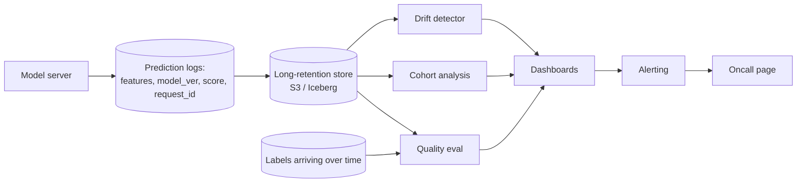

# 10 — Monitoring and Drift

> Time budget: 60 minutes. Monitoring is the difference between a model that quietly rots and one that the team catches before customers do.

**By the end you can:**

1. Distinguish data drift, concept drift, and label drift; pick the detection method for each.
2. Spec an ML observability stack.
3. Author a model card and a data card.
4. Instrument the "silent failure" mode where the model returns plausible answers that are wrong.
5. Write alerting SLOs that page humans only when humans should act.

---

## 1. Three kinds of drift

The vocabulary matters because the detection methods and fixes are different.

| Drift | What changes | Detection | Common cause |
|-------|---------------|-----------|---------------|
| **Data drift (covariate shift)** | `P(X)` — the input distribution | KS, PSI, JSD per feature | Population shifts, feature pipeline bug, new device class |
| **Concept drift** | `P(Y \| X)` — relationship between inputs and outcome | Performance metric vs baseline | Adversarial behaviour, world change (COVID, regulation) |
| **Label drift** | `P(Y)` — the label distribution | Distribution of recent labels | Promotion / seasonality / class boundary change |

A simple example: a credit-risk model.

- **Data drift.** Average income of applicants shifts because the marketing channel changed. The model's inputs look different.
- **Concept drift.** A new fraud pattern emerges. Same input distribution, different outcome rate.
- **Label drift.** The classifier was trained when 5% of applicants defaulted; now 2% do because of policy changes.

All three are real; concept drift is the hardest to detect because it requires labels.

---

## 2. The ML observability stack

The first thing to build is the **prediction log**. Without it, none of the downstream observability works. Log: features used, model version, score, request id, timestamp, async to a Kafka topic landing in a long-retention store (Iceberg / Parquet on S3).

| Component | Open option | Vendor option |
|-----------|-------------|---------------|
| Drift detection | Evidently AI, in-house Spark | Arize, WhyLabs, Fiddler |
| Performance monitoring | Same | Same |
| Slice / cohort analysis | Same | Same |
| Model cards | Hugging Face Model Cards, in-house | Vendor offerings |
| Lineage | OpenLineage + DataHub | Atlan, Alation |

A typical small/medium team builds: prediction log + Spark / DuckDB jobs computing drift metrics + a simple Grafana dashboard. Vendors win at large scale or for regulated environments where audit trail matters.

---

## 3. Drift metrics in practice

### Per-feature drift

For each numeric feature, compute on a rolling window vs a reference (training distribution):

- **KS statistic** (Kolmogorov-Smirnov). Robust, well-understood. Threshold: ~0.1-0.2 depending on feature.
- **PSI (Population Stability Index).** Industry standard for credit / banking; values >0.25 typically indicate material shift.
- **JS divergence.** Symmetric, bounded.

For categorical features:

- **Chi-square test.** Standard.
- **Top-N category drift.** Track the frequency of the top categories; alert on rank changes.

### Prediction drift

The model's output distribution can shift even when input distributions don't (or vice versa). Track:

- Distribution of predicted scores per cohort.
- Distribution of the model's argmax / topk distribution.
- Per-class prediction rates.

### Quality drift (the most important)

A rolling window of `metric(predictions, labels)` for whichever metric matters (AUC, NDCG, accuracy, calibration). When labels arrive late (see [Module 09](../09-real-time-ml/README.md)), use proxy metrics in the meantime.

---

## 4. Silent failures — the worst category

The hardest production bug isn't "the model crashes." It's "the model returns plausible answers that are wrong." Categories:

| Failure | What happens | Detection |
|---------|--------------|-----------|
| **Feature pipeline broken** | A feature is stuck at its default value; model degrades subtly. | Coverage SLI: fraction of requests where each feature is non-default. |
| **Wrong model loaded** | A staging model in production. | Model-version assertion at startup; tag predictions with model_id. |
| **Schema mismatch** | New feature added in training but not in serving. | Feature-set diff between training artefact and serving config. |
| **Label leakage in training** | Offline AUC 0.95, online 0.65. | Compare offline AUC to online AUC; investigate gaps > 5%. |
| **Calibration broken** | Scores no longer correspond to probabilities. | Calibration plot: predicted score vs empirical rate. |
| **Tail behaviour** | Median fine; tail catastrophic. | Per-percentile metrics, not just mean. |

The discipline: **every model serves a coverage metric, a quality metric, and a calibration metric**, in addition to latency and availability.

---

## 5. Model cards and data cards

Two documents that should exist for every production model and every important dataset.

### Model cards (Mitchell et al., FAT* 2019)

| Section | What goes in |
|---------|--------------|
| **Model details** | Architecture, version, training date, owner |
| **Intended use** | What the model is for; what it's not for |
| **Training data** | Source, time range, size, slices |
| **Evaluation** | Metrics on overall + per-slice |
| **Caveats and recommendations** | Known failure modes, fairness considerations |
| **Quantitative analyses** | Performance breakdown by demographic, geography, etc. |

A model card is the **artefact you point to when someone asks "what is this model and how does it perform?"** Living document; updated each major release.

### Data cards (Gebru et al., CACM 2021)

The same idea for datasets. Source, collection method, licensing, intended use, known limitations.

For regulated environments (finance, healthcare, EU AI Act), model and data cards aren't optional documentation — they're compliance artefacts. See [Module 13](../13-privacy-fairness-ethics/README.md).

---

## 6. Alerting hygiene

The two failure modes of alerting:

1. **Too noisy.** Every dashboard turns red on Mondays. Oncall ignores everything. Real outage missed.
2. **Too quiet.** A subtle regression accumulates for a week before anyone notices.

Three rules:

| Rule | What it does |
|------|--------------|
| **Page only on actionable events.** | If no human can act on it, don't page. Send to a daily digest instead. |
| **Alert on symptoms, not causes.** | Latency p99 breaching is a symptom; high CPU is a cause. Page on symptom; surface cause in the runbook. |
| **Tier alerts.** | Page (sev1, 24/7), email (sev2, business hours), dashboard only (sev3). |

ML-specific alerts to page on:
- Latency / availability breach.
- Coverage SLI breach (model not firing).
- Quality SLI breach (rolling metric drops > N standard deviations).

ML-specific alerts to *not* page on:
- Feature drift KS > 0.1. Notify; don't wake people up. Drift is a leading indicator; usually you have days.
- A single bad prediction. The whole point of a model is that individual predictions are probabilistic.

---

## 7. The observability for LLM systems

LLM monitoring has different shapes because the output is unstructured.

| Signal | What to track |
|--------|---------------|
| **Latency / cost per request** | Standard. Plus tokens-in, tokens-out, cache-hit-tokens. |
| **Refusal rate** | Fraction of requests the model declined. Spikes mean prompt change or content policy issue. |
| **Hallucination rate** | On a sampled subset: does the answer match the source? Model-graded judge. |
| **Quality on golden set** | Score on a held-out eval set, rerun on every model / prompt change. |
| **User feedback** | Thumbs up / down rate; correlates loosely with quality. |
| **Prompt cache hit ratio** | Cost lever; should be high if prompts are well-structured. |

Anthropic / OpenAI engineering posts (2024-2025) consistently emphasise that LLM observability requires per-request logging of full prompt + response (for debugging) plus model-graded eval on sampled traffic to catch quality regressions.

---

## 8. Cross-links

- [`cheat-sheet.md`](./cheat-sheet.md)
- [`exercises.md`](./exercises.md)
- [`pitfalls.md`](./pitfalls.md)
- [`case-studies/`](./case-studies/)
- Online ML reference: [`../diagrams-shared/online-ml-reference-architecture.md`](../diagrams-shared/online-ml-reference-architecture.md)
- Up next: [11 MLOps and CI/CD](../11-mlops-and-ci-cd/README.md)

## Sources

- "Model Cards for Model Reporting," Mitchell et al. (FAT* 2019).
- "Datasheets for Datasets," Gebru et al. (CACM 2021).
- "Failing Loudly: An Empirical Study of Methods for Detecting Dataset Shift," Rabanser et al. (NeurIPS 2019).
- "Monitoring Machine Learning Models in Production" (Chip Huyen, 2022).
- "Maintaining Machine Learning Model Accuracy Through Monitoring" (DoorDash Engineering, 2022).
- Evidently AI, WhyLabs, Arize documentation, current releases.
- *Site Reliability Engineering*, Beyer et al. (Google, O'Reilly, 2016), alerting chapters.
