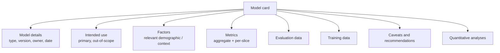

# Google — Model Cards (2019)

## Problem

By 2018, ML models were proliferating across products and across teams. Each model came with its own informal "what does this do" document — usually in a notebook, sometimes in a wiki, often nowhere. When models faced fairness questions or external scrutiny, no canonical artefact existed to answer "what's in this model and how does it perform."

Mitchell et al. (Google, FAT* 2019) proposed Model Cards as the canonical artefact.

## Architecture (of a model card itself)

## Three load-bearing ideas

1. **Standardised template.** A model card looks the same across teams and products. Comparison is easy.
2. **Per-slice metrics are mandatory.** Aggregate metrics are insufficient for a card — the card forces the team to compute and publish per-group performance.
3. **Living document.** Updated with each major model release; tied to the model version in the registry.

## What got hard in practice

- **Adoption.** Without enforcement, teams skip the harder sections (per-slice analysis). Mature ML platforms gate model promotion on a complete card.
- **What counts as a "slice"?** Race, gender, geography, language, device class — context-specific. Teams need guidance.
- **Privacy and slice metrics.** Computing per-demographic metrics requires having demographic labels in the eval data, which can be a privacy issue. Differential privacy techniques apply (see [Module 13](../13-privacy-fairness-ethics/README.md)).

## What you should steal

- The **standardised template**. Even a one-page version is much better than the alternative ("ask the team").
- **Per-slice mandatory**. The aggregate metric is the easy lie; the per-slice metric is the truth.
- **Versioning** of model cards alongside model artefacts. The model card from six months ago described a different model.

## Sources

- "Model Cards for Model Reporting," Mitchell, Wu, Zaldivar, Barnes, Vasserman, Hutchinson, Spitzer, Raji, Gebru (Google, FAT* 2019).
- "Datasheets for Datasets," Gebru et al. (CACM 2021).
- Hugging Face Model Cards specification, current.
