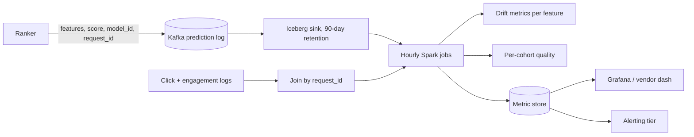

# 10 — Monitoring and Drift exercises

---

### 1. INTERVIEW. Design the monitoring stack for a recsys ranker at 100M DAU.

<details><summary>Solution</summary>



SLIs / SLOs:
- p99 latency, error rate, coverage (fraction with model firing).
- Rolling NDCG@10 vs week-ago baseline; auto-rollback at -2 pp.
- Per-cohort NDCG; alert at -3 pp on any major cohort.
- Per-feature freshness; alert at < SLO.
- Per-feature distribution drift; notify only.

Tooling: build the prediction log + Spark / Iceberg ourselves; consider a vendor (Arize / WhyLabs) for drift visualisation as the platform matures.
</details>

---

### 2. DECISION. The team's drift detector fires every Monday morning. What's wrong?

<details><summary>Solution</summary>

Almost certainly traffic-mix shift between weekday and weekend captured by a stationary reference. Monday's traffic returns to a weekday distribution that's different from Sunday's, the rolling KS shoots up, the detector fires.

Fixes:

1. **Compare against a day-of-week-matched reference.** Monday vs last Monday, not vs the rolling average.
2. **Use a longer window** so weekend traffic doesn't dominate.
3. **Add a "first-business-day flag"** to the alert suppression rules.

The deeper issue: a drift detector that fires on a non-actionable event trains oncall to ignore drift alerts. The signal is real — Monday's distribution is different from Sunday's — but the alert isn't.
</details>

---

### 3. CASE-STUDY READ. Read the Model Cards paper (Mitchell et al., FAT* 2019). What's the single most important section that production teams under-populate?

<details><summary>Solution</summary>

**Quantitative analyses by demographic / geographic / use-case slice.**

Most production model cards do well on "intended use" and "training data overview" but skip the per-slice performance breakdown. The omission matters because:

1. The aggregate metric (AUC 0.85) hides which subgroups the model performs worse on.
2. Without the breakdown, fairness audits and regulator inquiries are answered with hand-waving.
3. Internal reviewers can't tell if a model regression hits a sensitive slice.

The discipline that the paper advocates: explicitly compute the same metric on each demographic, geographic, and product-class slice; publish all of them; flag the ones below threshold for review.

In 2026, the EU AI Act effectively requires this for high-risk systems. See [Module 13](../13-privacy-fairness-ethics/README.md).
</details>

---

### 4. INTERVIEW. The model's online metric is fine in aggregate but click-through-rate is dropping for new users. What do you check?

<details><summary>Solution</summary>

Per-slice analysis:

1. **Cohort definition.** "New users" — pin a definition: signed up in the last 7 days? First 5 sessions? Lifetime < N activities?
2. **Per-cohort drift.** Is the new-user feature distribution shifting? New marketing channel pulling in a different demographic?
3. **Per-cohort prediction distribution.** Does the model produce different score distributions for new users?
4. **Cold-start fallback.** Is the new-user fraction actually being routed to a cold-start path that's now broken?
5. **Recsys feedback loop.** New users see less personalised results; if the ranker collapsed onto a narrow set, new users see less variety; they click less; the ranker learns to show them less; etc.

Common root cause: a feature pipeline change broke a feature that the model relied on for new users specifically. The feature has a sensible default for old users (who have other signals); for new users, the default is the entire signal, and the default is wrong.
</details>

---

### 5. DECISION. Auto-rollback fired at 3 AM. Was it the right call?

<details><summary>Solution</summary>

Postmortem questions:

1. **Were the SLI numbers real, or did they spike due to a measurement bug?** Verify the underlying data.
2. **Was the threshold sensible?** Auto-rollback firing every week on noise is broken policy.
3. **Did the rollback fix the problem?** If yes, the system worked.
4. **What was the cost of the rollback?** Lost engagement during the window? Customer-visible behaviour change?

Most teams I've seen tune auto-rollback at the wrong threshold initially — either too tight (frequent false alarms) or too loose (real regressions slide through). The discipline: calibrate against historical incidents.

If auto-rollback fired correctly: thank the system, investigate the underlying model bug, ship a fix, redeploy.

If auto-rollback fired incorrectly: tighten or loosen the threshold based on the actual incident dynamics. Document why.
</details>

---

### 6. INTERVIEW. The team wants to instrument hallucination detection on an LLM product. How?

<details><summary>Solution</summary>

Two-layer approach:

```text
Layer 1 - request-time (cheap, every request):
  - String-level checks: does the response cite a source? Does it admit uncertainty?
  - Refusal pattern: did the model decline appropriately when asked an off-topic question?
  - Length sanity: too short, too long.

Layer 2 - sampled async eval (expensive, ~1% of requests):
  - Model-graded eval: a strong judge model assesses if the response is grounded in the retrieved sources.
  - Specifically: for RAG, "is every factual claim supported by the retrieved chunks?"
  - Calibrate the judge against human-rated samples.

Layer 3 - golden set on every release (definitive):
  - Hand-curated cases with known correct grounding.
  - PR gate: regression on golden set blocks merge.
```

Logging: prompts, responses, retrieved chunks, model version, judge score (when computed). 90-day retention.

Alerting: hallucination rate > N% on the sampled async eval pages oncall. Per-day model-graded score deviation > threshold notifies.
</details>

---

### 7. DECISION. You're choosing between building observability in-house and buying Arize / WhyLabs / Fiddler. Frame it.

<details><summary>Solution</summary>

| Dimension | In-house | Vendor |
|-----------|----------|--------|
| **Initial cost** | Engineering time, ~1 quarter | License + setup |
| **Steady-state cost** | Maintenance | License |
| **Customization** | Total | Limited to vendor's UI / metrics |
| **Audit / compliance** | Build it | Often comes in |
| **Multi-team rollout** | Easier — you can mandate adoption | Requires per-team buy-in |
| **Vendor lock-in** | None | Real |

For a small team with one critical model: build the prediction log + a few Spark / DuckDB jobs + Grafana. Cheap; sufficient.

For a platform-team supporting many models across the organisation: vendor wins. The cost of building a vendor-quality multi-tenant observability product internally is multi-person-year.

For a regulated environment: vendor often wins on audit / certification (SOC 2, HIPAA, etc.), which would otherwise be an in-house investment.

Common middle path: in-house log + computed metrics + a vendor dashboard for visualisation. Best of both worlds.
</details>

---

### 8. INTERVIEW. The model has been in production for 6 months. The team didn't build a prediction log. What do you do first?

<details><summary>Solution</summary>

You're blind. The first move is the prediction log.

1. **Ship a logger asynchronously**: features used at serving time, score, model_version, request_id, timestamp. Async to Kafka; do not block the serving path.
2. **Land in Iceberg / Parquet on S3** with a 30-90 day retention to start.
3. **Wait one week.** A week of logged data is enough to build initial drift and quality jobs.
4. **First analyses:**
   - Distribution of each feature compared to the training data (you have to dig up the training set).
   - Distribution of predictions.
   - Spot-check 100 logged requests for plausibility.
5. **Set up quality eval against labels** (the labels you'd been using offline must be join-able by request_id).

Six months of unlogged production is not catastrophic — most regressions show up in product metrics within weeks. But without the log, you can't diagnose; you can only flail. Start now.
</details>

---

### 9. INTERVIEW. The CFO asks: "Is the model still working?" In one chart, what do you show?

<details><summary>Solution</summary>

A single chart: **rolling 7-day quality metric vs baseline**, plotted over the last 90 days.

- X-axis: date.
- Y-axis: the primary product metric (NDCG@10, AUC, revenue per query — whichever your business cares about).
- Two lines: model's metric, baseline (last quarter's average or a heuristic baseline).
- Shaded band: ± 2 standard errors.
- Annotations: model releases, known incidents.

If the model line is within the shaded band and tracking the baseline, "yes, working." If diverging, "here's where it diverged and what we know."

This single chart is what the team should look at every Monday. Everything else — drift KS per feature, latency percentiles, cohort breakdowns — is for investigating the chart when it diverges.
</details>

---

### 10. CASE-STUDY READ. Read DoorDash's "Maintaining Machine Learning Model Accuracy Through Monitoring" (2022). What's their single most novel SLI?

<details><summary>Solution</summary>

The **coverage SLI**: fraction of requests where the model fired vs the heuristic fallback.

Most teams build latency / availability SLOs but not coverage. The coverage SLI catches the silent failure where the feature pipeline degrades, the model server returns a fallback, the latency is normal, the availability is 100% — and the product quietly degrades because the model isn't actually doing anything.

Why it's novel: it's a measurement of the model's effective participation in the product, not of the model server's health. The two diverge surprisingly often.

DoorDash's post describes per-model coverage SLOs with alerting thresholds. When coverage drops, oncall investigates the feature pipelines and the feature service, not the model server.
</details>

---

### 11. INTERVIEW. Write the alerting rules for a fraud model.

<details><summary>Solution</summary>

```text
PAGE (sev1, 24/7):
  - p99 inference latency > 1.5x SLO for 10 minutes
  - error rate > 2x baseline for 10 minutes
  - coverage < 95% (model not firing on > 5% of requests)
  - block-rate change > 3 stddev from 24-hour rolling baseline (could indicate runaway model)

EMAIL / DAILY DIGEST:
  - feature freshness > SLO for any feature
  - per-feature KS > 0.1 for any feature
  - prediction distribution shift (JS distance vs prior week > 0.15)
  - calibration error > 5% on rolling sample

DASHBOARD ONLY (no alert):
  - per-cohort metric breakdowns
  - feature importance trends
  - latency percentile heatmaps
```

The principle: page on operational issues and runaway model behaviour (where humans must act now). Daily digest for drift signals (where humans should review but the world isn't on fire).

Alerts that are explicitly *not* in this list: "score for individual request > threshold" (that's the model's job to decide, not the alerting layer).
</details>

---

### 12. DECISION. The team wants to add a model card for every internal-only model. The eng manager thinks it's overhead. Argue for.

<details><summary>Solution</summary>

Three arguments:

1. **Six-months-later forensics.** When a model is investigated for a regression, fairness, or compliance reason in six months, the team that built it may have moved on. The card is the document that lets new engineers know what the model is, who owns it, and what trade-offs were made. Without it, every investigation starts at zero.

2. **Cross-team adoption.** When team B wants to use team A's model for their feature, the card is the contract. What inputs? What outputs? What known limitations? Without a card, this is a Slack thread that takes a week.

3. **Mandatory in regulated environments.** EU AI Act, FDA AI/ML SaMD guidance, FCA / OCC oversight in finance — model cards are increasingly required. Building the discipline now is cheaper than retrofitting later.

Cost: a model card takes 1-2 hours per model. The same engineers who can spend 1-2 hours writing a card can also avoid 10-20 hours of forensics six months later.

Common compromise: a lightweight template (1 page) for all models; a heavyweight version (full FAT* card) for customer-facing models. Mandatory for any production model.
</details>
