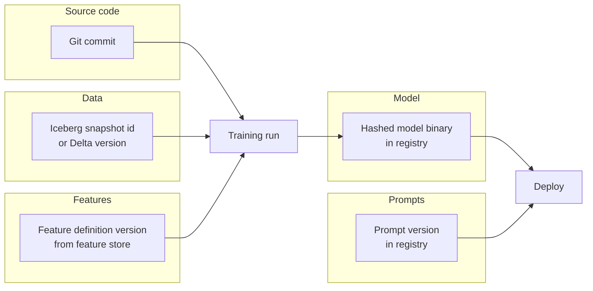
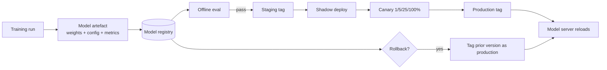
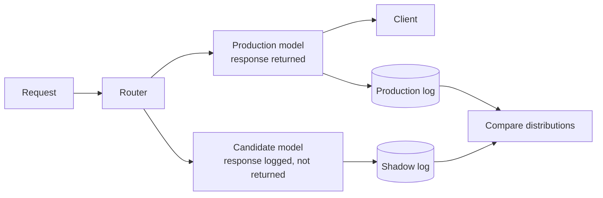

# 11 — MLOps and CI/CD

> Time budget: 90 minutes. MLOps is the discipline of treating ML systems like production software. The mistakes here are the ones that look obvious in postmortems and weren't obvious before.

**By the end you can:**

1. Version data, features, model, code, and prompts — and explain why each.
2. Set a reproducibility budget.
3. Pick a pipeline orchestrator (Airflow, Dagster, Prefect, Kubeflow, Flyte, Metaflow).
4. Design a deployment pipeline with model registry, canary, and rollback.
5. Use shadow traffic for safe candidate evaluation.

---

## 1. The five things to version

| Versioned | Tool | Reason |
|-----------|------|--------|
| **Code** | Git | Standard. |
| **Data** | Iceberg / Delta snapshot id, or DVC for non-table data | Two training runs on different snapshots produce different models even with same code. |
| **Features** | Feature store version | Same code over the same data with different feature definitions is a different model. |
| **Model binary** | Model registry with content hash | Two runs of the same code on the same data produce different binaries (non-determinism). Version the binary. |
| **Prompts** | Prompt registry (in-house or commercial) | An LLM's behaviour is the prompt + model + tools; treat the prompt as a versioned artefact. |

The model registry is the single most important MLOps primitive after the prediction log.

---

## 2. The reproducibility budget

Perfect reproducibility (bit-exact loss curves across reruns) is expensive and rarely useful. Define what you actually need:

| Level | What it means | Cost |
|-------|---------------|------|
| **Artifact reproducibility** | Same code, same data, same config -> a model within statistical noise of the original. | Modest. |
| **Loss-curve reproducibility** | Same artefact AND same loss curve at every step. | High. Distributed reductions are non-associative; FP ops aren't commutative. |
| **Bit-exact reproducibility** | Hash-identical model binary. | Very high. Often impossible at scale. |

Most production ML needs **artifact reproducibility**. Two runs that produce models with the same eval metrics (within stderr) is sufficient. The engineering cost of bit-exactness is large and rarely buys you anything.

---

## 3. Pipeline orchestrators — decision matrix

| Orchestrator | Strengths | Weaknesses | Pick if |
|--------------|-----------|------------|---------|
| **Airflow** | Ubiquitous. Mature. Huge ecosystem. | Painful for ML workflows (DAG-as-Python, dynamic graphs poor, ML-aware lineage weak). | You already run Airflow for data ETL; ML pipelines piggyback. |
| **Dagster** | Asset-centric. Strong typing. Good observability. Modern DX. | Smaller ecosystem; mostly Python. | Greenfield data + ML platform; modern team. |
| **Prefect** | Pythonic. Easy to start. | Has gone through architecture changes; smaller scale than Airflow. | Small / medium team that wants minimal infra. |
| **Kubeflow Pipelines** | K8s-native. ML-specific concepts (components, metadata). | Heavy. Operational complexity. | K8s-centric org, mostly ML pipelines. |
| **Flyte** | Strong typing. K8s-native. Built for ML at Lyft. | Smaller community than Airflow. | Mid-to-large ML platform, K8s-centric. |
| **Metaflow** | Pythonic. Built at Netflix for DS workflows. | Smaller ecosystem; primary backend is AWS. | DS-led teams; AWS-centric. |
| **Argo Workflows** | K8s-native, language-agnostic. | Lower-level; less ML-aware. | Custom platform; you want the workflow engine without opinions. |
| **GitHub Actions / GitLab CI** | The build pipeline you already have. | Not designed for long-running ML jobs. | Small models, occasional retraining. |

Defaults in 2026:

- **Data ETL + ML in one team:** Airflow or Dagster.
- **ML platform team at scale:** Flyte or Kubeflow.
- **Greenfield ML-first team:** Dagster (asset model fits ML well) or Metaflow.
- **Researcher-driven, AWS-heavy:** Metaflow.

Switching orchestrators after committing is expensive. Pick once, commit.

---

## 4. The model registry pattern

What the registry stores:

| Field | Why |
|-------|-----|
| Hashed binary | Versioning. |
| Training run metadata | What code, what data, what config produced this. |
| Eval metrics | Offline performance for traceability. |
| Tags | `staging`, `production`, `prior_production`. |
| Owner + on-call | Who is responsible. |

Open options: MLflow, Weights & Biases, in-house. The registry is simple enough that an in-house version on S3 + Postgres works fine.

Critical property: **promotion is a metadata change, not a binary copy**. Tagging `prod` to a different artefact rolls forward; tagging `prod` back to the previous artefact rolls back. The model server polls the registry and reloads on tag change.

---

## 5. Deployment pipeline

The full pipeline, end to end:

```mermaid
flowchart LR
    PR[PR to model repo] --> CI[CI: lint, type, unit tests]
    CI --> TRAIN[Trigger training pipeline]
    TRAIN --> ART[Model artefact]
    ART --> EVAL[Offline eval suite]
    EVAL -- block on regression --> CI
    EVAL -- pass --> REG[Register in model registry]
    REG --> SHADOW[Shadow deploy]
    SHADOW --> EVAL2[Online comparison: latency, quality]
    EVAL2 -- pass --> CANARY[Canary 1%]
    CANARY -- pass --> CANARY2[Canary 5%]
    CANARY2 -- pass --> CANARY3[Canary 25%]
    CANARY3 -- pass --> PROD[100%]
    CANARY -- fail at any stage --> ROLLBACK[Auto-rollback]
```

| Stage | Gate |
|-------|------|
| CI | Lint + type + unit pass; PR diff reviewed |
| Training | Job completes within budget |
| Offline eval | Within N% of baseline on golden set; no slice regression > M% |
| Shadow | Latency / error rate within bounds vs baseline; quality directionally OK |
| Canary | Auto-rollback criteria not breached at each step |
| Full rollout | All earlier stages passed |

This is the same shape as conventional software CI/CD plus three ML-specific stages (training, offline eval, shadow). The discipline that makes it work is **automated, blocking gates**: a regression at any stage stops the pipeline.

---

## 6. Shadow traffic

The under-deployed pattern. A new model runs on real production traffic in parallel with the production model; its responses are recorded but not returned to users.

What shadow catches that canary doesn't:

| Failure | Detected by |
|---------|--------------|
| Latency regression | Both; shadow earlier. |
| Error rate regression | Both. |
| Score distribution shift | Shadow. Canary's small % may not have statistical power to see it. |
| Quality regression on tail | Shadow. Canary takes weeks. |
| Calibration shift | Shadow. |

Cost: double the inference cost while shadow runs. For mature production systems with expensive models (LLMs especially), shadow is sometimes scoped to a sample (10-25% of traffic) rather than 100%.

---

## 7. Rollback strategies

The lesson from every postmortem: **how fast can you roll back?**

| Strategy | Rollback latency |
|----------|------------------|
| Re-tag in registry; model server polls | seconds-minutes |
| Re-deploy previous container | minutes |
| Re-train and re-deploy | hours-days |

A team that can re-train in two days but can't re-tag a model in a minute is one bad deploy away from a long outage. Make sure registry-tag-rollback is the default operation, not the exception.

Rollback-friendly architecture:

- Model server has the previous version warm (loaded but not serving), ready to take traffic.
- Routing is at the load-balancer or service level; rollback is a single config change.
- Predictions log includes the model version, so postmortem can identify exactly which requests hit the bad model.

---

## 8. Prompts as code

For LLM systems, the prompt is part of the model. A prompt change is a behaviour change. Treat it accordingly:

| Practice | What it gives you |
|----------|--------------------|
| **Prompt registry** | Versioned prompts with metadata. |
| **Prompt CI** | Tests run on every prompt change; regression blocks merge. |
| **Prompt diff in PR** | Reviewer sees the diff like code. |
| **Prompt rollback** | Same shape as model rollback. |
| **Prompt cache awareness** | Restructuring a prompt invalidates the cache; consider the cost. |

Anthropic and OpenAI engineering posts (2024-2025) describe internal teams treating prompts as code: code-review process, automated tests, rollback procedures. The discipline is new but the techniques are old.

---

## 9. Cross-links

- [`cheat-sheet.md`](./cheat-sheet.md)
- [`exercises.md`](./exercises.md)
- [`pitfalls.md`](./pitfalls.md)
- [`case-studies/`](./case-studies/)
- Serving: [04 Serving](../04-serving-online-batch-streaming/README.md)
- Monitoring: [10 Monitoring](../10-monitoring-and-drift/README.md)
- Up next: [12 Cost, Multi-tenancy, Scaling](../12-cost-multitenancy-scaling/README.md)

## Sources

- "MLOps: Continuous Delivery and Automation Pipelines in Machine Learning" (Google Cloud, 2020).
- "TFX: A TensorFlow-Based Production-Scale Machine Learning Platform," Baylor et al. (KDD 2017).
- "Continuous Delivery for Machine Learning" (Sato, Wider, Windheuser, martinfowler.com, 2019).
- "Metaflow: A Human-Friendly Python Library for Real-Life Data Science" (Netflix, 2019-2023).
- Flyte documentation and architecture (Lyft, current).
- Dagster documentation, current.
- "Hidden Technical Debt in Machine Learning Systems," Sculley et al. (NeurIPS 2015).
- "Reliable Machine Learning," Chen, Murphy, Zaharia et al. (O'Reilly, 2022).
