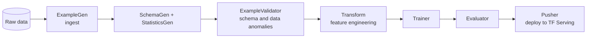

# Google — TFX (2017)

## Problem

By 2017, Google had production ML pipelines across many teams and was running into the same problems Sculley et al. had described in 2015: glue code, pipeline jungles, undeclared consumers. Different teams wrote their own training pipelines, validation logic, and deployment scripts. There was no canonical pipeline.

TFX (Baylor et al., KDD 2017) was Google's attempt to define one.

## Architecture

Each box is a "component" with typed inputs and outputs registered in a metadata store. Pipelines compose components into DAGs.

## Three load-bearing decisions

1. **Components with declared inputs and outputs.** Lineage is explicit; reuse is possible.
2. **Metadata store as the system of record.** Every artefact, every run, every component's output is recorded with full lineage.
3. **Validation as a first-class step.** ExampleValidator catches schema and data-quality issues before they reach the trainer.

## What didn't generalise easily

- **TF-only at first.** TFX was TensorFlow-centric; supporting PyTorch took years of work.
- **Heavyweight for small projects.** A two-person team didn't need TFX; the abstractions added more cost than benefit. The "lightweight TFX" mode emerged as a response.
- **Component reuse across organisations.** TFX components are easy to share inside Google but customising them for outside use was clunky.

## What you should steal

- The **components-with-typed-IO** pattern. Even if you don't use TFX, the discipline is durable.
- **Metadata store as system of record.** Without it, lineage and audit are guesses.
- **Validation as a pipeline step** with explicit success / failure. Don't let data anomalies surface during training.

The 2020 "MLOps maturity" post from Google Cloud (the canonical reference for MLOps levels) is essentially TFX's conceptual framework written for a broader audience.

## Sources

- "TFX: A TensorFlow-Based Production-Scale Machine Learning Platform," Baylor et al. (Google, KDD 2017).
- "MLOps: Continuous Delivery and Automation Pipelines in Machine Learning" (Google Cloud, 2020).
- TFX documentation, current release.
