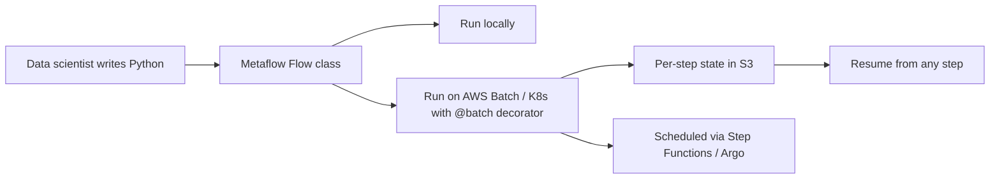

# Netflix — Metaflow (2019-2023)

## Problem

Netflix had hundreds of data scientists running ML experiments and ad-hoc workflows. Existing orchestrators (Airflow, then in 2017-2018) were data-engineering shaped — DAG definitions in YAML, separate worlds for prototyping and production. Data scientists wrote notebooks; engineers translated them to production pipelines. The handoff was slow and error-prone.

## Architecture

A workflow is a Python class with `@step` methods; transitions between steps via `self.next(...)`. Decorators expose infra concerns (`@batch`, `@resources`, `@retry`).

## Three load-bearing decisions

1. **Code-first DX.** A workflow is Python. Data scientists prototype on a laptop and ship the same code to AWS with one decorator change.
2. **State auto-versioning.** Variables set in one step (`self.foo = ...`) are pickled to S3, namespaced by run id. Resuming a step uses the same state.
3. **One canonical execution model** for prototyping, production, and orchestration. No "but production uses a different framework."

## What didn't translate to every org

- **AWS-centric.** Metaflow was AWS-shaped at launch; the multi-cloud story matured later.
- **Per-step pickling** is great for small intermediate state and bad for huge tensors. Teams using Metaflow for deep learning had to be careful.
- **Cross-flow dependencies.** Metaflow is per-flow; orchestrating dependencies between flows (e.g., feature pipeline feeds model training) needs external coordination.

## What you should steal

- **Code-first DX**. If your data scientists write YAML pipelines, you've lost the productivity battle. Make the same code run locally and in production.
- **Auto-versioned state.** Data scientists shouldn't think about checkpointing; the framework should do it.
- The discipline that **the production execution path is the same code as the prototype**. Eliminates the worst kind of bug ("it worked in the notebook").

## Sources

- "Open-Sourcing Metaflow" (Netflix Engineering, 2019).
- "Metaflow: A Human-Friendly Python Library for Real-Life Data Science" (Netflix, 2019-2023).
- Metaflow GitHub repository and documentation, current release.
- Netflix Tech Blog ML / data platform posts, 2018-2024.
