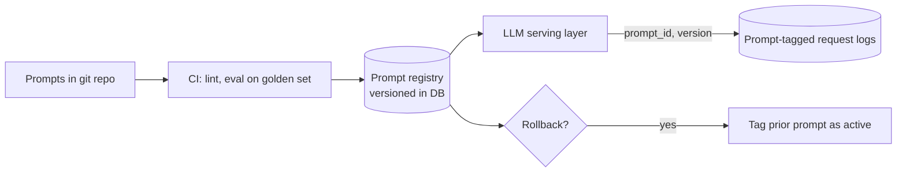

# 11 — MLOps and CI/CD exercises

---

### 1. INTERVIEW. Design an end-to-end MLOps pipeline for a team with 5 models in production.

```mermaid
flowchart LR
    GIT[GitHub] --> CI[CI: lint, type, unit, integration]
    CI --> SCHED[Scheduled training - Dagster / Airflow]
    SCHED --> DATA[Read Iceberg snapshot]
    DATA --> FEAT[Read Feature store]
    FEAT --> TRAIN[Training job on K8s]
    TRAIN --> REG[(Model registry: MLflow / in-house)]
    REG --> EVAL[Offline eval against golden set]
    EVAL -- pass --> SHADOW[Shadow deploy via Argo Rollouts]
    SHADOW --> COMPARE[Diff scores / latency vs prod]
    COMPARE -- pass --> CANARY[Canary at 1/5/25/100%]
    CANARY --> PROD[Promote to prod tag]
    PROD --> SVC[Model server polls registry]

    SVC --> LOG[(Prediction log)]
    LOG --> MON[Monitoring + drift]
    MON --> DASH[Dashboards]
    MON -.alert.-> ONCALL[Oncall]
```

<details><summary>Solution</summary>



Pieces:
- Source: GitHub.
- CI: GitHub Actions.
- Orchestrator: Dagster (asset-based, fits 5 models well).
- Training: K8s jobs with Kueue scheduling.
- Registry: MLflow self-hosted on Postgres + S3.
- Feature store: Feast.
- Deployment: Argo Rollouts for canary / shadow.
- Monitoring: prediction logs to Iceberg + Spark drift jobs + Grafana.

Per-model: each model owns a folder with its training code, eval set, prompt registry (if LLM), and a YAML defining its deployment pipeline.
</details>

---

### 2. DECISION. Your team uses Airflow for everything. The ML team is frustrated. Switch?

<details><summary>Solution</summary>

Airflow's pain points for ML:

1. Static DAGs; dynamic graphs (per-experiment) are awkward.
2. Task instances aren't artefact-aware.
3. UI is data-pipeline-shaped, not ML-experiment-shaped.

But: switching orchestrators is expensive. Six months of integration work for the team. Lost data lineage. Retraining all the existing pipeline code.

Middle path: keep Airflow for cross-team data pipelines; introduce **Metaflow or Flyte** for ML-specific pipelines that interoperate with Airflow at the boundaries. The ML team gets a tool fit for purpose; the data team's existing world is untouched.

Don't switch wholesale unless the productivity drag is well-quantified and there's eng capacity for a multi-quarter migration.
</details>

---

### 3. CASE-STUDY READ. Read Netflix's Metaflow architecture posts. What's the design choice that makes it data-scientist-friendly?

<details><summary>Solution</summary>

**Code-first, infra-aware-later.** A Metaflow workflow looks like a Python class with decorated methods; the decorators expose infra (resources, retries, batch / Kubernetes) without requiring the user to write YAML or DAG specs.

What this gives data scientists:

1. They can prototype locally and the same code runs on AWS Batch / K8s with one decorator change.
2. State (data flowing between steps) is automatically versioned and stored in S3.
3. Resuming from a step is a one-liner — useful for long ML jobs.

The 2019 post and follow-ups describe this as a deliberate trade-off: less general than Kubeflow / Airflow, but the DX wins for the ML use case.

What it gives up: orchestration features like cross-pipeline dependencies, complex event-driven triggers, multi-team coordination. Netflix layers those on with external tooling.

The lesson: **fit the orchestrator to the user**. ML researchers and data scientists are not infra engineers; the orchestrator they reach for first should respect that.
</details>

---

### 4. INTERVIEW. Spec the rollback procedure for a misbehaving model.

<details><summary>Solution</summary>

Two roles: human-driven and auto-rollback.

```text
AUTO-ROLLBACK CRITERIA (during canary or shadow):
  - error rate(candidate) > 2 x baseline for 5 minutes
  - p99 latency(candidate) > 1.3 x baseline for 5 minutes
  - quality SLI(candidate) < baseline - 2 stddev for 15 minutes

AUTO-ACTION:
  - Switch routing back to baseline immediately (registry tag flip).
  - Page oncall with incident summary.

HUMAN ROLLBACK (when auto missed or you decide manually):
  - Identify last-known-good model version from registry.
  - Re-tag baseline tag to that version.
  - Model server polls registry, reloads within 30-60 seconds.
  - Verify metrics return to baseline.

POST-ROLLBACK:
  - Postmortem within 24 hours.
  - Identify why the bad model passed prior gates (offline eval, shadow).
  - Fix the gate.
```

Two requirements that make this work:

1. The model server polls the registry frequently (every 10-30 seconds). A model server that requires a restart for rollback is broken.
2. The registry stores at least the last 3-5 versions, all of them deployable. "Latest only" is not rollback-friendly.
</details>

---

### 5. DECISION. The team wants to use online learning to skip the train -> register -> deploy cycle. Argue against, from an MLOps perspective.

<details><summary>Solution</summary>

(This complements the argument from [Module 09](../09-real-time-ml/README.md).)

MLOps angle:

1. **No artefact.** Online-learned weights aren't a versioned artefact. You can't promote, rollback, or audit.
2. **No CI for weight changes.** Every update is unreviewed.
3. **No reproducibility.** Two replicas diverge; later forensics impossible.
4. **No A/B testing.** A new "model" is a continuous evolution, not a discrete experiment.
5. **Audit trail breaks.** "What model produced this prediction?" has no clear answer.

A frequent-batch model (retrain every 15-60 min) preserves all of the above and captures most of the freshness benefit. Reserve true online learning for narrow contexts: contextual bandits with bounded action spaces and known-safe update rules.
</details>

---

### 6. INTERVIEW. Design the prompt-management system for an LLM product team with 5 prompts in production.

<details><summary>Solution</summary>



Pieces:

- **Storage:** prompts in git as Markdown / YAML; canonical source.
- **Registry:** small DB table mapping `(prompt_name, version) -> prompt body + metadata + eval results`.
- **Serving:** the LLM service reads `(prompt_name, version)` from config; resolves to the registry.
- **CI:** every PR running on the golden set; regression blocks merge.
- **Logging:** every request logged with the prompt_id and version that served it.

Why a registry on top of git: rollbacks are a tag flip, not a git commit. Same shape as model registry.

Two specific traps:

1. **Cache invalidation.** A prompt rewrite invalidates prompt cache hits. Plan the migration.
2. **Multi-tenant prompts.** If users can customise prompts, the registry has tenant-scoped versions; the global production tag isn't enough.
</details>

---

### 7. CASE-STUDY READ. Read Google's "MLOps: Continuous Delivery and Automation Pipelines in Machine Learning" (2020). What's the "MLOps maturity model"?

<details><summary>Solution</summary>

Google's post defines three maturity levels:

| Level | Description |
|-------|-------------|
| **MLOps 0** | Manual everything: data scientists train, hand off, ops deploys. Slow, error-prone. |
| **MLOps 1** | Automated pipeline: data + training + deploy are scripted. CI exists for code, not for models. |
| **MLOps 2** | Full CI/CD for ML: every code, data, or config change triggers an automated retrain-eval-shadow-canary pipeline. |

The honest assessment in 2026: most teams hover between MLOps 1 and 2. The hard part isn't the diagram — it's the discipline to make every change go through the pipeline rather than around it.

A useful diagnostic: when a model gets retrained, is it because (a) the pipeline fired automatically, or (b) someone in the team manually triggered it? If (b) more than 10% of the time, you're MLOps 1, not 2.
</details>

---

### 8. INTERVIEW. The team wants to skip shadow deploy and go straight to 5% canary. When is that OK?

<details><summary>Solution</summary>

Acceptable when:

- The model is a **drop-in replacement** with no structural change (same features, same architecture, retrained on fresher data).
- The offline eval is rigorous and you trust it.
- The canary auto-rollback is well-calibrated against historical incidents.
- The product impact of a 5% bad deploy is bounded (e.g., recommendations for a single shelf, not all of search).

Not acceptable when:

- The model has **new features** the serving stack hasn't seen.
- The model's score distribution is materially different from the baseline (calibration changes).
- The product impact is broad (every user is exposed to 5%).
- The auto-rollback policy isn't trusted.

Pragmatic rule: shadow is the cheap insurance. The cost is double inference cost during shadow; the benefit is catching the bad-fail-mode before users see it. Skip only when the marginal benefit doesn't justify the marginal cost.
</details>

---

### 9. DECISION. You're choosing between MLflow, Weights & Biases, and in-house for experiment tracking + model registry. Frame it.

<details><summary>Solution</summary>

| Dimension | MLflow | W&B | In-house |
|-----------|--------|-----|----------|
| **Cost** | OSS; self-host = infra + ops | Per-seat; hosted | Eng time only |
| **Experiment tracking UI** | Adequate | Best-in-class | Custom |
| **Model registry** | Solid, basic | Adequate | Whatever you build |
| **Lineage / governance** | Limited | Better | Custom |
| **Vendor lock-in** | Low (open format) | Real (proprietary data) | None |
| **Integration with your stack** | Whatever you build | Many integrations | Total |

Defaults:

- **Startup, < 10 ML engineers:** W&B (great DX, fast to ship).
- **Mid-size, cost-conscious or compliance-heavy:** MLflow self-hosted.
- **Large enterprise with custom platform:** in-house on top of MLflow primitives (storage on S3, metadata in Postgres).

Common middle path: MLflow for the registry + W&B for experiment-tracking UI. Some teams find this awkward; some find it ideal.
</details>

---

### 10. INTERVIEW. The audit team asks "show me every model that was ever in production, with its training data lineage." How do you answer?

<details><summary>Solution</summary>

If you've built the system right:

1. **Model registry** query: list all artefacts ever tagged `production`, with timestamps of when the tag was applied and removed.
2. **Per-artefact metadata** includes the training run id.
3. **Training run record** includes: git commit, Iceberg snapshot id of the input table, feature store version, hyperparameters, eval results.
4. **Lineage system** (OpenLineage + DataHub) maps the Iceberg snapshot back to upstream sources, transformations, and quality checks.

Output: a JSON / CSV with one row per production model version, columns for every link in the lineage.

If you haven't built the system right: months of forensics. Some of the data may not be recoverable.

This is the kind of question that distinguishes "we have an MLOps system" from "we have some scripts that train models." Build the lineage from day one.
</details>

---

### 11. CASE-STUDY READ. Read "Continuous Delivery for Machine Learning" (Sato, Wider, Windheuser, martinfowler.com, 2019). What three axes do they identify for ML deployment?

<details><summary>Solution</summary>

The post identifies three orthogonal axes that need to flow through a CD pipeline:

1. **Code.** Standard software engineering CD.
2. **Data / parameters.** New training data triggers a retrain pipeline; new hyperparameters likewise.
3. **Model artefact.** Once trained, the model itself moves through stages from staging to production.

The insight: many teams treat all three as one thing ("the ML pipeline") and end up unable to change any one independently. The right factoring is three pipelines that compose.

Practical consequence: a data refresh shouldn't require a code change; a hyperparameter sweep shouldn't require a data change; a model promotion shouldn't require either. Each axis has its own CI/CD flow.

This is the same idea behind orchestrators like Dagster (asset-based: data, features, models, predictions are each first-class assets with their own lifecycles).
</details>

---

### 12. INTERVIEW. The team wants to use feature flags to gate model behaviour. Pros and cons?

<details><summary>Solution</summary>

Pros:

1. **Decouples deploy from release.** Ship the code; flip the flag when ready.
2. **Per-user / per-cohort rollout.** Test on internal users before going wide.
3. **Fast rollback.** A flag flip is instant; no redeploy.
4. **A/B test integration.** Many feature-flag systems integrate with experiment frameworks.

Cons:

1. **Flag accumulation.** Flags that should be cleaned up after rollout often aren't; the codebase grows pockmarked.
2. **Combinatorial complexity.** N flags = 2^N possible flag states; testing all of them is impractical.
3. **Performance.** Excessive flag checks in hot paths add latency.

For ML systems specifically:

- **Model selection flag** (which model version to serve): yes, this is the registry's job; don't reinvent.
- **Feature flag for model rollout** (which fraction of traffic gets the new model): yes, that's canary.
- **Per-user feature flag for behaviour variants**: useful for product experiments on top of the model.

The discipline: every flag has an owner, a creation date, and an expected sunset date. Quarterly flag-cleanup review.
</details>
